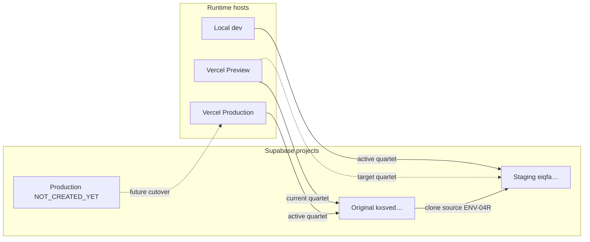

# Final Environment Topology — V170

**Policy ID:** `FINAL-ENV-TOPOLOGY-V170`  
**Effective:** 2026-05-19  
**Status:** ACTIVE — canonical map for Original, Staging, Vercel Preview, Vercel Production, and future Production  
**Supersedes for topology:** labeling sections of [dual-project-staging-registration.md](dual-project-staging-registration.md) where they conflict; dual-project remains source for clone/approval gates.

---

## 1. Project roles (four surfaces)

| Surface | Supabase ref | Role | Current wiring |
|---------|--------------|------|----------------|
| **Original** | `kxsvedvpjldygtdbylsy` | Live source DB, clone source, **rollback**, and **current Vercel Production** until a distinct production project exists | Vercel Production active quartet → original |
| **Staging** | `eiqfaapyumhixxoeltgu` | ENV-04R clone; local dev/test; Neda integration; scanner / product / TRID / API smokes; **target for Vercel Preview** | Local `.env.local` active quartet → staging (ENV-05E) |
| **Vercel Preview** | *should be* `eiqfaapyumhixxoeltgu` | PR/branch deploys; integration smoke before merge | **Gap:** Preview active quartet still → original (see ENV-06B audit) |
| **Production (future)** | `NOT_CREATED_YET` | Separate Supabase project; **BLOCKED** until explicit registration + cutover | `PRODUCTION_*` placeholders only — **must stay blank** |

Constants:

- `ORIGINAL_PROJECT_REF=kxsvedvpjldygtdbylsy`
- `STAGING_PROJECT_REF=eiqfaapyumhixxoeltgu`
- `PRODUCTION_PROJECT_REF=` *(empty until operator registers a new ref ≠ original ≠ staging)*

---

## 2. Policy rules (required)

### 2.1 Original

1. **Original** is the **rollback / clone source** and the **current Vercel Production** database until a real, separately registered production project exists.
2. Do **not** relabel original as “staging-only” or “deprecated.” It remains the production-facing DB for live Vercel Production traffic today.
3. `ORIGINAL_*` in `.env.local` preserves credentials for rollback and clone scripts; it does **not** switch the running app unless copied into the active quartet.

### 2.2 Staging

1. **Staging** is used for: local `npm run dev`, Neda/integration branch work, scanner/product/TRID/API staging smokes, and **Vercel Preview** (target state).
2. Staging is **not** production. Never set `PRODUCTION_*` to staging.
3. Postgres clone (ENV-04R) and partial storage clone (ENV-04B) apply to staging only; original stays the migration/source-of-truth for clone operations unless operator approves otherwise.

### 2.3 Production (future)

1. `PRODUCTION_*` env vars are **placeholders only** and must remain **blank** in repo, local files committed to operator vault, and Vercel until:
   - A **new** Supabase project is created (`ref` ≠ `kxsvedvpjldygtdbylsy` and ≠ `eiqfaapyumhixxoeltgu`), and
   - [production-readiness-01-approval.md](../operator-approvals/production-readiness-01-approval.md) (or successor) records the ref with explicit cutover approval.
2. Until then: `APPROVED_TO_REGISTER_PRODUCTION_REF=false`, no production probe, no production migrations.

### 2.4 How the app chooses the database

The Next.js app and `lib/supabase-server.ts` bind to **one** project via the **active quartet** only:

| Variable | Used by |
|----------|---------|
| `NEXT_PUBLIC_SUPABASE_URL` | Browser + server (`createClient`) |
| `NEXT_PUBLIC_SUPABASE_ANON_KEY` | Browser + anon paths |
| `SUPABASE_SERVICE_ROLE_KEY` | Server routes, scripts using `supabaseServer` |
| `DIRECT_POSTGRES_URL` | `pg` / CLI / one-off operator scripts |

**`STAGING_*` / `ORIGINAL_*` alone do not switch the app.** They are aliases for operator workflows unless their values are copied into the active quartet (or code is changed to read them — not current behavior).

### 2.5 Vercel Preview → staging (target)

1. **Vercel Preview** environment must set the **active quartet** to **staging** (`eiqfaapyumhixxoeltgu` keys).
2. Adding `STAGING_SUPABASE_URL` (or other `STAGING_*`) on Preview **without** updating `NEXT_PUBLIC_SUPABASE_URL` + matching keys **does not** change runtime behavior.
3. After Preview env update: redeploy Preview and verify ref in a smoke manifest (e.g. API-STAGING-MVP-SMOKE-V169, ENV-06B).

### 2.6 Vercel Production → original (current)

1. **Vercel Production** must continue to point at **original** (`kxsvedvpjldygtdbylsy`) until a deliberate **future production cutover**.
2. Do **not** point Vercel Production at staging for “testing.” Use Preview or local dev.

### 2.7 Future production cutover

1. Future production requires a **separate** Supabase project, new active quartet on **Vercel Production only**, operator approval, backup/clone plan, and audit signoff.
2. Cutover sequence (high level): register ref → clone or migrate → Preview smoke on new ref (optional) → Production env swap → rollback doc with `ORIGINAL_*` preserved.
3. Original (`kxsved…`) may remain rollback/archive; staging (`eiqfa…`) remains integration clone unless repurposed by operator plan.

---

## 3. Environment matrix (target vs current)

| Host | Active quartet target | Current (2026-05-19) | Action |
|------|----------------------|----------------------|--------|
| Local `.env.local` | Staging | Staging (ENV-05E) | OK |
| Vercel Preview | Staging | **Original** | Operator: set Preview quartet to staging |
| Vercel Production | Original | Original | OK until real production exists |
| Future Vercel Production | New production ref | N/A | BLOCKED |

---

## 4. Diagram

---

## 5. Script and smoke guardrails

- Staging smokes must resolve `STAGING_PROJECT_REF` or `NEXT_PUBLIC_SUPABASE_URL` host ref = `eiqfaapyumhixxoeltgu` (ENV-05B: `lib/staging-project-ref.ts`).
- Production readiness probe must refuse refs equal to staging or original when labeled as production.
- Never commit secrets; refs and hostnames only in audit packs.

---

## 6. Related artifacts

| Artifact | Path |
|----------|------|
| Dual-project registration | [dual-project-staging-registration.md](dual-project-staging-registration.md) |
| Local cutover approval | [staging-local-cutover-01-approval.md](../operator-approvals/staging-local-cutover-01-approval.md) |
| Preview smoke gap | [next-env-06b-vercel-preview-smoke/20260518T210000Z/](../audit-reports/next-env-06b-vercel-preview-smoke/20260518T210000Z/) |
| Staging MVP smoke | [api-staging-mvp-smoke-v169/20260518T230000Z/](../audit-reports/api-staging-mvp-smoke-v169/20260518T230000Z/) |
| Policy audit (this version) | [env-preview-staging-original-policy-v170/20260519T000000Z/](../audit-reports/env-preview-staging-original-policy-v170/20260519T000000Z/) |

---

## 7. Agent constraints (unchanged)

- No `package_items` table creation without explicit approval.
- No production migration apply while `PRODUCTION_PROJECT_REF` is blank.
- No labeling staging as production.
- No Vercel Production env changes except documented future cutover with approval.
