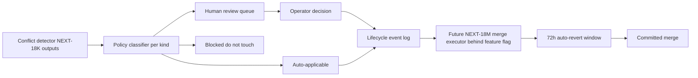
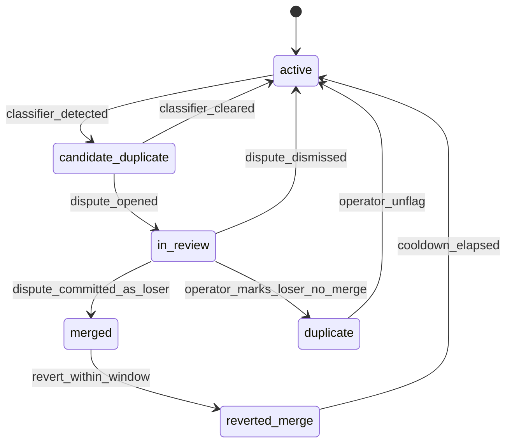
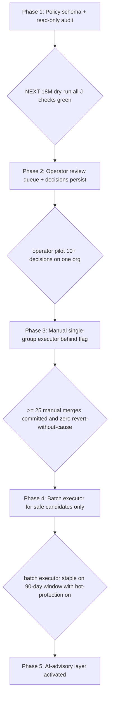

# NEXT-18L — Identifier Conflict Resolution Architecture (plan only)

## Purpose & locked constraints

NEXT-18K proved that no group is automatically mergeable: every one of 749 Shard A groups carries an identifier conflict, every one of 572 Shard B orphans has an ambiguous external winner, and all 3,083 simulated losers are operationally hot. Before any merge-execution pipeline can ship, the system needs a deterministic, multi-tenant, auditable policy layer that turns those conflicts into either auto-resolvable decisions or queued human reviews.

This plan documents the policy layer. It produces no code and no migrations. All NEXT-18 S.1 / S.2 / S.3 architectural constraints from [c:\Users\Jennifer\.cursor\plans\merge_winner_audit_33db146d.plan.md](c:\Users\Jennifer\.cursor\plans\merge_winner_audit_33db146d.plan.md) remain in force: connector-neutral field naming, AI as advisory-only seam, full who/when/why/evidence/change/rollback attribution.



## A. Identifier-authority policy matrix

Per-kind authority levels, ranked. Tells the future merge executor "when two products disagree on KIND, which value survives by default?". This matrix is the single source of truth; tenants may override per `pim_identifier_authority_policy` (proposed schema, section J).

- `asin`: **strong** — marketplace canonical. Most authoritative single value. Cannot be edited by tenant; tied to Amazon catalog.
- `fnsku`: **strong** — marketplace inventory canonical. Single value per (sku, fulfillment_network).
- `sku` (seller_sku): **strong-but-tenant-scoped** — single canonical per (org, store). Unique index `uq_imap_org_store_sku` in [supabase/migrations/20260808120000_pim_idempotent_import.sql](supabase/migrations/20260808120000_pim_idempotent_import.sql) line 77 enforces this.
- `upc_code`: **medium** — external directory identifier. Same UPC can legitimately back multiple SKUs (variant packs); cannot drive merges alone.
- `mfg_part_number`: **weak** — vendor canonical but vendor-namespaced; collisions across vendors are common.
- `gtin` / `ean` / `isbn`: **weak** — equivalent to UPC, sometimes computed.
- `barcode`: **weakest** — scanner-observed value; may equal UPC or be a tenant-internal code.

Authority decision per disagreeing-kind tuple `(kindᵢ, valuesᵢ)`:

1. If `kindᵢ` is `strong` and there is exactly one shape-valid value in the group, adopt it.
2. If `kindᵢ` is `strong` and there are >1 distinct shape-valid values, escalate to human review (`identifier_dispute_strong`).
3. If `kindᵢ` is `medium` / `weak` and only the winner has a value, adopt it.
4. If `kindᵢ` is `medium` / `weak` and disagreement exists, default policy is `drop_kind_from_winner` (do not adopt any value); a tenant may override to `prefer_most_recently_seen` via the policy table.

## B. Conflict-kind taxonomy

Every conflict the executor will encounter falls into exactly one cell. The classifier writes the cell tag into the decision-trace and into the proposed `pim_identifier_dispute` rows (section J).

- **C1 — strong-id_collision_intra_group** (e.g. same SKU, two different ASINs within a Shard A group). Highest severity. Defaults to human review.
- **C2 — strong-id_collision_cross_group** (e.g. same ASIN appearing as winner-strong in two distinct duplicate-orphan components). Indicates either a true second product or a resolver bug. Defaults to human review.
- **C3 — weak-id_collision_intra_group** (e.g. same SKU, two different UPCs). Defaults to `drop_kind_from_winner`.
- **C4 — orphan_vs_multiple_external_winners** (Shard B 572 / 572 case). Defaults to human review; selection narrowed by per-kind authority (ASIN-collision > FNSKU > SKU > UPC).
- **C5 — orphan_vs_single_external_winner_with_strong_match** (target state for safe Shard B). Auto-applicable iff external winner is alive, has matching strong-id, and orphan is cold.
- **C6 — identifier_format_drift** (one member has UPC `0034321908110`, another has `34321908110` — same value, leading-zero only). Auto-applicable after normalization; surfaced as `dirty_identifier_repair` event for audit.
- **C7 — title-only_disagreement** (every identifier matches but product_name differs). Auto-applicable; winner inherits the longest non-empty title.
- **C8 — operationally_hot_block** (winner candidate has activity within `hot_threshold_days`). Auto-applicable disabled regardless of other gates; routes to operator with a 7-day cool-off proposal.

Every conflict row in the future `pim_identifier_dispute` table carries a `taxonomy_cell ∈ {C1..C8}` column. J-check J19 (section M) requires every committed merge to reference a closed dispute with a taxonomy_cell.

## C. Human-review workflow architecture

Four-state workflow per dispute, persisted as event-sourced rows. No state mutation in place; every transition is an INSERT into `pim_conflict_review_event` (proposed; section J).

- `open` — created by the future classifier when policy cannot auto-resolve.
- `claimed` — an operator (or system actor for automated rules) holds the dispute. Includes `claimed_by` actor_id and a default 4h hold expiry.
- `decided` — operator has chosen a resolution. Includes `decision` JSON: `{ winner_id, surviving_identifier_set, dropped_identifiers, rationale_text, evidence_links }`.
- `committed` (terminal happy path) — merge executor consumed the decision and wrote the corresponding `product_merge_event` row.
- `reverted` (terminal) — merge was committed then reverted within the reversibility window.
- `dismissed` (terminal) — operator concluded the dispute does not warrant a merge (the products are intentionally distinct).

State-machine invariants (all enforced by future check constraints / triggers; not in this plan to implement):
- A dispute is `open` after creation, can transition only forward to `claimed`, `dismissed`, or `reverted`.
- A dispute in `committed` may only transition to `reverted` (one-way, within `reversibility_window_h`).
- Every transition writes one row; current state derives from the latest event ordered by `(occurred_at, event_id)`.

API contract surface (documentation only; no Next.js route created here):
- `GET /api/pim/conflict-review-queue?status=open&tenant=…` — page through disputes
- `POST /api/pim/conflict-review/:disputeId/claim` — claim with operator hold
- `POST /api/pim/conflict-review/:disputeId/decision` — submit decision
- `POST /api/pim/conflict-review/:disputeId/dismiss` — mark intentional duplicate
- `POST /api/pim/conflict-review/:disputeId/revert` — within window, post-commit

Every endpoint records actor_id, ip, user_agent, triggered_by_kind (`operator` | `automation` | `ai_assist` | `pipeline_retry`) into the event log.

## D. AI-assisted future review seams (documentation only)

Per S.2, all AI is advisory. Document four seams. None are wired in this plan.

- **D.1 normalization-suggestion** — a future advisor proposes canonical-form normalization candidates for `dirty_identifier` (e.g. add leading zero to a UPC). Output: structured `{kind, raw, suggested_normalized, confidence, rationale}`. Operator MUST confirm.
- **D.2 winner-recommendation** — given a conflict row, the advisor suggests which member should win + which surviving identifiers to keep. Output: `{recommended_winner_id, surviving_identifier_set, confidence, rationale, references}`. Recorded but NOT executed.
- **D.3 vendor-lineage-inference** — heuristics + AI inferring whether two `mfg_part_number` values are vendor-namespace variants of the same product. Output: graph hint, advisory.
- **D.4 similarity-clustering** — title / image / category similarity, advisory only. Cannot cross C1 (strong-id collision) gate without operator override.

AI advice never bypasses any J-check. AI advice is stored on `pim_identifier_dispute.ai_advice` JSON column (proposed). The `triggered_by_kind='ai_assist'` value is reserved for events whose causal chain references an AI suggestion; the actor_id remains the operator who committed.

## E. Deterministic tie-break hierarchy

When the per-kind authority policy yields equally authoritative candidates, fall back to the following deterministic ladder. NEXT-18K already implements steps 1, 3, 4 inside [lib/audits/product-seed-merge-winner.ts](lib/audits/product-seed-merge-winner.ts); this section formalizes the ladder for the executor.

1. `identifier_authority_score` — count of `strong` identifiers with shape-valid normalized value.
2. `policy_authority_kind_count` — count of `strong` identifiers that pass the authority matrix (section A) without conflict.
3. `downstream_link_count` — sum of rewrite counts across all surfaces (lower is safer for winner; for loser selection the higher cost goes to the loser, which is the inverse).
4. `operational_recency_score` — most recent activity across `product_prices` + 6 Amazon ops + repository.
5. `product_prices_count` — total price history rows.
6. `imap_history_score` — active + 0.25 × inactive map rows.
7. `age_score` — older `created_at` wins.
8. `actor_tenure_weight` — reserved seam for S.3 (operator-weighted; tenure derived from `profiles` history later).
9. `product_id_lex` — final lexicographic tiebreaker, guaranteed deterministic.

The ladder is a strict first-non-tie-wins sequence; the executor records the step at which it broke a tie into `reasoning.tiebreak_path[]`.

## F. Reversibility guarantees

Every committed merge MUST be reversible within the configured reversibility window (default 72h) without manual SQL.

- **Pre-merge snapshot** — taken atomically with the lifecycle event. Captures full loser identifier set, `merge_status`, `merged_into_id`, `deleted_at`, plus every active `product_identifier_map` row pointing at the loser.
- **Inverse-operation log** — every state-changing SQL the executor performs is mirrored into `product_merge_event.inverse_ops` JSON so revert can replay them in reverse without re-querying.
- **Auto-revert** — disputes still within `reversibility_until` and whose `committed` state has not been progressed by any other action MAY be auto-reverted by a future scheduled job (out of scope for this plan).
- **Manual revert** — operator-initiated; writes a `reverted` lifecycle event referencing the original committed event_id.
- **One-shot guarantee** — a reverted dispute cannot be re-committed; the operator must open a new dispute.

J-check J22 (section M) requires every `reverted` event to fully restore the pre-merge snapshot byte-for-byte on the captured columns.

## G. Product-prices inheritance strategy

`public.product_prices` has FK `REFERENCES public.products(id) ON DELETE CASCADE` ([supabase/migrations/20260705120000_pim_model_stabilization.sql](supabase/migrations/20260705120000_pim_model_stabilization.sql) line 110). Hard-deleting any loser destroys its price history. Strategy:

- **Never hard-delete losers.** Lifecycle terminal state for a merged loser is `merge_status='merged'` + `merged_into_id=winner.id` + `deleted_at IS NULL`.
- **Re-point price rows.** Executor issues `UPDATE product_prices SET product_id=winner.id WHERE product_id=loser.id AND organization_id=org`. This is one statement per loser, fully reversible (the inverse is the same statement with winner/loser swapped, applied to rows whose `merged_from_product_id` snapshot lists them).
- **Deduplicate after re-point.** The partial unique index `uq_prices_product_day_amount_source` (lines 96–107) covers `(org, store, product_id, amount, currency, source, day(observed_at))` but ONLY for `source IN ('product_master_import','pim_import_async')` or `source LIKE 'product_master%'`. After re-point, the executor MUST issue `INSERT ... ON CONFLICT DO NOTHING` semantics — i.e. **do not** rely on the unique index across other sources. Document the source whitelist in the merge spec; prices from other sources stay un-deduped after merge and are surfaced in the cascade-risk report.
- **Surface "phantom-duplicate" prices.** When two rows for the same `(amount, currency, source, day)` exist post-merge but the partial index does not cover the source, the executor emits a `phantom_price_duplicate` warning in the merge event and operator can opt-in to a `MERGE_PRICES` flag for the dispute.

## H. Operational-hotness protection rules

NEXT-18K marked 3,083 / 3,083 Shard A losers as hot. Rules:

- **H.1 hot_threshold_days** — default 30. Any loser with most-recent-activity-across-surfaces ≤ this threshold is `hot`.
- **H.2 cool-off override** — operator may set a per-dispute `hot_override_until` timestamp. The executor refuses to commit until `now() >= hot_override_until`.
- **H.3 hot blocks auto-commit.** A `hot_loser_flag=true` row never auto-commits, regardless of safe_to_merge.
- **H.4 hot rejects "drop_kind_from_winner".** When a kind would be dropped from the winner per section A.4, but the loser's value is the one that has been recently observed, the executor must escalate; otherwise reporting silently loses the freshest evidence.
- **H.5 hot-aware revert window.** Reversibility window doubles (default → 144h) for any merge involving a hot loser. Operator can shorten manually.

## I. Canonical product lifecycle states

Current `merge_status` CHECK constraint allows `'active' | 'merged' | 'duplicate'` only ([supabase/migrations/20260808120000_pim_idempotent_import.sql](supabase/migrations/20260808120000_pim_idempotent_import.sql) lines 131–134). The proposed lifecycle (NOT implemented here) adds three states; updating the CHECK is a section L prerequisite.

Proposed full enum: `active`, `candidate_duplicate`, `in_review`, `merged`, `duplicate`, `reverted_merge`.

Transition graph:



Each transition writes a `pim_canonical_lifecycle_event` row (section J). The current state of a product = latest event row.

Backward-compat fallback: until the CHECK constraint is widened, the executor restricts itself to writing only `merged` and `duplicate`. `candidate_duplicate` / `in_review` / `reverted_merge` live exclusively in the event log until the migration ships.

## J. Event-sourcing / audit-log architecture (proposed; markdown only)

Three new tables, all platform-neutral (S.1). All carry the six accountability axes from S.3 in the same shape: `actor_id`, `triggered_by_kind`, `triggered_by_run_id`, `reasoning`, `evidence_snapshot`, `reversible_until`.

### J.1 `pim_identifier_authority_policy`

Per-tenant overrides of section A defaults. One row per `(org, store, kind)`.

```
id                      uuid PK
organization_id         uuid NOT NULL
store_id                uuid
kind                    text NOT NULL CHECK (kind IN ('asin','fnsku','sku','upc_code','mfg_part_number','gtin','ean','isbn','barcode'))
authority_level         text NOT NULL CHECK (authority_level IN ('strong','medium','weak'))
on_conflict_default     text NOT NULL CHECK (on_conflict_default IN ('escalate','drop_kind_from_winner','prefer_most_recently_seen'))
created_at              timestamptz NOT NULL DEFAULT now()
created_by              uuid REFERENCES profiles(id)
UNIQUE (organization_id, store_id, kind)
```

If a `(org, store, kind)` row is missing, the executor falls back to the section A default for that kind.

### J.2 `pim_identifier_dispute`

One row per detected conflict awaiting / undergoing review. The classifier writes it `open`; events accumulate in `pim_conflict_review_event`.

```
id                      uuid PK
organization_id         uuid NOT NULL
store_id                uuid
shard                   text NOT NULL CHECK (shard IN ('A','B'))
group_id                text             -- Shard A duplicate-orphan-group id (NEXT-18J)
orphan_id               uuid             -- Shard B
members                 uuid[] NOT NULL
taxonomy_cell           text NOT NULL CHECK (taxonomy_cell IN ('C1','C2','C3','C4','C5','C6','C7','C8'))
recommended_winner_id   uuid REFERENCES products(id) ON DELETE SET NULL
identifier_conflicts    jsonb NOT NULL  -- [{kind, values[], members[]}]
ai_advice               jsonb           -- D.1–D.4 (advisory only)
status                  text NOT NULL CHECK (status IN ('open','claimed','decided','committed','dismissed','reverted'))
hot_loser_flag          boolean NOT NULL DEFAULT false
reversibility_window_h  int NOT NULL DEFAULT 72
detected_at             timestamptz NOT NULL DEFAULT now()
detected_by_run_id      uuid
detected_by_kind        text NOT NULL CHECK (detected_by_kind IN ('automation','operator','ai_assist','pipeline_retry'))
```

### J.3 `pim_conflict_review_event`

One row per state transition on a dispute. Source of truth for current state. Includes the inverse-op log for reversibility (F).

```
id                  uuid PK
organization_id     uuid NOT NULL
store_id            uuid
dispute_id          uuid NOT NULL REFERENCES pim_identifier_dispute(id) ON DELETE CASCADE
event_type          text NOT NULL CHECK (event_type IN ('detected','claimed','released','decision_drafted','decision_finalized','committed','dismissed','reverted','expired'))
actor_id            uuid REFERENCES profiles(id)
triggered_by_kind   text NOT NULL CHECK (triggered_by_kind IN ('operator','automation','ai_assist','pipeline_retry'))
triggered_by_run_id uuid
reasoning           jsonb NOT NULL
evidence_snapshot   jsonb NOT NULL
inverse_ops         jsonb              -- for committed events only
reversible_until    timestamptz
occurred_at         timestamptz NOT NULL DEFAULT now()

CHECK (event_type IN ('claimed','decision_drafted','decision_finalized','committed','dismissed','reverted') OR actor_id IS NULL)
CHECK (event_type NOT IN ('committed','reverted') OR actor_id IS NOT NULL)
```

### J.4 `pim_canonical_lifecycle_event`

One row per `products.merge_status` transition. Cross-references the dispute that drove it.

```
id                    uuid PK
organization_id       uuid NOT NULL
store_id              uuid
product_id            uuid NOT NULL REFERENCES products(id) ON DELETE CASCADE
prior_state           text NOT NULL
next_state            text NOT NULL
dispute_id            uuid REFERENCES pim_identifier_dispute(id) ON DELETE SET NULL
related_event_id      uuid REFERENCES pim_conflict_review_event(id) ON DELETE SET NULL
actor_id              uuid REFERENCES profiles(id)
triggered_by_kind     text NOT NULL
reasoning             jsonb NOT NULL
evidence_snapshot     jsonb NOT NULL
inverse_ops           jsonb
reversible_until      timestamptz
occurred_at           timestamptz NOT NULL DEFAULT now()
```

### J.5 `product_merge_event` (per section L of NEXT-18K plan)

Already proposed in [c:\Users\Jennifer\.cursor\plans\merge_winner_audit_33db146d.plan.md](c:\Users\Jennifer\.cursor\plans\merge_winner_audit_33db146d.plan.md) section L. NEXT-18L adds: foreign key `dispute_id uuid REFERENCES pim_identifier_dispute(id)` so every merge ties back to a dispute decision.

## K. Multi-tenant isolation guarantees

- Every event / dispute / policy row carries `organization_id NOT NULL` and `store_id` (NOT NULL for store-scoped products, NULL only for tenant-wide policy rows like authority overrides that apply across all stores).
- RLS policies modeled after `pim_duplicate_groups` ([supabase/migrations/20260808120000_pim_idempotent_import.sql](supabase/migrations/20260808120000_pim_idempotent_import.sql) lines 178–194): SELECT scoped to `organization_id IN (SELECT organization_id FROM profiles WHERE id = auth.uid())`; INSERT/UPDATE/DELETE permitted only via service_role or via verified API routes carrying the operator session.
- Cross-tenant merges PROHIBITED at three layers: (1) classifier ignores cross-org members; (2) executor refuses any merge where winner.org ≠ loser.org; (3) J-check J20 fails the run.
- Cross-store merges within the same org PROHIBITED by default. Per-org override toggle on `pim_identifier_authority_policy` (`store_id IS NULL` row with `allow_cross_store_merge=true`) unlocks it; absent override, executor refuses.
- All RPCs that read the new tables MUST `SET search_path = pg_catalog, public` and be marked `STABLE` (mirroring [supabase/migrations/20260808120000_pim_idempotent_import.sql](supabase/migrations/20260808120000_pim_idempotent_import.sql) line 220).

## L. Safe future merge-execution prerequisites (NEXT-18M checklist)

Before NEXT-18M (the merge executor) can be planned, these must exist:

1. Schema migrations for `pim_identifier_authority_policy`, `pim_identifier_dispute`, `pim_conflict_review_event`, `pim_canonical_lifecycle_event`, and an extension of `pim_duplicate_groups` adding `dry_run boolean DEFAULT false`.
2. CHECK constraint on `products.merge_status` widened to include `'candidate_duplicate','in_review','reverted_merge'`.
3. Per-tenant default policy seeded with the section A matrix (one INSERT per tenant for each of the 9 kinds).
4. Index `idx_dispute_org_status_detected` on `pim_identifier_dispute(organization_id, status, detected_at DESC)`.
5. Index `idx_lifecycle_event_product_time` on `pim_canonical_lifecycle_event(product_id, occurred_at DESC)`.
6. RLS policies on all four new tables (J / SELECT only for authenticated, INSERT/UPDATE only for service_role + verified API).
7. A read-only NEXT-18M dry-run that classifies every NEXT-18K row into a taxonomy cell (B), records `recommended_winner_id` + `identifier_conflicts`, and writes proposed `pim_identifier_dispute` row shapes to CSV / NDJSON without inserting.
8. Operator workflow UI behind a feature flag, scoped to one org for pilot.
9. Feature flag gating the executor itself: `flags.pim_merge_executor_enabled` per-org, default false.

## M. Required future J-checks (NEXT-18M and beyond)

Numbered to continue NEXT-18K's J1–J18.

- **J19** every committed merge row references a dispute whose final lifecycle event has `event_type='committed'` and references a non-null `taxonomy_cell`.
- **J20** no committed merge has `winner.organization_id ≠ loser.organization_id` (cross-tenant guard).
- **J21** no committed merge has `winner.store_id ≠ loser.store_id` unless the matching `pim_identifier_authority_policy(store_id IS NULL).allow_cross_store_merge=true` row exists.
- **J22** every reverted merge restores the captured `pre_merge_snapshot` columns byte-for-byte.
- **J23** every dispute in `committed` state has exactly one `product_merge_event` row tied to it.
- **J24** every product currently in `merge_status='merged'` has `merged_into_id IS NOT NULL` AND `merged_into_id` resolves to a product in `merge_status IN (NULL,'active')`.
- **J25** `merged_into` chain depth ≤ 1 across the entire snapshot (defensive; the executor never writes deeper, but a stale row could).
- **J26** every `product_prices` row whose `product_id` is in `merge_status='merged'` has a corresponding row pointing at the winner with matching `(amount, currency, source, day(observed_at))` OR the conflicting source falls outside the partial-unique-index whitelist and is surfaced as `phantom_price_duplicate`.
- **J27** every committed merge's `actor_id` is non-null AND the actor has the `pim:merge_commit` permission flag (future RBAC; out of scope to define here).
- **J28** every committed merge that involved a `hot_loser_flag=true` row also has a recorded `hot_override_until` timestamp in the dispute's claimed event.
- **J29** every committed merge has `reasoning.tiebreak_path` non-empty AND every step references either an authority-matrix rule or one of the section E ladder dimensions.
- **J30** AI advice rows present on `pim_identifier_dispute.ai_advice` never appear in the inverse-op log; advisory data is informational only.
- **J31** lifecycle event ordering: for any product, the sequence of `prior_state → next_state` transitions on `pim_canonical_lifecycle_event` ordered by `occurred_at` is a valid path through the section I state-machine.
- **J32** soft-warn: no executor SQL statement targets `product_prices` with `DELETE` (CASCADE protection); only `UPDATE product_id` is permitted.

J27 is strict but enforcement requires the RBAC migration to land first; until then it returns "skipped" with documented reason.

## N. Recommended phased rollout order

Each phase has a go / no-go gate that must pass before the next phase starts.



- **Phase 1 — Policy + classifier (read-only).** Migrations from L.1–L.6. NEXT-18M dry-run classifier (a separate plan) writes proposed `pim_identifier_dispute` rows to CSV/NDJSON only. J-checks J1–J18 + J19 + J29 + J30 enforced.
- **Phase 2 — Review queue persistence.** Disputes actually get inserted; events tracked. No merges. Operator UI behind feature flag for one pilot tenant. J-checks add J24–J25 + J31.
- **Phase 3 — Manual single-group executor.** Operator commits one merge per dispute. Full reversibility + inverse-op log enforced. J20–J23, J26, J28, J29 active; J27 returns "skipped" until RBAC ships.
- **Phase 4 — Batch executor.** Once Phase 3 stable, enable batched commits for disputes auto-resolvable per authority matrix without `hot_loser_flag`. J32 soft-warn active.
- **Phase 5 — AI-advisory layer.** D.1–D.4 seams populate `ai_advice` JSON; AI never commits. `triggered_by_kind='ai_assist'` events tracked alongside operator commits. J30 enforced.

Go / no-go between phases requires: (a) all enforced J-checks green for the prior phase across at least one full re-run on production data; (b) a documented operator playbook for the new capabilities; (c) zero unreviewed reverts in the prior phase; (d) explicit go-decision recorded as an event in a separate ops-ledger (out of scope here).

## Final recommendation

This is a plan. No execution recommended yet. The next concrete planning pass should be **NEXT-18M — Identifier Dispute Classifier (read-only dry run)** which consumes NEXT-18K outputs, applies the section A authority matrix + section B taxonomy + section E tiebreak ladder, and writes proposed `pim_identifier_dispute` row shapes as CSV / NDJSON to `.cursor/audit-reports/next-18m/<runId>/`. That is the smallest next step that produces real signal without DB writes; it also satisfies prerequisite L.7 above.

Locked constraints from S.1 / S.2 / S.3 are intact: every proposed table is connector-neutral (no `amzn_*`, no `mws_*`), AI lives only in advisory `ai_advice` columns and `triggered_by_kind='ai_assist'` event tags, and every state-changing event row carries the full who / when / why / evidence / change / rollback set.