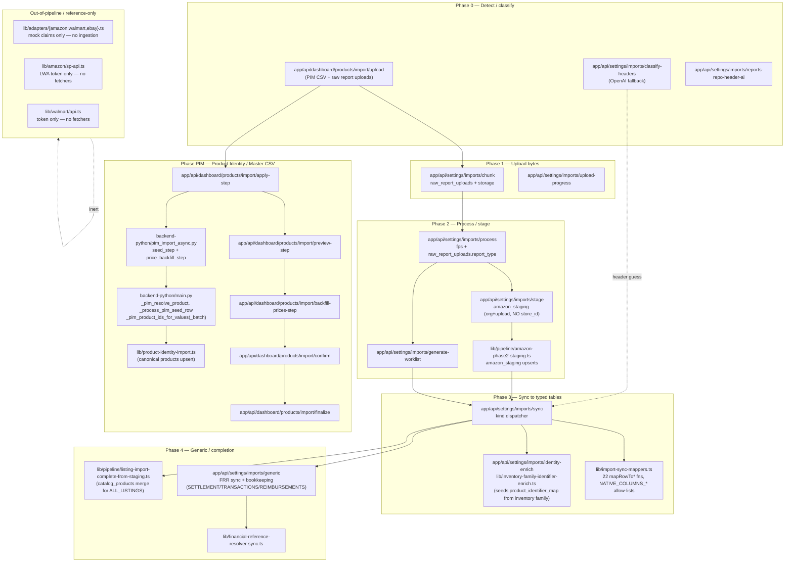
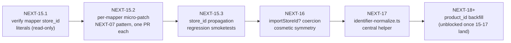

## NEXT-15 — Ingestion / writer surface audit (plan only)

Plan only. No edits, no migrations, no UPDATE/INSERT/DELETE/ALTER/CREATE/DROP. No product_id, no resolver writes, no identifier-map mutation, no upload_id type change, no schema rewrite, no expected/pallets/packages changes.

---

## A. Complete ingestion architecture map



The two parallel intake routes are the **raw-report import** (Phase 0–4) and the **PIM CSV import** (PIM phase). They share `raw_report_uploads` as the single intake row but never share staging or typed-table writes. There is **no live API ingestion** — adapters and SP-API are auth/mock only (NEXT-05, NEXT-12 confirmed).

---

## B. Every importer path

### B.1 Raw report ingestion (Amazon files)

| Phase | Endpoint | File | Touches |
|---|---|---|---|
| 0 detect | `POST classify-headers` | [`app/api/settings/imports/classify-headers/route.ts`](app/api/settings/imports/classify-headers/route.ts) | OpenAI fallback only |
| 0 detect | `POST reports-repo-header-ai` | [`app/api/settings/imports/reports-repo-header-ai/route.ts`](app/api/settings/imports/reports-repo-header-ai/route.ts) | reports_repository header AI |
| 1 upload | `POST chunk` | [`app/api/settings/imports/chunk/route.ts`](app/api/settings/imports/chunk/route.ts) | `raw_report_uploads`, storage |
| 1 upload | `GET upload-progress` | [`app/api/settings/imports/upload-progress/route.ts`](app/api/settings/imports/upload-progress/route.ts) | `file_processing_status` read |
| 2 process | `POST process` | [`app/api/settings/imports/process/route.ts`](app/api/settings/imports/process/route.ts) | `raw_report_uploads.report_type`, `file_processing_status` |
| 2 stage | `POST stage` | [`app/api/settings/imports/stage/route.ts`](app/api/settings/imports/stage/route.ts) | `amazon_staging` (org+upload, **no store_id by design**) |
| 2 stage | (lib) | [`lib/pipeline/amazon-phase2-staging.ts`](lib/pipeline/amazon-phase2-staging.ts) | `amazon_staging` upserts; key `(organization_id, upload_id, row_number)` |
| 2 worklist | `POST generate-worklist` | [`app/api/settings/imports/generate-worklist/route.ts`](app/api/settings/imports/generate-worklist/route.ts) | per-kind worklist |
| 3 sync | `POST sync` | [`app/api/settings/imports/sync/route.ts`](app/api/settings/imports/sync/route.ts) | dispatches to 22+ mappers in [`lib/import-sync-mappers.ts`](lib/import-sync-mappers.ts) |
| 3 enrich | `POST identity-enrich` | [`app/api/settings/imports/identity-enrich/route.ts`](app/api/settings/imports/identity-enrich/route.ts), [`lib/inventory-family-identifier-enrich.ts`](lib/inventory-family-identifier-enrich.ts) | seeds `product_identifier_map` from inventory family rows |
| 4 generic | `POST generic` | [`app/api/settings/imports/generic/route.ts`](app/api/settings/imports/generic/route.ts) | FRR sync + bookkeeping (SETTLEMENT/TRANSACTIONS/REIMBURSEMENTS) |
| 4 listing | (lib) | [`lib/pipeline/listing-import-complete-from-staging.ts`](lib/pipeline/listing-import-complete-from-staging.ts) | `catalog_products` merge for ALL_LISTINGS |
| 4 FRR | (lib) | [`lib/financial-reference-resolver-sync.ts`](lib/financial-reference-resolver-sync.ts) | FRR upserts (frozen post-NEXT-11) |

### B.2 PIM (product master) ingestion

| Phase | Endpoint | File | Touches |
|---|---|---|---|
| upload | `POST upload` | [`app/api/dashboard/products/import/upload/route.ts`](app/api/dashboard/products/import/upload/route.ts) | `raw_report_uploads` (PRODUCT_IDENTITY) |
| sessions | `POST sessions` + `[sessionId]` | [`app/api/dashboard/products/import/sessions/...`](app/api/dashboard/products/import/sessions) | `pim_import_sessions` |
| preview | `POST preview-step` | [`app/api/dashboard/products/import/preview-step/route.ts`](app/api/dashboard/products/import/preview-step/route.ts) | `product_identity_staging_rows` (read-only resolver lookups via Python) |
| apply | `POST apply-step` | [`app/api/dashboard/products/import/apply-step/route.ts`](app/api/dashboard/products/import/apply-step/route.ts) | `products`, `product_identifier_map` (via Python) |
| backfill prices | `POST backfill-prices-step` | [`app/api/dashboard/products/import/backfill-prices-step/route.ts`](app/api/dashboard/products/import/backfill-prices-step/route.ts) | `product_prices` (via Python) |
| retry | `POST retry-preview` + sessions sub-route | (per-session retry handlers) | re-runs preview |
| finalize | `POST finalize` | [`app/api/dashboard/products/import/finalize/route.ts`](app/api/dashboard/products/import/finalize/route.ts) | session close |
| confirm | `POST confirm` | [`app/api/dashboard/products/import/confirm/route.ts`](app/api/dashboard/products/import/confirm/route.ts) | session-confirmation transition |
| cancel | `POST cancel` + `[sessionId]/cancel` | (cancel handlers) | session abort |
| delete | `POST delete` | (delete handler) | session delete |
| reset | `POST reset` | (reset handler) | session reset |
| status | `GET status` | (status handler) | read-only |
| Python | (FastAPI) | [`backend-python/main.py`](backend-python/main.py), [`backend-python/pim_import_async.py`](backend-python/pim_import_async.py), [`backend-python/pim_product_master.py`](backend-python/pim_product_master.py), [`backend-python/pim_seed_cleaning.py`](backend-python/pim_seed_cleaning.py), [`backend-python/pim_import_session_db.py`](backend-python/pim_import_session_db.py) | resolvers, seed processors, async session machinery |

### B.3 Adapter / API ingestion (currently inert)

- [`lib/adapters/amazon.ts`](lib/adapters/amazon.ts), [`lib/adapters/walmart.ts`](lib/adapters/walmart.ts), [`lib/adapters/ebay.ts`](lib/adapters/ebay.ts) — **mock claim generators only**, no ingestion writes.
- [`lib/adapters/factory.ts`](lib/adapters/factory.ts), [`lib/adapters/configs.ts`](lib/adapters/configs.ts), [`lib/adapters/base.ts`](lib/adapters/base.ts) — adapter registry, no ingestion.
- [`lib/amazon/sp-api.ts`](lib/amazon/sp-api.ts) — LWA token endpoint only; **no `reports/2021-06-30` or `orders/v0` callers**.
- [`lib/walmart/api.ts`](lib/walmart/api.ts) — token only.

There is no Walmart, Shopify, or eBay ingestion path. No SP-API ingestion path. All non-CSV ingestion is design-future.

---

## C. Mapper / sync inventory

### C.1 Amazon raw mappers (in [`lib/import-sync-mappers.ts`](lib/import-sync-mappers.ts))

22 exported `mapRowTo*` functions; status reflects which prior NEXT patch verified each:

| Mapper | Line | Target table | Resolver convention | `importStoreId` accepted? | NATIVE_COLUMNS includes `store_id`? | Verified by |
|---|---|---|---|---|---|---|
| `mapRowToExpectedReturn` | 778 | `expected_returns` | none | n/a (no store_id in target) | n/a | – |
| `mapRowToExpectedPackage` | 830 | `expected_packages` | none | n/a | varies | – |
| `mapRowToExpectedRemoval` | 854 | `expected_removals` | none | n/a | n/a | – |
| `mapRowToProductFromLedger` | 883 | `products` (canonical, server) | n/a (writes products) | yes | yes | – (separate path) |
| `mapRowToCatalogProduct` | 1040 | `catalog_products` | n/a (resolver target itself) | yes | yes | – |
| `mapRowToAmazonReturn` | 1131 | `amazon_returns` | none | yes (`importStoreId!`) | yes | NEXT-15 to verify |
| `mapRowToAmazonRemovalShipment` | 1285 | `amazon_removal_shipments` | none | yes | yes | NEXT-15 to verify |
| `mapRowToAmazonRemoval` | 1357 | `amazon_removals` | none | yes (`importStoreId!`) | yes | NEXT-15 to verify |
| `mapRowToAmazonInventoryLedger` | 1470 | `amazon_inventory_ledger` | resolved | yes (`importStoreId!`) | yes | NEXT-15 to verify (writer not in NEXT-04/06/07) |
| `mapRowToAmazonReimbursement` | 1641 | `amazon_reimbursements` | none | yes (`importStoreId!`) | yes | NEXT-15 to verify |
| `mapRowToAmazonSettlementTxtFlat` | 1775 | (private delegate) | resolved | yes (NEXT-07) | yes | **NEXT-07 ✓** |
| `mapRowToAmazonSettlementLegacyCsv` | 1834 | (private delegate) | resolved | yes (NEXT-07) | yes | **NEXT-07 ✓** |
| `mapRowToAmazonSettlement` | 1971 | `amazon_settlements` | resolved | yes (NEXT-07) | yes | **NEXT-07 ✓** |
| `mapRowToAmazonSafetClaim` | 2008 | `amazon_safet_claims` | none | yes (`importStoreId!`) | yes | NEXT-15 to verify |
| `mapRowToAmazonTransaction` | 2057 | `amazon_transactions` | resolved | yes (NEXT-06) | yes (NEXT-06 added "store_id" to NATIVE_COLUMNS_TRANSACTIONS) | **NEXT-06 ✓** |
| `mapRowToAmazonReportsRepository` | 2256 | `amazon_reports_repository` | canonical (`product_id`) | yes (NEXT-04) | yes | **NEXT-04 ✓** |
| `mapRowToAmazonAllOrders` | 2427 | `amazon_all_orders` | resolved | yes | yes | NEXT-15 to verify |
| `mapRowToAmazonRawArchive` | 2480 | `amazon_replacements`, `amazon_fba_grade_and_resell`, `amazon_reserved_inventory` (dispatcher) | none | yes | yes | NEXT-15 to verify |
| `mapRowToAmazonManageFbaInventory` | 2602 | `amazon_manage_fba_inventory` | resolved | yes | yes | NEXT-15 to verify |
| `mapRowToAmazonFbaInventory` | 2731 | `amazon_fba_inventory` | resolved | yes | yes | NEXT-15 to verify |
| `mapRowToAmazonInboundPerformance` | 2848 | `amazon_inbound_performance` | none | yes | yes | NEXT-15 to verify |
| `mapRowToAmazonAmazonFulfilledInventory` | 2909 | `amazon_amazon_fulfilled_inventory` | resolved | yes | yes | NEXT-15 to verify (identity carrier — high priority) |

Sync dispatch is centralized in [`app/api/settings/imports/sync/route.ts:951-2096`](app/api/settings/imports/sync/route.ts) and passes `(mappedRow, orgId, uploadId, importStoreId)` for every kind. All call-sites already provide `importStoreId`; **the only remaining risk is whether each mapper actually puts `store_id` on the returned object body** (analogous to the NEXT-07 / NEXT-06 fixes). NEXT-15 verification = read each `mapRowToAmazon*` function and confirm `store_id: importStoreId ?? null` is in the return literal.

### C.2 Pipeline modules

- [`lib/pipeline/amazon-report-registry.ts`](lib/pipeline/amazon-report-registry.ts) — single source of truth for `AmazonSyncKind` + per-kind targets.
- [`lib/pipeline/amazon-phase2-staging.ts`](lib/pipeline/amazon-phase2-staging.ts) — `amazon_staging` upserts; key `(organization_id, upload_id, row_number)`. **Intentionally no store_id** (staging is org+upload only).
- [`lib/pipeline/listing-import-complete-from-staging.ts`](lib/pipeline/listing-import-complete-from-staging.ts) — listing finalisation; correctly passes `import_store_id` from `raw_report_uploads.metadata`.
- [`lib/pipeline/amazon-import-engine-log.ts`](lib/pipeline/amazon-import-engine-log.ts), [`amazon-removals-business-key.ts`](lib/pipeline/amazon-removals-business-key.ts), [`amazon-sync-batch-metrics.ts`](lib/pipeline/amazon-sync-batch-metrics.ts), [`removal-shipment-archive-key.ts`](lib/pipeline/removal-shipment-archive-key.ts), [`import-phase-labels.ts`](lib/pipeline/import-phase-labels.ts), [`file-processing-status-contract.ts`](lib/pipeline/file-processing-status-contract.ts), [`unified-import-pipeline.ts`](lib/pipeline/unified-import-pipeline.ts) — supporting infra; check whether `unified-import-pipeline.ts` has live callers (file is empty in greps for `mapRowTo|importStoreId|orgId` — likely **dead-code candidate**, see section D).

### C.3 Sync workers / completion

- [`lib/financial-reference-resolver-sync.ts`](lib/financial-reference-resolver-sync.ts) — frozen post-NEXT-11.
- [`lib/reports-repository-generic-completion.ts`](lib/reports-repository-generic-completion.ts) — bookkeeping only.
- [`lib/inventory-family-identifier-enrich.ts`](lib/inventory-family-identifier-enrich.ts) — seeds `product_identifier_map`. Section H discusses normalization placement.
- [`lib/product-identity-import.ts`](lib/product-identity-import.ts) — canonical `products` upsert path used by PIM.
- [`lib/import-listing-canonical-sync.ts`](lib/import-listing-canonical-sync.ts), [`lib/import-listing-physical-lines.ts`](lib/import-listing-physical-lines.ts), [`lib/import-raw-report-stream.ts`](lib/import-raw-report-stream.ts), [`lib/import-actor.ts`](lib/import-actor.ts), [`lib/import-file-analysis.ts`](lib/import-file-analysis.ts), [`lib/import-file-row-total.ts`](lib/import-file-row-total.ts), [`lib/import-removal-shipment-ui.ts`](lib/import-removal-shipment-ui.ts), [`lib/import-returns-csv-map.ts`](lib/import-returns-csv-map.ts), [`lib/import-upload-progress.ts`](lib/import-upload-progress.ts), [`lib/imports-types.ts`](lib/imports-types.ts) — supporting libraries.

### C.4 Backend Python ingestion

- [`backend-python/main.py`](backend-python/main.py) — PIM resolvers (`_pim_resolve_product`, `_pim_product_ids_for_values`, `_pim_product_ids_for_values_batch`, `_process_pim_seed_row`). Guarded post-PATCH-01 / NEXT-02b.
- [`backend-python/pim_import_async.py`](backend-python/pim_import_async.py) — async session machinery; `seed_step`, `price_backfill_step`.
- [`backend-python/pim_product_master.py`](backend-python/pim_product_master.py) — product master CSV processing.
- [`backend-python/pim_seed_cleaning.py`](backend-python/pim_seed_cleaning.py) — seed normalization.
- [`backend-python/pim_import_session_db.py`](backend-python/pim_import_session_db.py) — session DB I/O.
- [`backend-python/verify_patch01.py`](backend-python/verify_patch01.py) — local isolation verifier.

---

## D. Gap analysis

### D.1 organization_id propagation

- All mapper signatures take `orgId: string` as the second positional param. **No gaps.** `amazon_staging` upsert filter uses `organization_id` ([`lib/pipeline/amazon-phase2-staging.ts:42-45`](lib/pipeline/amazon-phase2-staging.ts)).
- Python PIM resolvers all require `organization_id` (PATCH-01 enforces).
- Adapters receive `orgId` via the API key context.

### D.2 store_id propagation (the active risk surface)

- Sync route `app/api/settings/imports/sync/route.ts` passes `importStoreId` to **every** mapper call. The NEXT-04/06/07 patches verified the target tables that initially dropped `store_id` (`amazon_reports_repository`, `amazon_transactions`, `amazon_settlements`).
- For the remaining mappers (`mapRowToAmazonInventoryLedger`, `mapRowToAmazonReimbursement`, `mapRowToAmazonReturn`, `mapRowToAmazonRemoval`, `mapRowToAmazonRemovalShipment`, `mapRowToAmazonSafetClaim`, `mapRowToAmazonAllOrders`, `mapRowToAmazonRawArchive`, `mapRowToAmazonManageFbaInventory`, `mapRowToAmazonFbaInventory`, `mapRowToAmazonInboundPerformance`, `mapRowToAmazonAmazonFulfilledInventory`), **NEXT-15 must read each function body and confirm**: (a) the function accepts `importStoreId`, (b) returns `store_id: importStoreId ?? null` in the row literal, (c) `NATIVE_COLUMNS_*` includes `"store_id"`. All NATIVE_COLUMNS sets confirmed in NEXT-13 / NEXT-14A audits to include `store_id`; the unverified piece is the per-mapper return literal.
- `amazon_inventory_ledger` is the highest-priority mapper to verify because NEXT-14D's future-row sanity flagged it as not yet covered by an explicit NEXT-07-equivalent patch. If section F's confirmation query shows non-zero NULL store_id on new ledger rows post-NEXT-14D, the mapper drop has to be the cause.
- `amazon_staging` deliberately has no `store_id` (per [`lib/pipeline/amazon-phase2-staging.ts:45`](lib/pipeline/amazon-phase2-staging.ts)). **Not a gap; intentional contract.** Store attribution lives on the typed-table row, never the staging row.
- PIM Python: all `_process_pim_seed_row` calls now require valid org+store (PATCH-01).

### D.3 upload linkage propagation

- Raw-report intake writes `raw_report_uploads.id` (uuid). Most typed tables FK to it via `upload_id` (uuid) or `source_upload_id` (uuid).
- `amazon_reports_repository.upload_id` is **text** (NEXT-14B). The sync writer stores the uuid as text successfully (round-trip works); the discrepancy is a column-type debt, not a propagation gap. **Do not fix in NEXT-15.**
- `amazon_staging.upload_id` is uuid; `amazon_ledger_staging.source_upload_id` was renamed in [`supabase/migrations/20260425_rename_source_upload_id.sql`](supabase/migrations/20260425_rename_source_upload_id.sql). No active gap.
- Listing finalisation passes the `import_store_id` correctly (NEXT-04 verified).
- PIM apply-step uses `upload_id` (uuid).

### D.4 Resolver-safe identifiers

- Inventory family enrichment ([`lib/inventory-family-identifier-enrich.ts`](lib/inventory-family-identifier-enrich.ts)) seeds `product_identifier_map` from inventory rows. Identifier normalisation (`btrim`, `nullif`, length checks) is applied at seed time. Reading-side in [`backend-python/main.py`](backend-python/main.py) `_pim_*` lookups also normalises (lower / strip).
- The Phase-3 sync writes do **not** normalise SKU / ASIN / FNSKU before persisting in `amazon_*` typed tables — they pass through whatever the mapper extracted from the CSV row. Section H proposes pinning normalisation in a single helper.

### D.5 Dead-code candidates (mark only — do not remove)

- [`lib/pipeline/unified-import-pipeline.ts`](lib/pipeline/unified-import-pipeline.ts) — search for any `mapRowTo|importStoreId|orgId` references returned 0 in greps. Likely an aborted refactor scaffold. **Mark: review later.**
- [`lib/adapters/walmart.ts`](lib/adapters/walmart.ts), [`lib/adapters/ebay.ts`](lib/adapters/ebay.ts) — mock-only generators. Not dead but inert. **Mark: keep until SP-API / Walmart-SP design.**
- [`lib/amazon/sp-api.ts`](lib/amazon/sp-api.ts) — LWA token only. **Mark: keep**, it's the foundation for any future SP-API fetcher.
- [`scripts/run-settlement-generic-once.ts`](scripts/run-settlement-generic-once.ts) — operator one-off; **mark: keep** for reference but not part of the live pipeline.
- [`scripts/wave1_sync_steps.js`](scripts/wave1_sync_steps.js) — historical artifact; **mark: candidate for deprecation later**.
- The dual `expected_packages` CREATE migrations ([`20260420_*`](supabase/migrations/20260420_import_detected_type_expected_sync.sql) vs [`20260427_*`](supabase/migrations/20260427_expected_packages_removal_orders.sql)) — flagged in NEXT-14A. **Mark: review later.**

### D.6 Duplicated sync logic

- The sync dispatcher is a long if/else ladder in `app/api/settings/imports/sync/route.ts:1990-2097`. Each kind has a near-identical pattern: call mapper, attach physical-row identity, push to insert array. **Not duplicate logic per se — just verbose dispatch.** Refactor would be cosmetic and is **not** in NEXT-15 scope.
- Settlement has three mappers (`mapRowToAmazonSettlement` is a dispatcher to `*TxtFlat` / `*LegacyCsv`). Justified by file-format polymorphism; not a duplicate.

### D.7 Inconsistent naming

- `upload_id` vs `source_upload_id` split (NEXT-14A section B). Historic. Recommended fix: forward-only adoption of `source_upload_id` for new tables; never rename existing columns.
- `mapRowToAmazonAmazonFulfilledInventory` (double-Amazon) — quirky but matches table name `amazon_amazon_fulfilled_inventory`. **Keep**; consistency wins over aesthetics here.
- `expected_*` naming conventions (`raw_row` vs `raw_data`) and `upload_id` vs `source_upload_id` differ across files in this family. Documented in NEXT-14A. **Mark: review later.**

### D.8 Unsafe assumptions in current code

- `importStoreId!` non-null assertion at multiple call sites (`FBA_RETURNS`, `REMOVAL_ORDER`, `INVENTORY_LEDGER`, `REIMBURSEMENTS`, `SAFET_CLAIMS`, `TRANSACTIONS` in [`app/api/settings/imports/sync/route.ts:2005,2007,2025,2030,2041,2043`](app/api/settings/imports/sync/route.ts)). The non-null bang means the caller has guaranteed `importStoreId` is set elsewhere (via [`app/api/settings/imports/sync/route.ts:1661`](app/api/settings/imports/sync/route.ts) — `if (kind !== "REPORTS_REPOSITORY" && !importStoreId)` early-return). Functionally correct, but the assertion is a smell: a future kind added to the registry without updating the early-return guard could pass `undefined` to a mapper with `!`. **Mitigation suggestion (plan only):** convert all mappers to `importStoreId?: string | null` and have the body coerce to null — symmetric with `SETTLEMENT` / `REPORTS_REPOSITORY` which already do this. Defer to NEXT-16.
- `amazon_reports_repository.upload_id` is text. Joins from FRR / future readers must cast (`r.id::text`). Don't change type. **Mark: review later.**
- ASIN values in `raw_data` JSONB (settlements / transactions / reports_repository). Phase-2 recoverability path. Section H discusses where to centralise.

---

## E. Files likely to need future patches (read-only inventory; no edits)

Listed by section, in priority order. Each is a **candidate** for a future small patch; nothing is changed in NEXT-15.

### E.1 Mapper store_id verification (one-line spot checks per function)

- [`lib/import-sync-mappers.ts`](lib/import-sync-mappers.ts) for each of: `mapRowToAmazonInventoryLedger`, `mapRowToAmazonReimbursement`, `mapRowToAmazonReturn`, `mapRowToAmazonRemoval`, `mapRowToAmazonRemovalShipment`, `mapRowToAmazonSafetClaim`, `mapRowToAmazonAllOrders`, `mapRowToAmazonRawArchive`, `mapRowToAmazonManageFbaInventory`, `mapRowToAmazonFbaInventory`, `mapRowToAmazonInboundPerformance`, `mapRowToAmazonAmazonFulfilledInventory`. Each is a NEXT-07-equivalent micro-patch if the function currently does not include `store_id: importStoreId ?? null` in its returned literal.

### E.2 Sync route call-site cleanups (cosmetic, defer)

- [`app/api/settings/imports/sync/route.ts:2005,2007,2025,2030,2041,2043`](app/api/settings/imports/sync/route.ts) — replace `importStoreId!` with `importStoreId ?? null` after E.1 makes mappers symmetric.

### E.3 Identifier normalization centralisation

- New helper file (e.g. `lib/identifier-normalize.ts`) as the single source of `normalizeSku`, `normalizeAsin`, `normalizeFnsku`, `normalizeUpc`. Currently inlined in [`lib/inventory-family-identifier-enrich.ts`](lib/inventory-family-identifier-enrich.ts), [`lib/product-identity-import.ts`](lib/product-identity-import.ts), [`backend-python/main.py`](backend-python/main.py) (Python side). Extract once, then import from both TS sites and mirror in Python. Defer to NEXT-17.

### E.4 PIM resolver Python file

- [`backend-python/main.py`](backend-python/main.py) — already PATCH-01 / NEXT-02b guarded. Future product_id backfill (NEXT-13 family) will reuse `_pim_resolve_product`. **No NEXT-15 change.**

### E.5 Reports-repository upload_id type debt (do not change)

- [`supabase/migrations/20260509_amazon_reports_repository.sql:7`](supabase/migrations/20260509_amazon_reports_repository.sql) declares `upload_id uuid`. NEXT-14B confirmed live type is `text`. The repo migration and live DB diverged out of band. **Do not reconcile in NEXT-15** — too many readers. Tracked in NEXT-14A.

---

## F. Recommended safest implementation order



Per-table priority for NEXT-15.2 (smallest to largest blast radius, identity carriers first):

1. `mapRowToAmazonAmazonFulfilledInventory` — identity carrier; lowest risk if patched.
2. `mapRowToAmazonInventoryLedger` — flagged by NEXT-14D follow-up; biggest historical NULL surface.
3. `mapRowToAmazonReimbursement` — small dataset, simple shape.
4. `mapRowToAmazonReturn`, `mapRowToAmazonRemoval`, `mapRowToAmazonRemovalShipment` — returns / removals family; tightly coupled but each mapper independent.
5. `mapRowToAmazonSafetClaim`, `mapRowToAmazonInboundPerformance` — secondary report families.
6. `mapRowToAmazonManageFbaInventory`, `mapRowToAmazonFbaInventory` — large FBA reports; safer last because the regression surface is biggest.
7. `mapRowToAmazonAllOrders` — biggest single dataset; do last.
8. `mapRowToAmazonRawArchive` (dispatcher to replacements / fba_grade / reserved_inventory) — three sub-targets; last.

Each entry above is a NEXT-07-equivalent micro-patch with: signature change, `store_id: importStoreId ?? null` in return literal, paired smoketest in `scripts/`, `tsc` + `eslint` clean. **No NEXT-15 implementation.**

---

## G. Resolver hooks priority (which imports get them first)

A "resolver hook" is the call that, post-NEXT-15.2, will populate `resolved_product_id` (or canonical `product_id` for `amazon_reports_repository`) on a row using `pickBestProductIdentifierMatch` against `product_identifier_map`. This is a **NEXT-18+** concern; NEXT-15 only sequences it.

Recommended order:

1. **`amazon_amazon_fulfilled_inventory`** — identity carrier; cleanest sku+fnsku+asin trio; highest match rate per NEXT-13 audits.
2. **`amazon_inventory_ledger`** — same identifier surface, large historical dataset.
3. **`amazon_manage_fba_inventory`**, **`amazon_fba_inventory`** — full identifier surface.
4. **`amazon_all_orders`** — sku-only resolution; ASIN in raw_data.
5. **`amazon_settlements`**, **`amazon_transactions`** — sku-only; transactions also has the all_orders order_id join recovery path.
6. **`amazon_reports_repository`** — sku-only; canonical convention; ship last because it crosses into the canonical FK column.

Convention pinning: tables 1–5 get `resolved_product_id`; only `amazon_reports_repository` writes canonical `product_id`. NEXT-14A documented this; NEXT-15 confirms it remains intact.

---

## H. Where normalized identifier extraction should live

Recommendation: a single shared helper exposed from `lib/identifier-normalize.ts` with these exports (names indicative; exact API decided in NEXT-17):

```ts
export function normalizeSku(s: unknown): string | null;
export function normalizeAsin(s: unknown): string | null;     // returns null on B-prefix-uppercase rule
export function normalizeFnsku(s: unknown): string | null;    // X-prefix; uppercase
export function normalizeUpc(s: unknown): string | null;      // 8/12/13/14-digit; checksum optional
export function normalizeProductName(s: unknown): string | null; // for display/log only, never resolver key
```

Used by:

- Mappers in [`lib/import-sync-mappers.ts`](lib/import-sync-mappers.ts) — replace inline `String(v).trim().toUpperCase()` with the helper.
- [`lib/inventory-family-identifier-enrich.ts`](lib/inventory-family-identifier-enrich.ts) — already does most of this; consolidate.
- [`lib/product-identity-import.ts`](lib/product-identity-import.ts) — same.
- Python: mirror as `backend-python/identifier_normalize.py` or extend [`backend-python/pim_seed_cleaning.py`](backend-python/pim_seed_cleaning.py). The Python file already implements these; pin the rules to be byte-identical with the TS helper.

**Why centralise?** `pim_ui_label_invalid` ([`supabase/migrations/20260718120000_pim_catalog_hub_facets_and_group_stats.sql`](supabase/migrations/20260718120000_pim_catalog_hub_facets_and_group_stats.sql)) already encodes some of these rules in SQL. Three implementations (TS / Python / SQL) drifting is the textbook way to introduce resolver-write inconsistencies. NEXT-17 unifies.

---

## I. How API ingestion should later integrate (design sketch)

When SP-API / Walmart-SP / Shopify ingestion ships, the safest pattern is:

1. **Synthetic `raw_report_uploads`** — every API pull writes a row with `report_type = 'API:<source>:<endpoint>'`, `metadata = { import_store_id, source_url, request_params }`, and a synthetic `source_file_sha256` (e.g. hash of normalized response).
2. **Reuse Phase 2/3** — convert API responses into the same row shape that the staged CSV produces; insert into `amazon_staging` with the same `(organization_id, upload_id, row_number)` key. Sync (Phase 3) then runs unchanged.
3. **No fork in mappers** — each `mapRowToAmazon*` continues to consume `Record<string, string>`. The transformer that produces the synthetic CSV-shape is per-source ([`lib/adapters/<source>/to-row.ts`](lib/adapters)).
4. **Identifier normalization** — runs in the per-source transformer and mirrors `lib/identifier-normalize.ts`.
5. **Resolver hook** — runs after sync, identical to CSV path.

Out-of-scope for NEXT-15. Pre-condition: all 22 mappers must have verified `store_id` propagation (sections D / E / F) before any API path is wired in, otherwise API rows will silently regress what NEXT-04/06/07/14D fixed.

---

## J. Dangerous areas before product_id phase

In the order they would bite if ignored:

1. **Mapper return-literal verification (section D.2 / E.1).** Any mapper that accepts `importStoreId` but doesn't put `store_id` in the returned literal will silently produce NULL `store_id` on every new row. Identical to the bug NEXT-06/NEXT-07 fixed for transactions and settlements; we have not proven the absence of this bug for the remaining 12 mappers. **Verify before any product_id patch.**
2. **`importStoreId!` non-null bang (section D.8).** A new kind added to the registry without the early-return guard would silently pass `undefined` to a `!`-asserting mapper. **Mitigate via NEXT-16 symmetric coercion.**
3. **Inventory ledger writer (NEXT-14D follow-up).** Even with NEXT-14D's historical attribution complete, future ledger rows may continue to land with NULL `store_id` if its mapper isn't on the section F list above. The first signal will be NEXT-14D's `F-confirm-future` query showing `rows_store_null_other_uploads > 0`.
4. **Identifier normalization drift (section D.4 / H).** TS, Python, and SQL each have their own rules for what an "active" SKU / ASIN / FNSKU is. A product_id backfill that uses one normalization while the live writers use another will create a permanent diff between historical resolved rows and live resolved rows. **Centralise before backfill.**
5. **Reports-repository upload_id type debt (D.3 / E.5).** Any join from a future product_id backfill against `amazon_reports_repository.upload_id` must remember the text comparison. A migration-side ALTER would touch every reader. **Don't change; document.**
6. **`amazon_staging` is intentionally store-blind.** A future contributor might "fix" this by adding `store_id` to staging. The staging contract is `(organization_id, upload_id, row_number)`; `store_id` belongs on the typed-table row, not staging. **Document this invariant in [`lib/pipeline/amazon-phase2-staging.ts`](lib/pipeline/amazon-phase2-staging.ts) header before NEXT-18.**
7. **FRR is frozen.** Per NEXT-11, no FRR write change. A product_id backfill that joins through FRR for context **must** use the read-side recovery join, never patch FRR's writer.
8. **PIM resolver guards.** PATCH-01 / NEXT-02b are in force; do not regress. Any new caller of `_pim_resolve_product` / `_pim_product_ids_for_values(_batch)` must pass valid org+store UUIDs.
9. **`expected_packages` dual schema.** NEXT-14A flagged; NEXT-14B confirmed the live shape has `store_id + upload_id` already populated. A future contributor reading the wrong CREATE migration could regress this. **Section J reiterates: do not touch.**
10. **`product_identifier_map` active filter.** Every read must include `WHERE deleted_at IS NULL`. A backfill that forgets this will resolve to soft-deleted bridge rows.

---

## Constraints recap (still in force; do not violate in any sub-prompt)

- No code edits.
- No migrations.
- No schema change.
- No `upload_id` type conversion.
- No `product_id` writes.
- No `product_identifier_map` mutations.
- No deletions.
- No expected_packages / pallets / packages changes.
- No FRR writer change.
- No API ingestion implementation.
- No SP-API / Walmart / Shopify ingestion path activation.
- No removal of "dead" code; mark only.

Plan only. No edits.