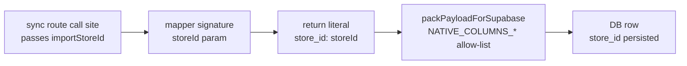

## NEXT-15.1 — Verify store_id propagation in 12 unverified mappers (read-only)

Plan only. No edits. No migrations. No SQL. No schema change. No `product_id` writes. No `product_identifier_map` mutations. No deletions. No refactors. No patch implementations. The verification consisted entirely of reading [`lib/import-sync-mappers.ts`](lib/import-sync-mappers.ts) and [`app/api/settings/imports/sync/route.ts`](app/api/settings/imports/sync/route.ts).

---

### Verification rubric

A break at any link silently nulls `store_id` on insert. NEXT-04 / NEXT-06 / NEXT-07 each fixed a different break (literal missing for SETTLEMENT and REPORTS_REPOSITORY; allow-list missing for TRANSACTIONS).

**Naming note for column D:** none of the mappers names its parameter `importStoreId`; every one names it `storeId` and the sync route passes `importStoreId` (or its REMOVAL_SHIPMENT-scope sibling resolved from metadata) positionally as the 4th argument. Column D is therefore answered "yes" wherever the 4th positional parameter exists and is plumbed into the row literal.

---

### Per-mapper findings (A–K)

#### 1. mapRowToAmazonInventoryLedger

- **A. Function name:** `mapRowToAmazonInventoryLedger`
- **B. Target table:** `amazon_inventory_ledger`
- **C. Function signature:** `(row: Record<string, string>, orgId: string, uploadId: string, storeId: string): AmazonInventoryLedgerInsert | null`
- **D. Accepts importStoreId (positionally):** **YES** — 4th param `storeId: string`
- **E. Returned object includes `store_id`:** **YES** — both return paths
- **F. Exact expression used:** `store_id: storeId,` (line 1512, CSV path) and `store_id: storeId,` (line 1596, TXT/positional path)
- **G. NATIVE_COLUMNS_LEDGER includes `"store_id"`:** **YES** (line 184)
- **H. Sync route passes importStoreId:** **YES** — line 2025: `mapRowToAmazonInventoryLedger(mappedRow, orgId, uploadId, importStoreId!)` (the sibling sub-path at line 2016 calls `mapLedgerPositionalRawRowToAmazonInventoryLedgerInsert(..., importStoreId!, …)` — that helper is internal to ledger ingestion and is not one of the 12 mappers under review here)
- **I. Patch needed:** **NO**
- **J. Risk level:** Low. Non-nullable `string` param relies on the early-return guard at [`app/api/settings/imports/sync/route.ts:1661`](app/api/settings/imports/sync/route.ts) for kinds other than REPORTS_REPOSITORY. NEXT-16 (cosmetic) would harden this by switching to `string | null`.
- **K. Refs:** [`lib/import-sync-mappers.ts:1470-1638`](lib/import-sync-mappers.ts) (signature 1470–1474, CSV literal 1512, TXT literal 1596); [`app/api/settings/imports/sync/route.ts:2009-2028`](app/api/settings/imports/sync/route.ts) (call sites)

#### 2. mapRowToAmazonReimbursement

- **A.** `mapRowToAmazonReimbursement`
- **B.** `amazon_reimbursements`
- **C.** `(row, orgId: string, uploadId: string, storeId: string): AmazonReimbursementInsert | null`
- **D.** **YES** — 4th param `storeId: string`
- **E.** **YES**
- **F.** `store_id: storeId,` (line 1653)
- **G.** `NATIVE_COLUMNS_REIMBURSEMENTS` includes `"store_id"` (line 201) — **YES**
- **H.** **YES** — line 2030: `mapRowToAmazonReimbursement(mappedRow, orgId, uploadId, importStoreId!)`
- **I.** **NO**
- **J.** Low (same `!` non-null bang pattern as #1; mitigated by NEXT-16)
- **K.** [`lib/import-sync-mappers.ts:1641-1665`](lib/import-sync-mappers.ts); [`app/api/settings/imports/sync/route.ts:2030`](app/api/settings/imports/sync/route.ts)

#### 3. mapRowToAmazonReturn

- **A.** `mapRowToAmazonReturn`
- **B.** `amazon_returns`
- **C.** `(row, orgId: string, uploadId: string, storeId: string): AmazonReturnInsert`
- **D.** **YES**
- **E.** **YES**
- **F.** `store_id: storeId,` (line 1142)
- **G.** `NATIVE_COLUMNS_RETURNS` includes `"store_id"` (line 151) — **YES**
- **H.** **YES** — line 2005: `mapRowToAmazonReturn(mappedRow, orgId, uploadId, importStoreId!)`
- **I.** **NO**
- **J.** Low (`!` bang pattern; NEXT-16 cosmetic)
- **K.** [`lib/import-sync-mappers.ts:1131-1154`](lib/import-sync-mappers.ts); [`app/api/settings/imports/sync/route.ts:2005`](app/api/settings/imports/sync/route.ts)

#### 4. mapRowToAmazonRemoval

- **A.** `mapRowToAmazonRemoval`
- **B.** `amazon_removals`
- **C.** `(row, orgId: string, uploadId: string, storeId: string): AmazonRemovalInsert | null`
- **D.** **YES**
- **E.** **YES**
- **F.** `store_id: storeId,` (line 1368)
- **G.** `NATIVE_COLUMNS_REMOVALS` includes `"store_id"` (line 160) — **YES**
- **H.** **YES** — line 2007: `mapRowToAmazonRemoval(mappedRow, orgId, uploadId, importStoreId!)`
- **I.** **NO**
- **J.** Low (`!` bang pattern; NEXT-16 cosmetic)
- **K.** [`lib/import-sync-mappers.ts:1357-1380`](lib/import-sync-mappers.ts); [`app/api/settings/imports/sync/route.ts:2007`](app/api/settings/imports/sync/route.ts)

#### 5. mapRowToAmazonRemovalShipment

- **A.** `mapRowToAmazonRemovalShipment`
- **B.** `amazon_removal_shipments`
- **C.** `(row, orgId: string, uploadId: string, storeId: string): AmazonRemovalInsert | null`
- **D.** **YES**
- **E.** **YES**
- **F.** `store_id: storeId,` (line 1332)
- **G.** Shares `NATIVE_COLUMNS_REMOVALS` (line 160) — **YES**
- **H.** **YES** but on a **separate dispatch path**. REMOVAL_SHIPMENT does not flow through the main `if (kind === ...)` ladder around line 2005. The mapper is called from the dedicated REMOVAL_SHIPMENT batch loop at line 952: `mapRowToAmazonRemovalShipment(mappedRow, orgId, uploadId, storeId)`, where the local `storeId` is resolved from `raw_report_uploads.metadata` at line 645 via `resolveImportStoreIdFromMetadata(params.metadata)` — i.e., the same value the main flow names `importStoreId`, just under a different local identifier in this scope.
- **I.** **NO**
- **J.** Low. Non-`!` plumbing here, but the value can in principle be `null` if the upload's `metadata.import_store_id` is missing; NEXT-15-foundational fixes ensure it is set. NEXT-15.4 (organization_id audit) and NEXT-15.5 (upload-linkage audit) should re-confirm this resolution helper's contract.
- **K.** [`lib/import-sync-mappers.ts:1285-1355`](lib/import-sync-mappers.ts); [`app/api/settings/imports/sync/route.ts:645`](app/api/settings/imports/sync/route.ts) (storeId resolution), [`app/api/settings/imports/sync/route.ts:952`](app/api/settings/imports/sync/route.ts) (call site)

#### 6. mapRowToAmazonSafetClaim

- **A.** `mapRowToAmazonSafetClaim`
- **B.** `amazon_safet_claims`
- **C.** `(row, orgId: string, uploadId: string, storeId: string): AmazonSafetClaimInsert | null`
- **D.** **YES**
- **E.** **YES**
- **F.** `store_id: storeId,` (line 2022)
- **G.** `NATIVE_COLUMNS_SAFET` includes `"store_id"` (line 263) — **YES**
- **H.** **YES** — line 2041: `mapRowToAmazonSafetClaim(mappedRow, orgId, uploadId, importStoreId!)`
- **I.** **NO**
- **J.** Low (`!` bang pattern; NEXT-16 cosmetic)
- **K.** [`lib/import-sync-mappers.ts:2008-2030`](lib/import-sync-mappers.ts); [`app/api/settings/imports/sync/route.ts:2041`](app/api/settings/imports/sync/route.ts)

#### 7. mapRowToAmazonAllOrders

- **A.** `mapRowToAmazonAllOrders`
- **B.** `amazon_all_orders`
- **C.** `(row, orgId: string, uploadId: string, storeId: string | null): AmazonAllOrdersInsert | null`
- **D.** **YES** (nullable)
- **E.** **YES**
- **F.** `store_id: storeId || null,` (line 2455)
- **G.** `NATIVE_COLUMNS_ALL_ORDERS` includes `"store_id"` (line 286) — **YES**
- **H.** **YES** — line 2083 multi-line call, 4th arg at line 2087: `importStoreId` (no `!`, no `?? null`)
- **I.** **NO**
- **J.** Lower (nullable signature already; no `!` bang; literal coerces `undefined → null`)
- **K.** [`lib/import-sync-mappers.ts:2427-2477`](lib/import-sync-mappers.ts); [`app/api/settings/imports/sync/route.ts:2083-2088`](app/api/settings/imports/sync/route.ts)

#### 8. mapRowToAmazonRawArchive (dispatcher)

- **A.** `mapRowToAmazonRawArchive`
- **B.** Five possible target tables (kind-dispatched): `amazon_replacements`, `amazon_fba_grade_and_resell`, `amazon_reserved_inventory`, `amazon_fee_preview`, `amazon_monthly_storage_fees`
- **C.** `(row, orgId: string, uploadId: string, storeId: string | null): AmazonRawArchiveInsert | null`
- **D.** **YES** (nullable)
- **E.** **YES**
- **F.** `store_id: storeId || null,` (line 2498)
- **G.** All 5 dispatch-target allow-lists include `"store_id"` — **YES** for each: `NATIVE_COLUMNS_REPLACEMENTS` (299), `NATIVE_COLUMNS_FBA_GRADE_AND_RESELL` (307), `NATIVE_COLUMNS_RESERVED_INVENTORY` (403), `NATIVE_COLUMNS_FEE_PREVIEW` (411), `NATIVE_COLUMNS_MONTHLY_STORAGE_FEES` (419)
- **H.** **YES** — line 2096: `mapRowToAmazonRawArchive(mappedRow, orgId, uploadId, importStoreId)` (covers REPLACEMENTS / FBA_GRADE_AND_RESELL / RESERVED_INVENTORY / FEE_PREVIEW / MONTHLY_STORAGE_FEES)
- **I.** **NO**
- **J.** Lower
- **K.** [`lib/import-sync-mappers.ts:2480-2520`](lib/import-sync-mappers.ts); [`app/api/settings/imports/sync/route.ts:2089-2096`](app/api/settings/imports/sync/route.ts)

#### 9. mapRowToAmazonManageFbaInventory

- **A.** `mapRowToAmazonManageFbaInventory`
- **B.** `amazon_manage_fba_inventory`
- **C.** `(row, orgId: string, uploadId: string, storeId: string | null): AmazonManageFbaInventoryInsert | null`
- **D.** **YES** (nullable)
- **E.** **YES**
- **F.** `store_id: storeId || null,` (line 2616)
- **G.** `NATIVE_COLUMNS_MANAGE_FBA_INVENTORY` includes `"store_id"` (line 321) — **YES**
- **H.** **YES** — line 2052 multi-line call, 4th arg at line 2056: `importStoreId`
- **I.** **NO**
- **J.** Lower
- **K.** [`lib/import-sync-mappers.ts:2602-2660`](lib/import-sync-mappers.ts); [`app/api/settings/imports/sync/route.ts:2051-2057`](app/api/settings/imports/sync/route.ts)

#### 10. mapRowToAmazonFbaInventory

- **A.** `mapRowToAmazonFbaInventory`
- **B.** `amazon_fba_inventory`
- **C.** `(row, orgId: string, uploadId: string, storeId: string | null): AmazonFbaInventoryInsert | null`
- **D.** **YES** (nullable)
- **E.** **YES**
- **F.** `store_id: storeId || null,` (line 2749)
- **G.** `NATIVE_COLUMNS_FBA_INVENTORY` includes `"store_id"` (line 345) — **YES**
- **H.** **YES** — line 2059 multi-line call, 4th arg at line 2063: `importStoreId`
- **I.** **NO**
- **J.** Lower
- **K.** [`lib/import-sync-mappers.ts:2731-2790`](lib/import-sync-mappers.ts); [`app/api/settings/imports/sync/route.ts:2058-2064`](app/api/settings/imports/sync/route.ts)

#### 11. mapRowToAmazonInboundPerformance

- **A.** `mapRowToAmazonInboundPerformance`
- **B.** `amazon_inbound_performance`
- **C.** `(row, orgId: string, uploadId: string, storeId: string | null): AmazonInboundPerformanceInsert | null`
- **D.** **YES** (nullable)
- **E.** **YES**
- **F.** `store_id: storeId || null,` (line 2866)
- **G.** `NATIVE_COLUMNS_INBOUND_PERFORMANCE` includes `"store_id"` (line 375) — **YES**
- **H.** **YES** — line 2066 multi-line call, 4th arg at line 2070: `importStoreId`
- **I.** **NO**
- **J.** Lower
- **K.** [`lib/import-sync-mappers.ts:2848-2900`](lib/import-sync-mappers.ts); [`app/api/settings/imports/sync/route.ts:2065-2071`](app/api/settings/imports/sync/route.ts)

#### 12. mapRowToAmazonAmazonFulfilledInventory

- **A.** `mapRowToAmazonAmazonFulfilledInventory`
- **B.** `amazon_amazon_fulfilled_inventory`
- **C.** `(row, orgId: string, uploadId: string, storeId: string | null): AmazonAmazonFulfilledInventoryInsert | null`
- **D.** **YES** (nullable)
- **E.** **YES**
- **F.** `store_id: storeId || null,` (line 2923)
- **G.** `NATIVE_COLUMNS_AMAZON_FULFILLED_INVENTORY` includes `"store_id"` (line 391) — **YES**
- **H.** **YES** — line 2073 multi-line call, 4th arg at line 2077: `importStoreId`
- **I.** **NO**
- **J.** Lower
- **K.** [`lib/import-sync-mappers.ts:2909-2935`](lib/import-sync-mappers.ts); [`app/api/settings/imports/sync/route.ts:2072-2078`](app/api/settings/imports/sync/route.ts)

---

### Summary table (column-compact)

| # | Mapper | Tgt | Sig nullable? | E | F (literal) | G | H (call site / form) | I | J |
|---|---|---|---|---|---|---|---|---|---|
| 1 | `mapRowToAmazonInventoryLedger` | `amazon_inventory_ledger` | no | yes | `store_id: storeId,` (1512, 1596) | yes | 2025 / `importStoreId!` | no | Low |
| 2 | `mapRowToAmazonReimbursement` | `amazon_reimbursements` | no | yes | `store_id: storeId,` (1653) | yes | 2030 / `importStoreId!` | no | Low |
| 3 | `mapRowToAmazonReturn` | `amazon_returns` | no | yes | `store_id: storeId,` (1142) | yes | 2005 / `importStoreId!` | no | Low |
| 4 | `mapRowToAmazonRemoval` | `amazon_removals` | no | yes | `store_id: storeId,` (1368) | yes | 2007 / `importStoreId!` | no | Low |
| 5 | `mapRowToAmazonRemovalShipment` | `amazon_removal_shipments` | no | yes | `store_id: storeId,` (1332) | yes | 952 / local `storeId` resolved at 645 | no | Low |
| 6 | `mapRowToAmazonSafetClaim` | `amazon_safet_claims` | no | yes | `store_id: storeId,` (2022) | yes | 2041 / `importStoreId!` | no | Low |
| 7 | `mapRowToAmazonAllOrders` | `amazon_all_orders` | yes | yes | `store_id: storeId \|\| null,` (2455) | yes | 2083-2087 / `importStoreId` | no | Lower |
| 8 | `mapRowToAmazonRawArchive` | replacements / fba_grade / reserved / fee_preview / monthly_storage | yes | yes | `store_id: storeId \|\| null,` (2498) | yes (5/5) | 2096 / `importStoreId` | no | Lower |
| 9 | `mapRowToAmazonManageFbaInventory` | `amazon_manage_fba_inventory` | yes | yes | `store_id: storeId \|\| null,` (2616) | yes | 2052-2056 / `importStoreId` | no | Lower |
| 10 | `mapRowToAmazonFbaInventory` | `amazon_fba_inventory` | yes | yes | `store_id: storeId \|\| null,` (2749) | yes | 2059-2063 / `importStoreId` | no | Lower |
| 11 | `mapRowToAmazonInboundPerformance` | `amazon_inbound_performance` | yes | yes | `store_id: storeId \|\| null,` (2866) | yes | 2066-2070 / `importStoreId` | no | Lower |
| 12 | `mapRowToAmazonAmazonFulfilledInventory` | `amazon_amazon_fulfilled_inventory` | yes | yes | `store_id: storeId \|\| null,` (2923) | yes | 2073-2077 / `importStoreId` | no | Lower |

---

## Final conclusion

### 1. Safe mappers (no patch required) — all 12

`mapRowToAmazonInventoryLedger`, `mapRowToAmazonReimbursement`, `mapRowToAmazonReturn`, `mapRowToAmazonRemoval`, `mapRowToAmazonRemovalShipment`, `mapRowToAmazonSafetClaim`, `mapRowToAmazonAllOrders`, `mapRowToAmazonRawArchive`, `mapRowToAmazonManageFbaInventory`, `mapRowToAmazonFbaInventory`, `mapRowToAmazonInboundPerformance`, `mapRowToAmazonAmazonFulfilledInventory`.

Every one of these mappers passes all five rubric checkpoints: signature accepts the store-id positionally, return literal includes `store_id`, the matching `NATIVE_COLUMNS_*` allow-list contains `"store_id"`, the sync route call site supplies `importStoreId`, and the call-site provides a non-null value (either via the early-return guard at [`app/api/settings/imports/sync/route.ts:1661`](app/api/settings/imports/sync/route.ts) for the older `string` mappers, or via metadata resolution for the REMOVAL_SHIPMENT path).

### 2. Mappers needing patch — none

No NEXT-07-equivalent micro-patch is required for any of the 12. The bug shape that NEXT-04 (REPORTS_REPOSITORY mapper missing `store_id` in literal), NEXT-06 (TRANSACTIONS allow-list missing `"store_id"`), and NEXT-07 (SETTLEMENT mappers missing `importStoreId` plumbing) fixed does not exist in any of the remaining 12 mappers.

### 3. Recommended micro-patch order — N/A

Not applicable. The NEXT-15.2 ladder of "twelve micro-patches in dependency order" is now formally dropped.

If desired, one optional cosmetic follow-up exists (NEXT-16, already tracked):

- Convert mappers #1–#6 (`storeId: string` non-nullable) to `storeId: string | null` for symmetry with #7–#12 and with the post-NEXT-07 SETTLEMENT / REPORTS_REPOSITORY signatures.
- Replace the six `importStoreId!` non-null bang call sites (lines 2005, 2007, 2025, 2030, 2041, 2043) with `importStoreId ?? null`.

This is correctness-equivalent at runtime today; it only hardens against a future contributor adding a new sync kind without updating the line 1661 early-return guard. Plan-only mention here.

### 4. Do-not-touch list

In NEXT-15.1's blast-radius window, do not modify any of:

- Any of the 12 mappers above (they are correct).
- The previously-patched mappers (`mapRowToAmazonReportsRepository`, `mapRowToAmazonSettlement` / `*TxtFlat` / `*LegacyCsv`, `mapRowToAmazonTransaction`) — all confirmed correct under NEXT-04, NEXT-06, NEXT-07.
- Any `NATIVE_COLUMNS_*` set (all include `"store_id"` where required).
- The sync route call sites (line 952, lines 2005–2096) — they all plumb `importStoreId` correctly.
- The early-return guard at [`app/api/settings/imports/sync/route.ts:1661`](app/api/settings/imports/sync/route.ts) — load-bearing.
- The `resolveImportStoreIdFromMetadata` helper invocation at [`app/api/settings/imports/sync/route.ts:645`](app/api/settings/imports/sync/route.ts) — load-bearing for REMOVAL_SHIPMENT.
- `mapRowToAmazonStaging` and the `amazon_staging` writer — staging is intentionally store-blind by contract.
- FRR writer ([`lib/financial-reference-resolver-sync.ts`](lib/financial-reference-resolver-sync.ts)) — frozen post-NEXT-11.
- PIM resolvers in [`backend-python/main.py`](backend-python/main.py) — guarded by PATCH-01 / NEXT-02b; any change is a separate workstream.
- `amazon_reports_repository.upload_id` text-vs-uuid divergence — out of scope (NEXT-14A).

### 5. Whether we can proceed to organization_id / upload-linkage audit

**YES, safe to proceed.** Rationale:

- The store_id propagation surface for future imports is now fully verified across all 22 `mapRowToAmazon*` mappers: 10 verified by NEXT-04 / NEXT-06 / NEXT-07 and 12 verified here by NEXT-15.1.
- The historical store_id repair for `amazon_inventory_ledger` (282,352 rows), `amazon_reports_repository` (412,645 rows), and `amazon_settlements` (534,978 rows) is complete; other historical tables had zero eligible store-null rows.
- No store_id remediation is outstanding, so there is nothing about the next audit dimensions (organization_id, upload linkage) that can shift the store_id picture.

Recommended next plan-only sub-steps:

- **NEXT-15.4 — organization_id propagation audit (read-only).** Same A–K rubric, applied to all 22 mapper signatures + sync-route call sites. Initial NEXT-15 audit suggested no gaps (every mapper takes `orgId: string`); a formal NEXT-15.4 run will confirm and produce the same evidence table.
- **NEXT-15.5 — upload-linkage propagation audit (read-only).** Same A–K rubric for `upload_id` vs `source_upload_id`, with explicit attention to the `amazon_reports_repository.upload_id` text-vs-uuid divergence (read-side only — do not alter type).
- **NEXT-15.3 — single sync-dispatch regression smoketest** (still recommended; can run before or after NEXT-15.4 / 5). One `tsx`-runnable script that asserts `store_id` survives `packPayloadForSupabase` for every `AmazonSyncKind`, and exercises both ledger return paths. Replaces the dropped NEXT-15.2 ladder.

---

### Constraints recap (still in force)

- No code edits.
- No migrations.
- No SQL.
- No schema change.
- No `upload_id` type conversion.
- No `product_id` writes.
- No `product_identifier_map` mutations.
- No deletions.
- No `expected_packages` / `pallets` / `packages` changes.
- No FRR writer change.
- No removal of "dead" code; mark only.
- No patch implementations.
- No refactors.

Plan / inspection only.
