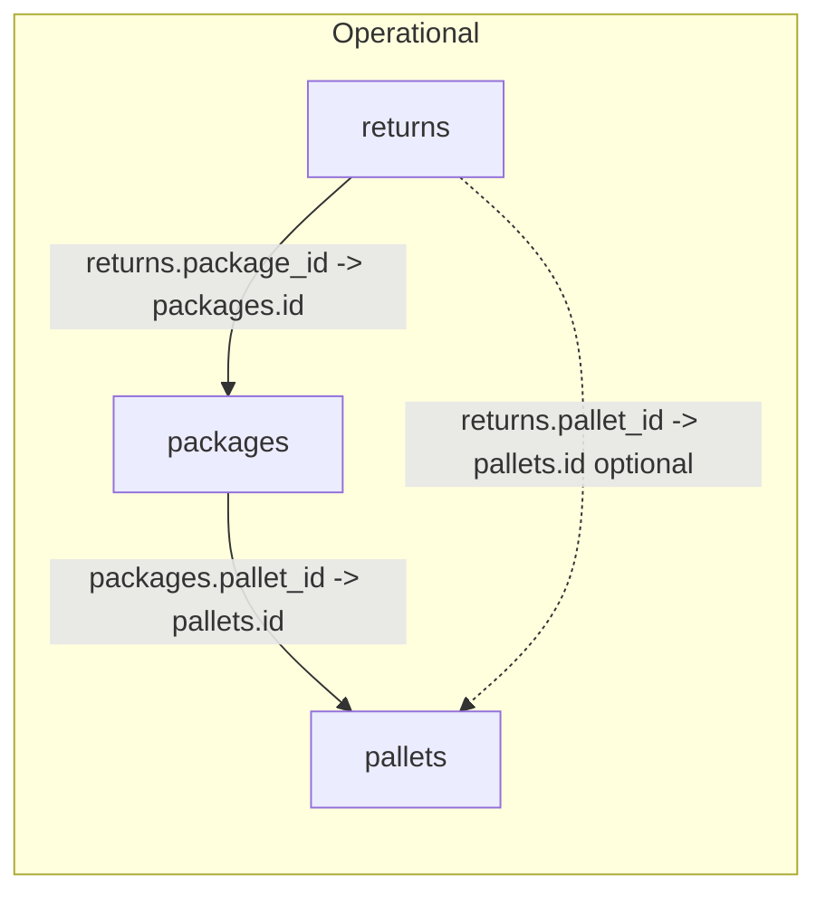

# NEXT-CLAIM-01C — Schema-first Return / Package / Pallet / Claim reality audit

## Scope and method

- **Source of truth for this plan:** [supabase/migrations/](supabase/migrations/) (grep/read) + [app/returns/returns-constants.ts](app/returns/returns-constants.ts), [app/returns/returns-action-types.ts](app/returns/returns-action-types.ts), [types/database.types.ts](types/database.types.ts), [supabase/migrations/20260633_v_claim_base_amazon_removals.sql](supabase/migrations/20260633_v_claim_base_amazon_removals.sql).
- **Not executed:** no DB queries from this session; any object **not** named in migrations is marked **needs SQL confirmation** unless clearly absent from repo.
- **Critical repo vs narrative drift:** Your note on Neda (`pallet_photo_urls`, `bol_photo_urls`, `shipping_label_urls`, `photo_evidence` dropped) **does not appear** in this workspace’s migrations or TypeScript. Repo still documents **`pallets.order_id`** (with comment “renamed from `amazon_order_id`” in [types/database.types.ts](types/database.types.ts)) while migration [20260418_pallets_carrier_amazon_order_id.sql](supabase/migrations/20260418_pallets_carrier_amazon_order_id.sql) only **adds `amazon_order_id`**. Treat **live Supabase** as authoritative for pallet column names until `information_schema` confirms.

---

## A. Discovered tables/views (repo) — status

| Object | Status |
|--------|--------|
| `public.returns` | **Found** — core operational return/scanned line |
| `public.packages` | **Found** |
| `public.pallets` | **Found** |
| `public.package_audit_log` | **Found** — [20250319_returns_v3_packages.sql](supabase/migrations/20250319_returns_v3_packages.sql) |
| `public.return_audit_log` | **Found** — referenced in [app/returns/actions.ts](app/returns/actions.ts) |
| `public.expected_returns` | **Found** — [20260420_import_detected_type_expected_sync.sql](supabase/migrations/20260420_import_detected_type_expected_sync.sql) |
| `public.expected_packages` | **Found** (also evolved in [20260427_expected_packages_removal_orders.sql](supabase/migrations/20260427_expected_packages_removal_orders.sql), Wave 1) |
| `public.expected_removals` | **Found** — [20260428_expected_removals_rls_cleanup.sql](supabase/migrations/20260428_expected_removals_rls_cleanup.sql) |
| `public.expected_pallets`, `public.expected_items` | **Found** — [20260407120000_expected_pallets_items_and_staging_batch.sql](supabase/migrations/20260407120000_expected_pallets_items_and_staging_batch.sql) |
| `public.shipment_containers`, `public.shipment_boxes`, `public.shipment_box_items` | **Found** — parallel scan tree [20260522_shipment_scan_allocation_tree.sql](supabase/migrations/20260522_shipment_scan_allocation_tree.sql); **not wired** to `returns`/`packages` in that migration |
| `public.amazon_returns` | **Found** — altered/indexed in many migrations (e.g. [20260430_amazon_prefix_global_refactor.sql](supabase/migrations/20260430_amazon_prefix_global_refactor.sql), [20260618_amazon_returns_align_unique_physical_row.sql](supabase/migrations/20260618_amazon_returns_align_unique_physical_row.sql)) |
| `public.amazon_removals`, `public.amazon_removal_shipments` | **Found** |
| `public.amazon_reimbursements`, `public.amazon_settlements`, `public.amazon_transactions`, `public.amazon_inventory_ledger` | **Found** (ALTER/INDEX in migrations; original CREATE may predate repo or live-only — **needs SQL confirmation** for first DDL) |
| `public.amazon_reports_repository` | **Found** — [20260509_amazon_reports_repository.sql](supabase/migrations/20260509_amazon_reports_repository.sql) |
| `public.amazon_all_orders`, `public.amazon_fba_inventory`, `public.amazon_manage_fba_inventory`, `public.amazon_amazon_fulfilled_inventory` | **Found** — [20260604_amazon_missing_report_tables.sql](supabase/migrations/20260604_amazon_missing_report_tables.sql), [20260622_fba_inventory_engine_wave4.sql](supabase/migrations/20260622_fba_inventory_engine_wave4.sql) |
| `public.amazon_staging` (renamed from `amazon_ledger_staging`) | **Found** — [20260430_amazon_prefix_global_refactor.sql](supabase/migrations/20260430_amazon_prefix_global_refactor.sql) |
| `public.products` | **Found** |
| `public.product_identifier_map` | **Found** (ALTER in multiple migrations) |
| `public.pim_identifier_authority_policy`, `public.pim_identifier_dispute`, `public.pim_conflict_review_event`, `public.pim_canonical_lifecycle_event` | **Found** — [20260811120000_pim_identifier_review_queue.sql](supabase/migrations/20260811120000_pim_identifier_review_queue.sql) |
| `public.claim_submissions` | **Found** — [20260328_claim_submissions.sql](supabase/migrations/20260328_claim_submissions.sql) |
| `public.claim_history_logs` | **Found** — [20260329_claim_history_crm.sql](supabase/migrations/20260329_claim_history_crm.sql) |
| `public.v_claim_base_amazon_removals` | **Found** — removal claim-base view |
| `slip_contents` | **Not found** in repo |
| Dedicated `scanner_sessions` / `scanner_events` tables | **Not found** in repo (audit logs + app actor fields only) |
| `claims` (legacy) | **Renamed to `claims_deprecated`** if existed — [20260333_claim_submissions_master_queue_deprecate_claims.sql](supabase/migrations/20260333_claim_submissions_master_queue_deprecate_claims.sql) |

---

## B. Operational chain (as coded in repo)

**Tables:** `public.returns` → `public.packages` → `public.pallets`.



- **`returns.package_id`** → `packages(id)` ON DELETE SET NULL — [20250319_returns_v3_packages.sql](supabase/migrations/20250319_returns_v3_packages.sql).
- **`packages.pallet_id`** → `pallets(id)` ON DELETE SET NULL — same file.
- **`returns.pallet_id`** → `pallets(id)` — [20250319_returns_v1_pallets_rbac.sql](supabase/migrations/20250319_returns_v1_pallets_rbac.sql). Both pallet links can exist; app inheritance uses package/pallet hierarchy (see UI comments in [app/returns/_components.tsx](app/returns/_components.tsx)).

**No FK** from `packages` to `returns` (child direction only from returns → package).

---

## C. Marketplace evidence chain (conceptual + repo joins)

- **Raw FBA returns:** `amazon_returns` — tenant + file-row identity ([20260618_amazon_returns_align_unique_physical_row.sql](supabase/migrations/20260618_amazon_returns_align_unique_physical_row.sql)); columns include `raw_data`, `store_id` (PIM stabilization), `lpn`, etc. — **full column list: live SQL**.
- **Removals / shipments:** `amazon_removals`, `amazon_removal_shipments`, `expected_packages` linked by `source_detail_row_id` and aggregates in **`v_claim_base_amazon_removals`** — explicit comment: **`amazon_returns` is NOT joined** to removal rows ([20260633_v_claim_base_amazon_removals.sql](supabase/migrations/20260633_v_claim_base_amazon_removals.sql)).
- **Reconciliation to operational:** inferential joins only in app/ETL — **`lpn`**, **`order_id`**, **`rma_number`**, **`tracking_number`** (package/pallet), **`asin`/`fnsku`/`sku`/`product_identifier`**, **`store_id`/`organization_id`**. No single enforced FK from `amazon_returns` → `returns`.

---

## D. Key columns (high level; full typing via SQL below)

**`returns`** (from [types/database.types.ts](types/database.types.ts) + [20260413_returns_module_full_sync.sql](supabase/migrations/20260413_returns_module_full_sync.sql)): `id`, `organization_id`, `store_id`, `package_id`, `pallet_id`, `order_id`, `lpn`, `rma_number`, `marketplace`, `status`, identifiers (`asin`, `fnsku`, `sku`, `product_identifier`), `item_name`, `conditions`, `notes`, `photo_evidence`, `estimated_value`, soft-delete `deleted_at`, legacy **`product_id`**, pricing blob columns.

**`packages`:** `pallet_id`, `tracking_number`, `order_id`, `rma_number`, `manifest_data` (JSONB “packing slip lines”), `photo_evidence`, per-slot photo URLs, counts, `store_id`, `organization_id`.

**`pallets`:** `tracking_number`, `carrier_name`, **`order_id` in generated types** vs **`amazon_order_id` in migration 20260418** — **verify live**. Photo fields in repo: `photo_url`, `bol_photo_url`, `manifest_photo_url`, optional `photo_evidence` jsonb ([20260331_pallets_packages_photo_evidence.sql](supabase/migrations/20260331_pallets_packages_photo_evidence.sql)).

**Carton slip lines:** **`packages.manifest_data`** — not a separate `slip_contents` table in repo.

**`expected_*`:** `expected_returns` (org, `lpn`, `asin`, `order_id`, `source_upload_id`, `raw_row`); `expected_packages` (tracking, shipment, upload linkage, Wave-1 `store_id`, `order_type`, `source_detail_row_id` per view); `expected_pallets` / `expected_items` for staging batch expectations.

**Raw Amazon (representative):** `amazon_returns` + removals/reimbursements/settlements/transactions/ledger — all have `raw_data` bucket post-refactor; dedupe keys vary by table (see alignment migrations).

**Claim:** `claim_submissions` (`return_id` FK CASCADE, `store_id`, `report_url`, `status` enum, `submission_id`, `source_payload` JSONB per [20260333](supabase/migrations/20260333_claim_submissions_master_queue_deprecate_claims.sql)); `claim_history_logs`.

---

## E. Pallet schema “after Neda changes” vs this repo

| Field (your note) | Repo state |
|-------------------|------------|
| `order_id` vs `amazon_order_id` | **Ambiguous:** TS types + `PALLET_LIST_SELECT` use `order_id`; migration adds `amazon_order_id` only. |
| `pallet_photo_urls` / `bol_photo_urls` / `shipping_label_urls` | **Not in repo** — use live `information_schema`. |
| `photo_evidence` dropped | **Still present** in migrations on pallets/packages/returns. |

**Conclusion:** Treat Neda delta as **live-only until a migration appears in repo** or regenerate [types/database.types.ts](types/database.types.ts) from Supabase.

---

## F. Product linkage matrix

| Path | Mechanism |
|------|-----------|
| Direct `product_id` | **`returns.product_id`** nullable legacy UUID/text ([types/database.types.ts](types/database.types.ts)); not in `RETURN_LIST_SELECT` — easy to miss in UI lists. |
| Identifier-only | `asin`, `fnsku`, `sku`, `product_identifier` on `returns`; join to `products` / `product_identifier_map` in application logic — **no FK** in migrations reviewed. |
| Operational return line | `returns` row is the scanned unit. |
| Package child-line | **`packages.manifest_data`** JSONB lines; `shipment_box_items` for alternate scan tree — **no FK to `returns`**. |
| Marketplace raw | `amazon_returns` / removals / ledger rows; match via **LPN, order_id, SKU/FNSKU/ASIN**, `raw_data`. |
| Blocked by identity dispute | `pim_identifier_dispute` + `pim_conflict_review_event` — disputes reference **`products.id`** (`members`, `recommended_winner_id`); no direct link column to `returns` in PIM migration. |

---

## G. Org / store / upload / provenance matrix

| Concern | Where |
|---------|--------|
| `organization_id` | `returns`, `packages`, `pallets`, all `expected_*`, `amazon_*`, PIM tables |
| `store_id` | `returns`, `packages`, `pallets`, Wave-1 Amazon removals/expected_packages, PIM disputes |
| Upload / source | `raw_report_uploads` (`source_upload_id` on `expected_returns` / `expected_packages`), staging `amazon_staging`, dedupe columns (`source_file_sha256`, `source_physical_row_number` on `amazon_returns`) |
| Scanner / actor | `created_by` / `updated_by` UUIDs on returns/packages/pallets; `return_audit_log`, `package_audit_log` — **no dedicated scanner session table** in repo |

---

## H. Table classification (1–7)

1. **Raw marketplace:** `amazon_*` domain tables, `amazon_staging`, `amazon_reports_repository`.
2. **Operational return line:** `returns`.
3. **Package/carton:** `packages` (+ `manifest_data`).
4. **Pallet/tracking container:** `pallets` (+ parallel `shipment_containers`).
5. **Evidence/photo/OCR:** `returns.photo_evidence`, `packages.photo_evidence` + URL slots, `pallets` photo columns; org flags `is_ai_*_ocr` in [returns-action-types OrgSettings](app/returns/returns-action-types.ts).
6. **Product identity/review:** `products`, `product_identifier_map`, `pim_*` tables.
7. **Claim case/candidate:** `claim_submissions`, `claim_history_logs`, view **`v_claim_base_amazon_removals`** (candidate-shaped rows for removals).

---

## I. Claim MVP candidate types (grounded)

- **Scanned return vs Amazon return:** `returns` vs `amazon_returns` on **org + store + `lpn` / `order_id` / identifiers** (no enforced link).
- **Amazon return not scanned:** inverse of above on `expected_returns` / `amazon_returns` vs `returns`.
- **Return not reimbursed / missing reimbursement:** join `returns` identifiers + `order_id` to `amazon_reimbursements` / settlements / transactions (patterns similar to `v_claim_base` aggregates).
- **Removal mismatch:** already scaffolded in **`v_claim_base_amazon_removals`** (disposed without reimbursement, shipped vs scanned, etc.).
- **Package/pallet discrepancy:** `packages.expected_item_count` vs `actual_item_count` (trigger-maintained), `status = suspicious`, `discrepancy_note`.
- **Damaged/expired/bad storage:** `returns.conditions`, photos, ledger reason codes — **needs product resolution** for strong claims.
- **Inventory discrepancy:** `amazon_inventory_ledger` + optional `resolved_product_id` columns (later migrations).

---

## J. Data gaps / blockers

- **Pallet column naming drift** (`order_id` vs `amazon_order_id`) and **photo schema drift** (single URL vs array URLs vs JSONB).
- **No FK** from marketplace tables to `returns`.
- **`returns.product_id` optional / not in list SELECT** — weak catalog join for Claim MVP.
- **`shipment_*` tree isolated** from `returns`/`packages`.
- **PIM disputes** not keyed to operational rows — human review queue first.
- **`amazon_returns` intentionally excluded** from removal claim view — separate model for return-side claims.

---

## K. Minimum viable Claim/Return module sequence

1. **Now (schema-safe):** read-only candidate queries using **`returns` + `packages` + `pallets` + `claim_submissions`**; removal candidates via **`v_claim_base_amazon_removals`**; store/org scope from existing columns.
2. **After product identity:** claims that require canonical SKU/product (`inventory discrepancy`, richer reimbursement tie-out).
3. **After pallet/package cleanup:** unified photo model and definitive **`order_id`** on pallets; optional merge of `shipment_*` with operational hierarchy.

---

## L. AI/OCR future seams

- **Carton slip:** `packages.manifest_data` + `is_ai_packing_slip_ocr_enabled`.
- **Label/photo evidence:** `photo_evidence` JSONB shapes ([lib/return-photo-evidence](lib/return-photo-evidence) if present).
- **Claim summary:** `claim_submissions.source_payload` + PDF pipeline under [app/claim-engine/](app/claim-engine/).
- **Advisory only:** no auto Amazon submission in this audit scope.

---

## M. Do-not-touch list (per your rules)

- No `UPDATE`/`DELETE`/`ALTER` on production; **no** `products` / `product_identifier_map` / merge writes; **no** scanner behavior changes; **no** Amazon case submission automation from this audit.

---

## N. Recommended next step (pick one)

**4. Pause and request live schema SQL output first** — because pallet/order/photo columns and any Neda-only DDL are **not fully reconciled** with tracked migrations, then run the read-only audit (option 1) against confirmed `information_schema` results.

---

## Read-only SQL pack (operator)

Run against **production/staging** read-only role.

**1) Tables matching keywords**

```sql
SELECT table_schema, table_name, table_type
FROM information_schema.tables
WHERE table_schema = 'public'
  AND (
    table_name ILIKE '%return%'
    OR table_name ILIKE '%package%'
    OR table_name ILIKE '%pallet%'
    OR table_name ILIKE '%slip%'
    OR table_name ILIKE '%claim%'
    OR table_name ILIKE '%expected%'
    OR table_name ILIKE '%scanner%'
    OR table_name ILIKE '%shipment%'
    OR table_name ILIKE '%amazon%'
  )
ORDER BY table_type, table_name;
```

**2) Columns + types for selected tables** (paste names from step 1)

```sql
SELECT c.table_name, c.column_name, c.data_type, c.is_nullable, c.column_default
FROM information_schema.columns c
WHERE c.table_schema = 'public'
  AND c.table_name = ANY (ARRAY['returns','packages','pallets','expected_returns','expected_packages','expected_removals','expected_pallets','expected_items','amazon_returns','amazon_removals','amazon_removal_shipments','amazon_reimbursements','amazon_settlements','amazon_transactions','amazon_inventory_ledger','claim_submissions','claim_history_logs','pim_identifier_dispute','pim_conflict_review_event','product_identifier_map','shipment_containers','shipment_boxes','shipment_box_items']::text[])
ORDER BY c.table_name, c.ordinal_position;
```

**3) Foreign keys among operational core**

```sql
SELECT
  tc.table_name,
  kcu.column_name,
  ccu.table_name AS foreign_table_name,
  ccu.column_name AS foreign_column_name,
  tc.constraint_name
FROM information_schema.table_constraints AS tc
JOIN information_schema.key_column_usage AS kcu
  ON tc.constraint_name = kcu.constraint_name AND tc.table_schema = kcu.table_schema
JOIN information_schema.constraint_column_usage AS ccu
  ON ccu.constraint_name = tc.constraint_name AND ccu.table_schema = tc.table_schema
WHERE tc.constraint_type = 'FOREIGN KEY'
  AND tc.table_schema = 'public'
  AND tc.table_name = ANY (ARRAY['returns','packages','pallets','claim_submissions']::text[])
ORDER BY tc.table_name, kcu.column_name;
```

**4) Views referencing key tables**

```sql
SELECT table_name AS view_name, view_definition
FROM information_schema.views
WHERE table_schema = 'public'
  AND (
    view_definition ILIKE '%returns%'
    OR view_definition ILIKE '%amazon_returns%'
    OR view_definition ILIKE '%expected_packages%'
    OR view_definition ILIKE '%claim%'
  )
ORDER BY view_name;
```

**5) Row counts + nulls on join keys** (sample)

```sql
SELECT
  COUNT(*) AS returns_total,
  COUNT(*) FILTER (WHERE package_id IS NULL) AS returns_no_package,
  COUNT(*) FILTER (WHERE pallet_id IS NULL) AS returns_no_pallet,
  COUNT(*) FILTER (WHERE store_id IS NULL) AS returns_no_store,
  COUNT(*) FILTER (WHERE order_id IS NULL) AS returns_no_order_id,
  COUNT(*) FILTER (WHERE lpn IS NULL) AS returns_no_lpn
FROM public.returns
WHERE deleted_at IS NULL;

SELECT
  COUNT(*) AS packages_total,
  COUNT(*) FILTER (WHERE pallet_id IS NULL) AS packages_no_pallet,
  COUNT(*) FILTER (WHERE tracking_number IS NULL) AS packages_no_tracking,
  COUNT(*) FILTER (WHERE store_id IS NULL) AS packages_no_store
FROM public.packages
WHERE deleted_at IS NULL;

SELECT COUNT(*) AS amazon_returns_rows FROM public.amazon_returns;
```

Adjust table list if step 1 shows renames (e.g. quoted `"Return"` — unlikely; repo uses `returns`).
