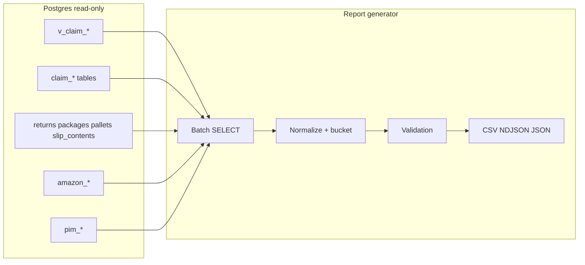

# NEXT-CLAIM-02 — Read-only Claim MVP Report Design

## Authority

- Vocabulary and operational reality: [next-claim-01d_claim_engine_audit.plan.md](next-claim-01d_claim_engine_audit.plan.md) and operator live schema.
- **Product identity:** 1321 rows in `pim_identifier_dispute` + matching `pim_conflict_review_event` (`detected`); no merges — treat as **blocker layer** for high-confidence automation only.

---

## A. Proposed read-only report architecture

**Shape:** A single **offline report generator** (future: `scripts/claim-mvp-readonly-report.ts` + optional `lib/audits/claim-mvp-readonly-report.ts` for shared types) run by operators or CI with **service-role read** credentials. **Zero** `INSERT`/`UPDATE`/`DELETE`/`ALTER`; only filesystem writes under a run directory.

**Execution model:**

1. **Inputs:** `--organization-id=<uuid>` (required for tenant-safe runs; optional `--store-id` filter); `--run-id` or auto `YYYYMMDDThhmmssZ`.
2. **Phase — fetch:** Paginated or batched `SELECT` against Postgres (Supabase) for each bucket query; respect statement timeouts (chunk by `created_at` or primary key cursor if needed).
3. **Phase — normalize:** Map each row to a **canonical claim-candidate record** (JSON shape) with `bucket`, `confidence`, `evidence_refs[]`, `join_keys{}`, `blockers[]`.
4. **Phase — validate:** In-process checks + `10-validation-checks.json` (mirror NEXT-18 scripts: [scripts/product-seed-dispute-classifier.ts](scripts/product-seed-dispute-classifier.ts) pattern).
5. **Phase — write:** Emit files listed in **F** below under **`.cursor/audit-reports/next-claim-02/<run_id>/`** (new namespace; do not collide with `next-18*`).

**Stack:** TypeScript + `@supabase/supabase-js` server client (same as existing audit scripts), Node 20+.

---

## B. Exact source views/tables and why each is used

| Source | Why |
|--------|-----|
| **`v_claim_base_amazon_removals`** | **Primary removal-side candidate feed** — pre-joined removal + `expected_packages` scan aggregates + reimbursement/transaction rollups (defined in repo migration). |
| **`v_claim_candidate_financial_hints`** | Precomputed **money/SKU/order** hints tied to **claim candidate** grain — reduces duplicate join logic in TS. |
| **`v_claim_candidate_source_context`** | **Upload/staging/source** context for traceability (which import, which raw row class). |
| **`v_claim_financial_events`** | **Canonical financial event rows** for reimbursement / mismatch buckets without hand-rolling unions in v1. |
| **`v_claim_analytics_base`** | Optional **rollup / KPI** slice for `00-claim-rollup.csv` if grain matches org/day/status; else defer to Phase 2. |
| **`claim_candidates`** | **Live candidate spine** — if app ignores it, report still lists rows for operator review and maps to buckets by status/type columns (exact names TBD from live SQL export). |
| **`claim_cases`** | **Case grouping** — link multiple candidates/submissions; use for dedupe keys in `02-evidence-links.csv`. |
| **`claim_submissions`** | **App-aligned queue** — overlay “already filed / PDF ready” state; join on `return_id` or candidate FK if present. |
| **`claim_reimbursements`** | **Posted reimbursement lines** vs expected — bucket 2 / 6. |
| **`claim_history_logs`** | Optional **timeline snippet** per submission id for evidence pack (not required for MVP rollup). |
| **`returns`** | Operational **scanned line** — core for buckets 3–5 and all `returns`-side joins. |
| **`packages`**, **`pallets`** | Container evidence, discrepancy fields, `tracking_number`, live pallet URL arrays if columns exist. |
| **`slip_contents`** | Package-level **line** evidence; bridges to SKU/FNSKU without assuming `returns` row per slip line. |
| **`expected_packages`** | Removal expectation / scan expectation join anchor (per removal view design). |
| **`amazon_returns`** | Raw **FBA return** evidence — never merge with `returns` without explicit join keys. |
| **`amazon_removals`**, **`amazon_removal_shipments`** | Raw removal/shipment evidence when view does not expose enough detail for drill links. |
| **`amazon_reimbursements`**, **`amazon_settlements`**, **`amazon_transactions`** | Drill-through for financial buckets if views omit columns operators need in CSV. |
| **`amazon_inventory_ledger`**, **`amazon_all_orders`**, **`amazon_reports_repository`** | Secondary enrichment links in `02-evidence-links.csv` only (keep v1 thin). |
| **`products`**, **`product_identifier_map`** | Read-only **resolution** for display SKU → product title; **no writes**. |
| **`pim_identifier_dispute`**, **`pim_conflict_review_event`** | **Blocker** flags — bucket 7 and `confidence = blocked`. |

**Priority rule (see H):** Prefer **`v_claim_*`** for any grain they already define; use bare tables only to **fill gaps** or add **drill IDs** for `02-evidence-links.csv`.

---

## C. Candidate buckets (seven)

1. **Removal claim candidates** — Rows from **`v_claim_base_amazon_removals`** (or `claim_candidates` filtered `type = removal` if that exists live). Carry through `claim_reason_candidate` / equivalent from view.
2. **Return not reimbursed** — Operational **`returns`** with `order_id` / identifiers present, left join **`amazon_reimbursements`** / **`v_claim_financial_events`** / **`claim_reimbursements`**; flag expected amount vs zero reimbursement (thresholds in validation JSON, not business rules in DB).
3. **Amazon return not scanned** — **`amazon_returns`** left join **`returns`** on org + store + **LPN** primary; secondary keys ASIN/FNSKU/SKU + `order_id` where LPN sparse.
4. **Operational return without Amazon return evidence** — **`returns`** left join **`amazon_returns`** on same key set; inverse of (3).
5. **Package / pallet discrepancy** — **`packages`** (`expected_item_count` vs `actual_item_count`, `status`, `discrepancy_note`) and **`pallets`** (`operator_package_count` vs child package count if column live); optional **`returns`** without `package_id`.
6. **Financial mismatch / hints** — **`v_claim_candidate_financial_hints`** + **`v_claim_financial_events`** rows with anomaly flags (null reimbursement where view expects one, reversal counts from removal view aggregates, etc.).
7. **Blocked by product identity disputes** — Join operational or candidate **SKU/FNSKU/ASIN** to **`pim_identifier_dispute`** (`status` in `open`, `claimed`, …) via `members` / `identifier_conflicts` / store scope; do **not** auto-resolve.

---

## D. Join keys per bucket

| Bucket | Keys (use all that exist on row; null = weaker confidence) |
|--------|--------------------------------------------------------------|
| 1 Removal base | `organization_id`, `store_id`, `order_id`, `sku`, `fnsku`, `source_detail_row_id` / `amazon_removals.id`, `tracking_number` (if in view), link to `expected_packages` aggregate keys |
| 2 Return not reimbursed | `organization_id`, `store_id`, `returns.order_id`, `returns.sku` / `fnsku` / `asin`, `returns.id` |
| 3 Amazon not scanned | `organization_id`, `store_id`, `lpn`, `amazon_returns.id`, `asin`/`fnsku`/`sku` from raw or typed columns |
| 4 Ops without Amazon evidence | Same as 3 from **`returns`** side + `returns.id`, `package_id`, `pallet_id` |
| 5 Package/pallet | `organization_id`, `store_id`, `packages.id`, `packages.pallet_id`, `pallets.id`, `tracking_number`, `packages.order_id`, `returns.id` (children) |
| 6 Financial hints | `organization_id`, `store_id`, `order_id`, `sku`, view-specific surrogate keys |
| 7 PIM blockers | `organization_id`, `store_id`, identifier tuple + `pim_identifier_dispute.id`, `classifier_fingerprint`, `status` |

**`product_id` / `resolved_product_id`:** Use only when column is **non-null** on the driving row **and** bucket 7 does not block the same identifier family; otherwise emit key in CSV but set confidence **low** or **blocked**.

---

## E. Confidence scoring model

| Level | Meaning |
|-------|---------|
| **high** | All of: correct org (and store if required), primary join key non-null (e.g. LPN match for return↔amazon_returns), supporting identifier agreement, **no open PIM dispute** on resolved product. |
| **medium** | Primary key partial (e.g. order_id match but multiple SKU lines) or one supporting field null; or PIM **dismissed** only with documented policy (optional v1: treat as medium). |
| **low** | Fuzzy-only match (SKU without order_id), high cardinality join, or heavy reliance on `raw_data` extraction. |
| **blocked** | Any **active** `pim_identifier_dispute` covering an identifier in the row’s `members` / conflict set for same org+store; or explicit manual `do_not_auto` flag if present on candidate row (live schema TBD). |

**Rules:** **Never** emit an action flag implying Amazon submission; manifest includes `"auto_submit": false` always. Confidence affects **sort order** and CSV column only.

---

## F. Output files (per run)

All under `.cursor/audit-reports/next-claim-02/<run_id>/`.

| File | Content |
|------|---------|
| **`manifest.json`** | `run_id`, `created_at`, `organization_id`, `store_id` filter, git sha optional, list of queries run, row counts per file, `supabase_project_ref` redacted flag, `read_only: true`. |
| **`00-claim-rollup.csv`** | One row per **bucket** + optional per-store slice: `bucket`, `candidate_count`, `high_count`, `medium_count`, `low_count`, `blocked_count`, `notes`. |
| **`01-claim-candidates.ndjson`** | One JSON object per line: normalized candidate (bucket, confidence, keys, evidence_refs, `source_table` / `source_view`, raw surrogate ids for drill). |
| **`02-evidence-links.csv`** | Long format: `candidate_surrogate_id`, `link_type` (amazon_return, return, package, pallet, slip_line, reimbursement, submission, dispute), `target_table`, `target_id`, `join_key`, `confidence`. |
| **`03-product-identity-blockers.csv`** | Disputes intersecting report rows: `dispute_id`, `store_id`, `fingerprint`, `taxonomy_cell`, `status`, `affected_candidate_ids` (semicolon-separated), `identifiers_summary`. |
| **`04-package-pallet-gaps.csv`** | Operational gaps: null `package_id`, null `pallet_id`, package/pallet count mismatch flags, missing `tracking_number`, slip lines without resolvable SKU. |
| **`05-financial-hints.csv`** | Flat extract from **`v_claim_candidate_financial_hints`** / **`v_claim_financial_events`** (or join result) with candidate linkage when joinable. |
| **`10-validation-checks.json`** | Array of `{ "id", "passed", "detail" }` — see **G**. |

---

## G. Validation checks (`10-validation-checks.json`)

| Check id | Rule |
|----------|------|
| `no_db_writes` | Generator process issued only `SELECT` (enforce in code review + no `.insert/.update/.delete` in module). |
| `single_org` | Every exported row `organization_id` equals CLI filter (fail if any stray). |
| `store_scope` | If `--store-id` set, all rows match that store (where column exists). |
| `required_evidence` | Per-bucket minimum columns non-null (config in script: e.g. bucket 3 requires `lpn` or (`order_id` + `asin`)). |
| `bucket_counts` | Sum of NDJSON lines per bucket matches rollup CSV (±0). |
| `dispute_blockage_counts` | Count NDJSON with `confidence=blocked` matches blocker CSV join cardinality sanity. |
| `package_pallet_nulls` | `04` row counts align with SQL null-count baseline embedded in manifest `sql_baseline` optional. |
| `view_readable` | All configured views/tables returned 200/empty — no missing relation errors. |

---

## H. Live-vs-app gap handling

| Layer | Role in report |
|--------|----------------|
| **`v_claim_*` views** | **First-class read path** — canonical candidate and financial grains where definitions live in DB. |
| **`claim_candidates` / `claim_cases`** | **Include always if table exists** — drives `01` when view rows are missing type metadata; dedupe key = `(organization_id, candidate_natural_key TBD)`. |
| **`claim_submissions`** | **Overlay only** — enrich NDJSON with `submission_id`, `status`, `report_url` presence when `return_id` or shared candidate key matches; never overwrite view-based bucket classification without explicit join. |

**Decision:** Report **reads all three layers** where joins exist; **prioritize view rows** for buckets 1 and 6; use **`claim_submissions`** for “already in pipeline” badges in `02-evidence-links.csv`. If a FK from `claim_candidates` → `claim_submissions` exists live, emit one `link_type=submission` row per candidate.

---

## I. What to defer

- Amazon case **submission**, SAFE-T filing automation, email bots.
- **LLM** summaries, OCR on slip photos (seam: optional future column in NDJSON `evidence_refs.ocr_placeholder`).
- **Product merge** executor, `product_identifier_map` writes, dispute resolution writes.
- **Schema migrations**, new claim tables, RLS changes.
- **UI/API** changes to Claim Engine page (separate ticket after report stabilizes).
- Broad **warehouse redesign**, ERP, accounting exports beyond this CSV set.

---

## J. Do-not-touch list

- No writes to: `products`, `product_identifier_map`, `pim_identifier_dispute`, `pim_conflict_review_event`, `claim_*`, `returns`, `packages`, `pallets`, `slip_contents`, any `amazon_*` tables.
- No migrations, no merge, no import pipeline changes, no scanner behavior.

---

## K. Recommended next step

**2. Run more SELECT-only SQL before implementation** — Export column lists and `pg_get_viewdef` for every **`v_claim_*`** plus `\d claim_candidates` / `\d claim_cases` / FK graph, and save beside the plan (or in run `manifest.json` `schema_snapshot_ref`). That removes guesswork for NDJSON field names and join keys. **Then** **1. Proceed to Agent mode** to implement the generator using the frozen column contract.

---

## Future seams (document only)

- OCR on **`slip_contents`** + `packages.manifest_data` reconciliation.
- Optional Canvas/dashboard ([canvas skill](file:///unused)) for operator triage — out of scope for file-only MVP.
