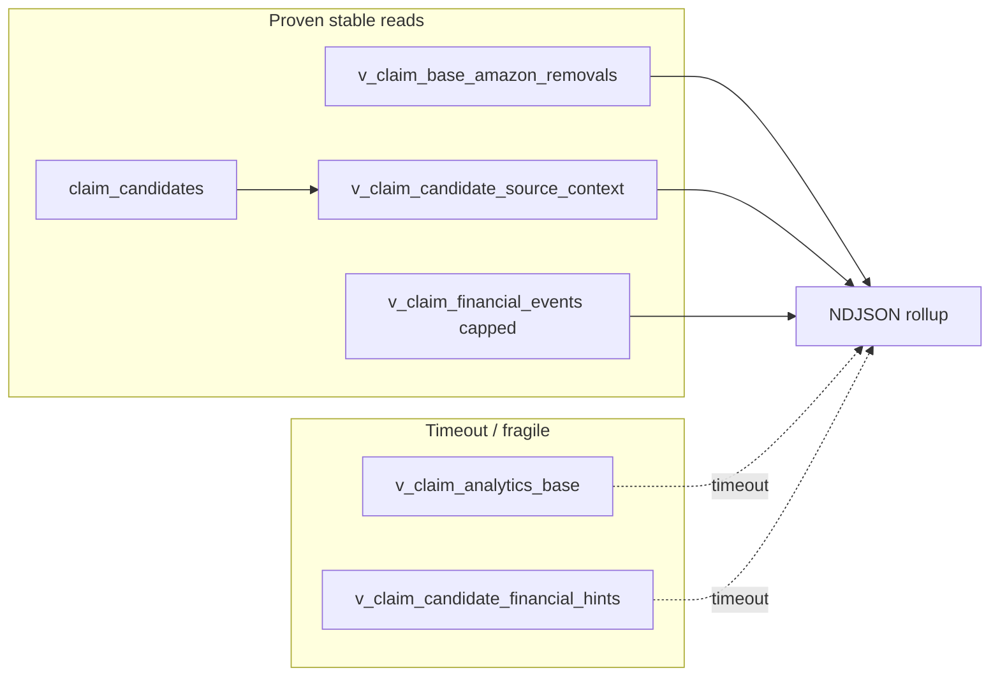

# NEXT-CLAIM-04 — Review Claim MVP report output / dedup + timeout plan

## Evidence read (run `20260512T120006Z`)

- [manifest.json](c:\Users\Jennifer\Desktop\ecommerce-os\.cursor\audit-reports\next-claim-03\20260512T120006Z\manifest.json): `claim_candidates` **9055**, `claim_submissions` **3**, `v_claim_base_amazon_removals` **ok 1629**, `v_claim_candidate_source_context` **ok 9055**, `v_claim_financial_events` **ok 1000** (capped), `v_claim_analytics_base` / `v_claim_candidate_financial_hints` **timeout**, `candidate_ndjson_lines` **23069**.
- [00-claim-rollup.csv](c:\Users\Jennifer\Desktop\ecommerce-os\.cursor\audit-reports\next-claim-03\20260512T120006Z\00-claim-rollup.csv): bucket totals match manifest `bucket_counts`.
- [01-claim-candidates.ndjson](c:\Users\Jennifer\Desktop\ecommerce-os\.cursor\audit-reports\next-claim-03\20260512T120006Z\01-claim-candidates.ndjson): `removal_base` rows are rich (e.g. `reason_codes` include `shipped_not_fully_scanned`); `claim_candidate_existing` lines repeat **`claim_candidate_id`** once from **`claim_candidates`** (rollup: **9055 low**) and once from **`v_claim_candidate_source_context`** (**9055 high**, `reason_codes:["source_context"]`).
- [03-product-identity-blockers.csv](c:\Users\Jennifer\Desktop\ecommerce-os\.cursor\audit-reports\next-claim-03\20260512T120006Z\03-product-identity-blockers.csv): open **C1=749**, **C4=572** (matches J8).
- [04-package-pallet-gaps.csv](c:\Users\Jennifer\Desktop\ecommerce-os\.cursor\audit-reports\next-claim-03\20260512T120006Z\04-package-pallet-gaps.csv): 9 concrete operational gaps on tiny `returns`/`packages`/`pallets` population.
- [logs/warnings.ndjson](c:\Users\Jennifer\Desktop\ecommerce-os\.cursor\audit-reports\next-claim-03\20260512T120006Z\logs\warnings.ndjson): only the two view timeouts.

---

## A. What the report proves

1. **Operational + removal evidence is queryable at scale** without timeouts: **`v_claim_base_amazon_removals`** (1629) and **`v_claim_candidate_source_context`** (9055) are usable from the app’s DB.
2. **The candidate spine is `claim_candidates`**, not `claim_submissions`: 9055 vs 3 rows — submissions are a **thin filing/pipeline** slice.
3. **`claim_cases` / `claim_reimbursements` / `slip_contents`** are empty in this environment; the report tolerates that (J9).
4. **PIM pressure is real**: 1321 NDJSON `product_identity_blocked` rows align with **749 + 572** open disputes (C1/C4); this is the main **automation-confidence ceiling** until review resolves.
5. **Heavy analytics/financial-hint views are not operationally safe** for on-demand full scans with current PostgREST timeouts (warnings + zero rows for those views in `view_query_summary`).

---

## B. Should `claim_candidate_existing` be deduped?

**Yes for operator-facing counts and first UI**, with a clear rule:

- **Dedup key:** `claim_candidate_id` (UUID), when present.
- **Merge strategy:** one logical row per candidate — keep **`claim_candidates`** as canonical fields (`candidate_status`, `resolved_product_id`, `claim_family`, etc.); treat **`v_claim_candidate_source_context`** as **enrichment** (source_table / source_row_id / reason / SKU fields) merged into `evidence` or parallel columns.
- **Why not “intentional duplicate” long-term:** rollup **18,110** double-counts work; confidence split (**9055 high** vs **9055 low**) is an artifact of emitting two records per id, not two different business events.
- **Exception:** if you later need **audit trail** “table vs view snapshot differed,” keep a second export file (e.g. `01b-claim-candidate-raw-pairs.ndjson`) instead of doubling the main candidate stream.

---

## C. Primary queue source: `claim_candidates` vs `claim_submissions`

| Layer | Role |
|-------|------|
| **`claim_candidates`** | **Detection / work queue** — volume, diversity of `claim_family`, links to `source_table` + `source_row_id`. |
| **`claim_submissions`** | **Filing / PDF / pipeline** — aligns with existing Next [claim-repository.ts](app/claim-engine/claim-repository.ts) (“submissions-centric”). |

**Recommendation:** Treat **`claim_candidates` as primary for “Claim MVP inbox”** and **`claim_submissions` as downstream** when an operator promotes a row to “ready to file.”** No schema change required for read-only UI; promotion later may INSERT into `claim_submissions` (out of scope for this plan).

---

## D. Best bucket for the **first** Claim MVP screen

**Order of usefulness:**

1. **`removal_base`** (from `v_claim_base_amazon_removals`) — **best first tab:** full population in this run, structured `reason_codes` / reimbursement evidence in JSON, already “triage-ready.”
2. **`claim_candidate_existing`** — **best second tab after dedup** — spans removals, returns, shipments (`source_table` in sample lines); matches mental model “everything detected.”
3. **`operational_return_gap`** — small but **high signal for warehouse** (9 rows); good as a **side widget** or third tab.
4. **`product_identity_blocked`** — important **gating** banner / filter, not the primary work queue for money claims.
5. **`financial_hint`** — currently **thin** (1000 capped rows) and **hints view times out**; defer as primary until E is fixed.
6. **`amazon_return_reconciliation_seed`** — sample/limit-driven; good **research** tab, not first.

---

## E. Timeout views (`v_claim_analytics_base`, `v_claim_candidate_financial_hints`)

**Root cause class:** expensive joins/aggregations over large domains (manifest also shows huge `amazon_settlements` count in prior runs), not the client script alone.

**Options (pick 1–2 for a later Agent phase, not now):**

1. **DB-side:** materialized view or scheduled batch table refreshed nightly; or rewrite views with stricter filters + indexes on join keys (`claim_candidate_id`, `organization_id`, `order_id`, `sku`).
2. **Ops-side:** raise `statement_timeout` for a dedicated read-only role (narrow scope, documented).
3. **Report-side:** replace view reads with **narrow SQL** against base tables (same keys as view definitions in [Supabase Snippet (15).csv](c:\Users\Jennifer\Desktop\ecommerce-os\.cursor\audit-reports\next-claim-02b\20260512T120000Z-snapshot\Supabase Snippet List Specific Public Tables (15).csv)) — more code, less magic.
4. **Product:** accept **partial financial** output until views are cheap; keep **`v_claim_financial_events` capped** as the only financial_hint feed temporarily.

---

## F. `--org-id` on the report script

**Yes, recommended** for multi-tenant reality and faster runs:

- Filters: `claim_candidates`, `returns`, `pallets`, paginated views where columns exist, and PIM counts already scoped.
- Default: all orgs only when explicitly requested (avoid accidental cross-tenant exports).

---

## G. Report refinement before UI?

**Yes, a small refinement pass before a production UI** (still read-only):

- Dedup `claim_candidate_existing` by `claim_candidate_id`.
- Add `--org-id` (and optional `--store-id`).
- Optionally emit **`01-claim-candidates-deduped.ndjson`** alongside raw for audit.

**Parallel path:** a **minimal UI** that reads **static JSON/CSV from a chosen run directory** can proceed without waiting for dedup, but operator confusion from double counts argues for **dedup first** if the UI shows aggregates.

---

## H. Can existing `claim_candidates` feed UI without schema changes?

**Yes for read-only listing/detail**, assuming:

- Service role or RLS policies allow `SELECT` for the operator role (verify in Supabase; not visible in report files).
- UI uses same columns as snapshot (13): `source_table`, `source_row_id`, `claim_family`, `claim_reason`, `candidate_status`, `confidence_score`, `resolved_product_id`, etc.

**No schema change** needed for **read** MVP; writes (`claim_submissions`) stay a separate later step.

---

## I. What is blocked by product identity disputes

- **1321** `product_identity_blocked` candidates: any claim that depends on **canonical product resolution** for disputed members should stay **`blocked` / low confidence** until `pim_identifier_dispute` is **decided/dismissed** for the relevant products/identifiers.
- **Removal / financial tabs** can still proceed on **order_id + SKU/FNSKU** evidence where product id is not required for human triage.

---

## J. Do-not-touch (this plan phase)

- No DB writes, migrations, claim/product/PIM mutations, Amazon submission, AI, scanner logic, or Claim Engine UI edits until a follow-up Agent task is explicitly approved.

---

## K. Recommended next step

**1. Agent refine report generator with dedup + `--org-id` (and optionally `--store-id`)**, plus a short README of timeout view limitations.

Then **3. Plan Claim API / UI against `claim_candidates`** (read-only inbox + link to existing `claim_submissions` for filed items), with **`removal_base` as the first tab** content source.

**Not 4 first** unless DBAs own view performance; **not 5** — source-of-truth is clear enough: **candidates = inbox, submissions = pipeline.**
