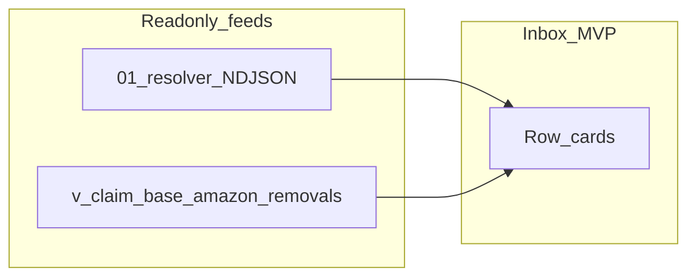

# NEXT-CLAIM-12 — `amazon_removals` missing source root-cause + Claim inbox prep (plan only)

## Context anchored in repo schema

- [`v_claim_base_amazon_removals`](c:\Users\Jennifer\Desktop\ecommerce-os\supabase\migrations\20260633_v_claim_base_amazon_removals.sql) defines **`ar.id AS source_detail_row_id`** and joins `expected_packages` on **`source_detail_row_id = amazon_removals.id`**. Canonical removal detail key for claim-base work is **`amazon_removals.id`**.
- [`amazon_removals`](c:\Users\Jennifer\Desktop\ecommerce-os\supabase\migrations\20260519_amazon_removals_one_row_per_staging_line.sql) adds **`source_staging_id`** (“FK to `amazon_staging.id` — one removal row per staged CSV line”). [`20260617_amazon_removals_removal_order_business_upsert.sql`](c:\Users\Jennifer\Desktop\ecommerce-os\supabase\migrations\20260617_amazon_removals_removal_order_business_upsert.sql) documents that **staging ids are lineage only**, not the business-line arbiter—reinforcing that **two different UUID namespaces** exist on the same table.
- The resolver ([`scripts/claim-product-linkage-resolver-dry-run.ts`](c:\Users\Jennifer\Desktop\ecommerce-os\scripts\claim-product-linkage-resolver-dry-run.ts)) loads source rows with **`SELECT * FROM <table> WHERE id IN (...)`** — i.e. it always interprets **`claim_candidates.source_row_id` as the primary key `id`** of the source table. There is **no** alternate join path today.

The rollup you cited (99% missing only for `amazon_removals`) is **exactly what you would expect** if most `source_row_id` values are **not** `amazon_removals.id` but still “look like” UUIDs (e.g. **`source_staging_id`** or another upstream id).

---

## A. Hypotheses for `amazon_removals` `missing_source_row`

1. **Wrong key semantics (highest prior):** `claim_candidates.source_row_id` stores **`amazon_removals.source_staging_id`** (or `amazon_staging.id`) while the resolver joins on **`amazon_removals.id`**.
2. **Stale / deleted / reimported rows:** Candidates reference removal lines removed by re-upload, retention, or environment refresh; PK no longer exists.
3. **Org/store/upload lineage skew:** Pointer valid only within `(organization_id, upload_id)` but resolver fetch is **id-only** (no upload scoping); less likely to cause *total* miss if id is truly PK, but relevant if ids were reused across environments (unlikely for UUID) or bad copy-paste batches.
4. **Generator mismatch:** `claim_candidates` produced from a **view/job** that emits a non-`id` key for removals while returns/shipments jobs emit real PKs — consistent with “only `amazon_removals` breaks.”
5. **Table name vs semantics:** `source_table = 'amazon_removals'` correct, but **row id column semantics** inconsistent with returns/shipments (see D).
6. **Environment mismatch:** Snapshot of `claim_candidates` from env A against DB B (quickly falsified if other tables join cleanly in same run).
7. **Type/text vs UUID:** `source_row_id` stored as text with invisible formatting; less likely at 99% scale but cheap to rule out with casts/`trim` in SQL.

---

## B. SELECT-only SQL checks (set-based; bounded samples)

Run in Supabase SQL editor or `psql`. Prefer **aggregates first**, then **small `LIMIT` samples**. Filter: `source_table = 'amazon_removals'`.

**B1 — Hit rates: PK vs staging vs neither (core proof)**

```sql
-- Replace filters if you multi-tenant; keep set-based.
WITH cc AS (
  SELECT
    id AS claim_candidate_id,
    organization_id,
    store_id,
    source_row_id::uuid AS sid
  FROM public.claim_candidates
  WHERE lower(source_table) = 'amazon_removals'
    AND source_row_id IS NOT NULL
)
SELECT
  COUNT(*) AS claim_rows,
  COUNT(*) FILTER (WHERE ar_id.id IS NOT NULL)  AS hit_amazon_removals_by_id,
  COUNT(*) FILTER (WHERE ar_stg.id IS NOT NULL) AS hit_amazon_removals_by_source_staging_id,
  COUNT(*) FILTER (WHERE ar_id.id IS NULL AND ar_stg.id IS NULL) AS hit_neither
FROM cc
LEFT JOIN public.amazon_removals ar_id
  ON ar_id.id = cc.sid
LEFT JOIN public.amazon_removals ar_stg
  ON ar_stg.source_staging_id = cc.sid;
```

Interpretation:

- If **`hit_by_source_staging_id` ~ 1536** and **`hit_by_id` ~ 11** (1547−1536): confirms **alternate key** hypothesis.
- If **`hit_neither` dominates**: stale/delete or wrong third id space.

**B2 — Scoped staging join (if B1 shows partial staging hits)**

Add `AND ar_stg.organization_id = cc.organization_id` (and optionally `store_id` / `upload_id` if present on `claim_candidates` or joinable) to detect **collisions** without N+1.

**B3 — Group by upload / org (import batch signal)**

```sql
SELECT
  cc.organization_id,
  ar.upload_id,
  COUNT(*) AS cc_rows,
  COUNT(*) FILTER (WHERE ar.id IS NULL) AS missing_by_id
FROM public.claim_candidates cc
LEFT JOIN public.amazon_removals ar ON ar.id = cc.source_row_id::uuid
WHERE lower(cc.source_table) = 'amazon_removals'
GROUP BY 1, 2
ORDER BY missing_by_id DESC NULLS LAST
LIMIT 50;
```

(If `upload_id` is not on `claim_candidates`, derive via join on `source_staging_id` once B1 confirms path.)

**B4 — Sample rows for human audit (bounded)**

```sql
SELECT cc.id, cc.source_row_id, ar.id AS removals_id, ar.source_staging_id
FROM public.claim_candidates cc
LEFT JOIN public.amazon_removals ar ON ar.id = cc.source_row_id::uuid
WHERE lower(cc.source_table) = 'amazon_removals'
  AND ar.id IS NULL
LIMIT 30;
```

Then repeat with `LEFT JOIN amazon_removals ar ON ar.source_staging_id = cc.source_row_id::uuid`.

**B5 — Optional: compare to claim-base view key**

```sql
SELECT COUNT(*) FROM public.v_claim_base_amazon_removals v
WHERE v.source_detail_row_id IN (
  SELECT source_row_id::uuid FROM public.claim_candidates
  WHERE lower(source_table) = 'amazon_removals' AND source_row_id IS NOT NULL
);
```

Shows overlap between candidate pointers and **view’s canonical** `source_detail_row_id` set.

---

## C. Should the resolver support an alternate source key for `amazon_removals`?

**Plan stance:** Only after **B1** confirms misses are explained by **`source_staging_id` (or similar)**.

- If yes: a **read-only dry-run enhancement** is reasonable: for `amazon_removals` only, resolve `source_row` by **`id` first**, then fallback **`(organization_id [, upload_id], source_staging_id)`** in **set-based** batches (same spirit as current per-page prefetch—**no per-candidate N+1**). Keep behavior **explicitly labeled** in NDJSON (e.g. `source_lookup_key: id|source_staging_id`) so stakeholders do not confuse semantics with returns/shipments.
- If no: do **not** add alternate keys; fix upstream **candidate generator** or backfill pointer (future write path; out of scope here).

---

## D. Are `claim_candidates.source_row_id` semantics inconsistent by `source_table`?

**Working theory for planning:** **Yes, plausibly only for `amazon_removals`**, because returns/shipments show **0 missing** in your rollup while removals are **99% missing** under an `id` join. That pattern rarely comes from PostgREST alone; it usually means **different producers** or **different id columns** chosen when inserting candidates.

Prove with B1–B4 and document a **per-`source_table` contract** in the inbox spec: “`source_row_id` means `<table>.id` except …” (hopefully no exceptions after fix).

---

## E. Impact on Claim inbox (read-only; prep only)



- **What can show now (from resolver NDJSON):** All buckets (`safe_update_candidate`, `resolvable_from_*`, `ambiguous`, `missing_source_row`, `blocked_pim`, `unsupported_source_table`, `unresolved_no_identifiers`) with clear **copy** that linkage is **dry-run only**.
- **`amazon_removals` blocked pending RCA:** Treat **`missing_source_row` where `source_table = amazon_removals`** as **“linkage unknown — do not imply sellable product”** until B1 outcome. Inbox can still list the candidate with **resolver bucket + reason_codes**, but should **not** present a confident `proposed_resolved_product_id` for those rows (usually null anyway).
- **`v_claim_base_amazon_removals`:** Still **usable as removal_base** for narrative/metrics: the view is grounded in **`amazon_removals.id`**, independent of whether `claim_candidates.source_row_id` is wrong. Inbox MVP can **dual-anchor**:
  - **Removal story / financial hints:** keyed by `source_detail_row_id` from the view (or join view ↔ candidate on **correct** key once known).
  - **Linkage / PIM / evidence gating:** keyed by resolver NDJSON keyed by `claim_candidate_id`.

If B1 proves staging-id mismatch, add a **join suggestion** in inbox spec: `claim_candidates.source_row_id::uuid = amazon_removals.source_staging_id` **within org** for display-only enrichment (still SELECT-only in UI data loader later).

---

## F. Do-not-touch list (this phase)

- No **UPDATE/DELETE/INSERT** on `claim_candidates`, `amazon_removals`, `amazon_staging`, `expected_packages`, or related tables.
- No **migrations**, **resolver `--execute`**, **Amazon submissions**, **AI**, **PIM dispute changes**, or **production UI deploy**.
- No **silent widening** of “safe” buckets; RCA first.

---

## G. Recommendation (pick order)

1. **Run SQL snapshot first (B1–B3 minimum).** This is cheap, set-based, and decisive.
2. **If B1 confirms staging-vs-id mismatch:** schedule an **Agent** pass to **refine the resolver** with a **batched alternate lookup for `amazon_removals` only** (no N+1), plus NDJSON/CSV annotation of which key matched. Still **SELECT-only**.
3. **In parallel (after B1, even before code change):** proceed with **read-only Claim inbox design** that **does not block** on removal linkage—use **`v_claim_base_amazon_removals`** for removal rows, and **visually segregate** `amazon_removals` + `missing_source_row` candidates as **“needs data fix”** (excluded only from **auto-linkage** UX, not from the inbox list entirely unless you want a stricter filter).
4. **Pause** only if B1 shows **mass `hit_neither`** without a clean staging-id explanation—in that case escalate to **import lineage / job audit** before any resolver change.

**Not recommended:** skipping SQL and jumping straight to resolver changes—risk of encoding the wrong alternate key.
