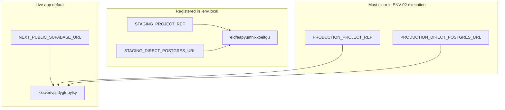

# NEXT-ENV-02 — Staging registration and safe clone plan

## Scope (plan only — no execution)

| Allowed on approval | Forbidden |
|---------------------|-----------|
| Write audit pack under [`.cursor/audit-reports/next-env-02/<run_id>/`](.cursor/audit-reports/next-env-02/) | Migrations, SQL, Supabase API/DB writes |
| Write [`.cursor/plans/next-env-02-staging-registration-and-clone-plan.md`](.cursor/plans/next-env-02-staging-registration-and-clone-plan.md) | `supabase db push`, `pg_restore`, production probe |
| Update policy/registration **markdown only** (no secrets) | Touch scanner merge branch/code, create `package_items` |

Suggested `run_id`: `20260521T120000Z`.

---

## Current repo + operator env state (read-only findings)



| Role | Ref | App wired? | Clone state |
|------|-----|------------|-------------|
| **Original (source)** | `kxsvedvpjldygtdbylsy` | Yes — [`NEXT_PUBLIC_SUPABASE_URL`](lib/supabase-server.ts) | Live data |
| **Candidate staging** | `eiqfaapyumhixxoeltgu` (from operator `.env.local`) | No — correct until ENV-05 cutover | Empty (operator confirmed) |
| **Production** | Must stay `NOT_CREATED_YET` | No | Blocked |

**Critical remediation before clone:** Operator `.env.local` currently sets `PRODUCTION_PROJECT_REF` and `PRODUCTION_DIRECT_POSTGRES_URL` to the **original** ref. That violates [single-supabase-project-policy.md](.cursor/environment-policy/single-supabase-project-policy.md) and would pass wrong gates. ENV-02 execution must **clear** all `PRODUCTION_*` values (keep approval flags `false` in [production-readiness-01-approval.md](.cursor/operator-approvals/production-readiness-01-approval.md)).

**Do not paste** `service_role` keys or full Postgres URLs into chat, git, or audit JSON.

---

## Task 1 — Env naming conventions

### Active application target (unchanged until cutover)

| Variable | Consumer | Purpose |
|----------|----------|---------|
| `NEXT_PUBLIC_SUPABASE_URL` | [lib/supabase-server.ts](lib/supabase-server.ts), [lib/supabase-server-auth.ts](lib/supabase-server-auth.ts), verify scripts | PostgREST + Auth for app |
| `NEXT_PUBLIC_SUPABASE_ANON_KEY` | Session cookies | Browser auth |
| `SUPABASE_SERVICE_ROLE_KEY` | Server actions, pipelines, smokes | Bypass RLS (gitignored) |
| `DIRECT_POSTGRES_URL` | `scripts/next-universal-resolver-*`, `next-product-*`, `product-id-15-*` | Transactional SQL via `pg` |

Aliases: `DATABASE_URL`, `SUPABASE_DB_URL` (fallback in some scripts).

### New dual-project prefixes (ENV-02 introduces)

| Prefix | Role |
|--------|------|
| `ORIGINAL_*` | Clone **source** (`kxsvedvpjldygtdbylsy`) |
| `STAGING_*` | Clone **target** (new ref) |
| `PRODUCTION_*` | **Future** real production only — remain empty |

Legacy constant `CURRENT_SINGLE_SUPABASE_PROJECT` in policy = original until dual-project policy supersedes it.

### Misleading “STAGING” in code (not Supabase project refs)

Hardcoded `STAGING_REF = "kxsvedvpjldygtdbylsy"` in ~10 scripts (e.g. [import-api-09-settlement-staging-smoke-preflight.ts](scripts/import-api-09-settlement-staging-smoke-preflight.ts), [next-production-readiness-02-probe.ts](scripts/next-production-readiness-02-probe.ts)) — means “sole live DB,” not the new staging project. **Do not change in ENV-02** (scanner constraint); migrate to `process.env.STAGING_PROJECT_REF` in ENV-05+ after cutover.

Table names like `amazon_staging` are unrelated.

---

## Task 2 — Scripts reading env vars

| Pattern | Files | Notes |
|---------|-------|-------|
| `NEXT_PUBLIC_SUPABASE_URL` + `SUPABASE_SERVICE_ROLE_KEY` | Most `scripts/*-staging-verify.ts`, smokes, storage inventory | Active target |
| `DIRECT_POSTGRES_URL` | Resolver/product pilots | Should map to `ORIGINAL_DIRECT_POSTGRES_URL` after registration |
| `PRODUCTION_*` | [next-production-readiness-02-probe.ts](scripts/next-production-readiness-02-probe.ts) only | Refuses if ref equals hardcoded `kxsvedvpjldygtdbylsy` |
| Hardcoded `kxsvedvpjldygtdbylsy` | 10 script files + domain approvals | Update labels in ENV-05, not ENV-02 |

`.env*` is gitignored ([.gitignore](.gitignore)).

---

## Task 3 — Policy and approvals

| Artifact | Action in ENV-02 |
|----------|------------------|
| [single-supabase-project-policy.md](.cursor/environment-policy/single-supabase-project-policy.md) | Add banner: superseded for staging registration; original remains live |
| **New** `dual-project-staging-registration.md` | Document ORIGINAL vs STAGING vs blocked PRODUCTION |
| [production-readiness-01-approval.md](.cursor/operator-approvals/production-readiness-01-approval.md) | Set `separate staging project exists: true`; keep register/probe **false**; production ref `NOT_CREATED_YET` |
| **New** `staging-registration-01-approval.md` | Record staging ref + `APPROVED_TO_REGISTER_STAGING_REF=true`; **no** clone execute |
| **New** `staging-clone-01-approval.md` (template) | Flags `APPROVED_TO_PREPARE_STAGING_CLONE` / `EXECUTE` = **false** until ENV-04 |

---

## Task 4 — Env registration plan

### 4a. Original (source — keep app on this)

```bash
ORIGINAL_PROJECT_REF=kxsvedvpjldygtdbylsy
ORIGINAL_SUPABASE_URL=https://kxsvedvpjldygtdbylsy.supabase.co
ORIGINAL_DIRECT_POSTGRES_URL=<copy current DIRECT_POSTGRES_URL>
ORIGINAL_SERVICE_ROLE_KEY=<copy current SUPABASE_SERVICE_ROLE_KEY>

# App unchanged until ENV-05:
NEXT_PUBLIC_SUPABASE_URL=https://kxsvedvpjldygtdbylsy.supabase.co
NEXT_PUBLIC_SUPABASE_ANON_KEY=<unchanged>
SUPABASE_SERVICE_ROLE_KEY=<unchanged>
DIRECT_POSTGRES_URL=<same as ORIGINAL_DIRECT_POSTGRES_URL>
```

### 4b. Candidate staging (registered, not app default)

```bash
STAGING_PROJECT_REF=eiqfaapyumhixxoeltgu
STAGING_SUPABASE_URL=https://eiqfaapyumhixxoeltgu.supabase.co
STAGING_ANON_KEY=<from new project dashboard>
STAGING_SERVICE_ROLE_KEY=<vault only>
STAGING_DIRECT_POSTGRES_URL=<direct host db.eiqfaapyumhixxoeltgu.supabase.co:5432>
```

Gate: `STAGING_PROJECT_REF` length 20 and **not equal** to `kxsvedvpjldygtdbylsy`.

### 4c. Production (blank / blocked)

```bash
PRODUCTION_PROJECT_REF=
PRODUCTION_SUPABASE_URL=
PRODUCTION_DIRECT_POSTGRES_URL=
PRODUCTION_SERVICE_ROLE_KEY=
```

Remove any values currently aliasing the original ref.

---

## Task 5 — Safe clone plan (documentation only; execute in ENV-04)

### 5a. Schema + functions + RLS

- **Include:** `public` schema — tables, views, matviews, sequences, functions, triggers, RLS policies, grants.
- **Include:** `auth` schema — users/identities (FKs from `public` to `auth.users`).
- **Include:** `supabase_migrations.schema_migrations` row history (parity with live DB).
- **Method:** Two custom-format dumps: `--schema=public` and `--schema=auth` (see Task 7).

### 5b. Data

- Full data copy via same dumps (live DB is source of truth, not git migrations).
- **199** files under [supabase/migrations/](supabase/migrations/) document intent only; applied state on original may differ.

### 5c. Storage buckets (8 referenced in app)

From [scripts/storage-inventory-report.ts](scripts/storage-inventory-report.ts): `raw-reports`, `claim-reports`, `logos`, `media`, `manifests`, `profiles`, `incident-photos`.

- 7 buckets have `INSERT INTO storage.buckets` in migrations; **`manifests`** is app-only — verify/create on staging before object copy.
- Phase: read-only inventory on original → bucket create on staging → object copy with `STAGING_SERVICE_ROLE_KEY`.

### 5d. Auth/users

- Required: `auth.users` + related tables (triggers like `trg_on_auth_user_created` in [20260416_rls_enterprise_security.sql](supabase/migrations/20260416_rls_enterprise_security.sql)).
- Operators re-test login on staging after clone; JWT secrets differ per project.

### 5e. Secrets / env (do not clone)

| Item | Action |
|------|--------|
| Per-project API keys | New anon/service_role in staging dashboard |
| `DIRECT_POSTGRES_URL` | New connection string per ref |
| Amazon LWA / credentials in DB | Operator decision: copy org rows vs test credentials |
| Vercel env | Unchanged until ENV-05 |

### 5f. What NOT to clone

- Production labeling or `PRODUCTION_*` pointing at either ref
- `.cursor/audit-reports/**` blobs
- `package_items` table (forbidden)
- Scanner merge branch changes
- Local test artifacts / quarantined storage paths
- Supabase billing/SMTP/custom domain settings

### 5g. Backup requirements

1. Supabase dashboard backup / PITR on **original** before ENV-04.
2. Optional `pg_dump -Fc` of `public` + `auth` to encrypted offline storage.
3. Post-restore snapshot of staging before any cutover experiment.

### 5h. Verification queries (read-only on staging post-clone)

```sql
SELECT version FROM supabase_migrations.schema_migrations ORDER BY version DESC LIMIT 5;
SELECT count(*) FROM auth.users;
SELECT 'return_items' AS t, count(*) FROM return_items
UNION ALL SELECT 'organizations', count(*) FROM organizations;
SELECT tablename, rowsecurity FROM pg_tables
 WHERE schemaname = 'public' AND tablename IN ('return_items','products');
```

Parity script (ENV-04): adapt gates from [next-production-readiness-02-probe.ts](scripts/next-production-readiness-02-probe.ts) as **staging-vs-original**, not production.

Prior preflight ([next-env-03/20260520T180000Z](.cursor/audit-reports/next-env-03/20260520T180000Z)): `pg_dump`/`pg_restore`/`psql` missing on PATH; re-check after PostgreSQL client install.

---

## Task 6 — Method comparison

| Method | Pros | Cons | Fit |
|--------|------|------|-----|
| **A. pg_dump / pg_restore** | Full `public`+`auth`; RLS/triggers/functions; selective schemas | Needs client tools; storage separate | **Best** |
| **B. Supabase CLI `db dump` / restore** | Official; `npx supabase` 2.100.0 available | Less control; auth/storage still partial | Acceptable fallback |
| **C. migrations-only + seed** | Clean from git | No live data; drift vs 199 files; no auth | **Reject** as primary |

---

## Task 7 — Recommendation

**Method A:** `pg_dump -Fc` (public + auth) from `ORIGINAL_DIRECT_POSTGRES_URL` → `pg_restore` to `STAGING_DIRECT_POSTGRES_URL` on direct port 5432, then storage object copy, then read-only parity probe.

Do **not** run `supabase db push` of 199 migrations onto empty staging as the primary path.

---

## Task 8 — NEXT-ENV-03 prompt (include in audit pack; do not execute in ENV-02)

```markdown
# NEXT-ENV-03 — STAGING CLONE PREFLIGHT ONLY

Prerequisite: NEXT-ENV-02 audit + plan approved; STAGING_* registered; PRODUCTION_* cleared.

Mode: read-only — no migrations, no pg_restore, no Supabase writes.

Tasks:
1. Verify STAGING_PROJECT_REF set and != kxsvedvpjldygtdbylsy
2. Verify PRODUCTION_* blank; production-readiness flags false
3. Check pg_dump, pg_restore, psql, npx supabase on PATH
4. Inventory supabase/migrations (count + list)
5. Inventory storage buckets (code/config only)
6. Emit NEXT-ENV-04 implementation prompt

Output: .cursor/audit-reports/next-env-03/<run_id>/
```

(Note: an ENV-03 run already exists at `20260520T180000Z` with **NOT READY** — re-run after ENV-02 execution clears `PRODUCTION_*` and confirms staging ref.)

---

## Execution deliverables (after plan approval)

| Path | Content |
|------|---------|
| [`.cursor/plans/next-env-02-staging-registration-and-clone-plan.md`](.cursor/plans/next-env-02-staging-registration-and-clone-plan.md) | This plan (canonical) |
| `.cursor/audit-reports/next-env-02/20260521T120000Z/manifest.json` | Run metadata |
| `env-registration-plan.md` | Sections 4a–4c + remediation checklist |
| `clone-plan.md` | Section 5 full clone charter |
| `method-comparison.md` | Section 6–7 |
| `next-env-03-prompt.md` | Section 8 |
| `handoff-summary.md` | Operator one-pager |

### ENV-02 execution checklist (no DB)

1. Clear `PRODUCTION_*` from `.env.local`; add `ORIGINAL_*` aliases per 4a–4b.
2. Write policy + approval markdown files (refs only, no secrets).
3. Do **not** switch `NEXT_PUBLIC_SUPABASE_URL` to staging.
4. Do **not** run NEXT-ENV-03/04 until operator reviews audit pack.

---

## Prompt order (aligned with HISTORY-V158)

1. **NEXT-ENV-02** (this plan → then execute docs)
2. Re-run **NEXT-ENV-03** preflight
3. **NEXT-ENV-04** clone (gated)
4. **NEXT-ENV-05** app/Vercel cutover (future)
