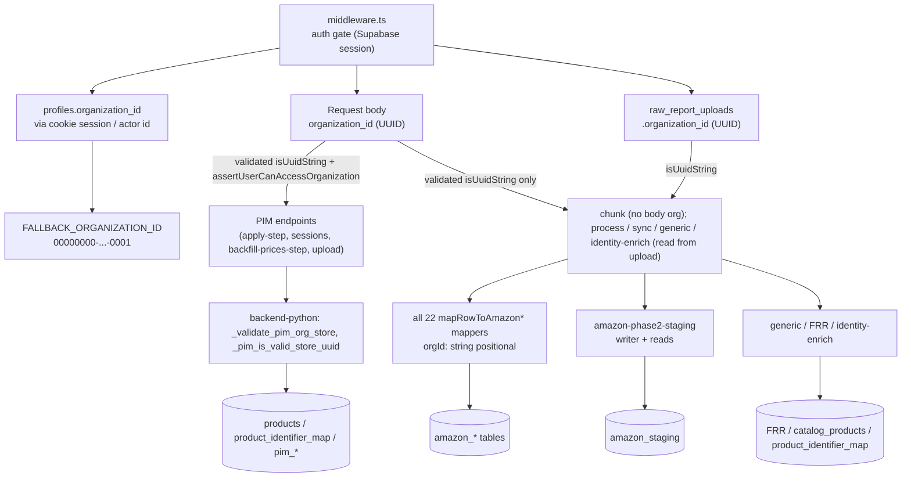
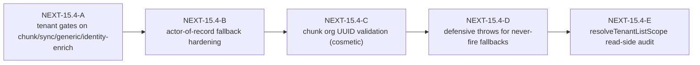

## NEXT-15.4 — organization_id propagation audit (read-only, plan only)

Plan / inspection only. No code edits, no migrations, no SQL, no schema changes, no `product_id` writes, no resolver changes, no `product_identifier_map` mutations, no patch implementations. The audit consisted of reading the middleware, the org-resolver helpers, every ingestion API route, the mapper file, the staging writer, the generic / FRR completion paths, the identity-enrich library, and the PIM Python resolvers.

---

### A. Org-derivation taxonomy



Source files for the four origins:

- Middleware auth gate: [`middleware.ts`](middleware.ts) — every non-`/_next` / non-`/login` / non-`/auth/*` route requires `supabase.auth.getUser()`.
- Body / explicit org: PIM endpoints take `organization_id` in the JSON body and validate via `isUuidString`.
- Upload-row anchoring: raw-report endpoints read `organization_id` from `raw_report_uploads` by `upload_id` and re-validate as UUID before use.
- Profile / fallback: [`lib/organization.ts`](lib/organization.ts), [`lib/server-tenant.ts`](lib/server-tenant.ts), [`lib/import-actor.ts`](lib/import-actor.ts).

---

### B. Safe paths (verified correct propagation)

#### B.1 Mappers — [`lib/import-sync-mappers.ts`](lib/import-sync-mappers.ts)

All 22 `mapRowToAmazon*` and 4 `mapRowToExpected*` / `mapRowToProductFromLedger` / `mapRowToCatalogProduct` mappers:

- Accept `orgId: string` as the 2nd positional parameter (always non-nullable; never `string | null`).
- Return `organization_id: orgId,` in the row literal — confirmed for every mapper at lines 786, 838, 862, 891, 1077, 1141, 1331, 1367, 1511, 1595, 1652, 1814, 1890, 2021, 2103, 2308, 2454, 2497, 2615, 2746 (and the FbaInventory / InboundPerformance / AmazonFulfilledInventory mirrors).
- Every `NATIVE_COLUMNS_*` allow-list contains `"organization_id"` (lines 151, 160, 184, 201, 211, 263, 272, 286, 299, 307, 321, 345, 375, 391, 403, 411, 419, 427, 901).
- `computeSourceLineHash(orgId, row)` (line 1754) prefixes the hash with `orgId`, ensuring per-tenant uniqueness of `source_line_hash`.

**Verdict:** zero gaps. No nullable signatures; no missing return-literal entries; no missing allow-list entries.

#### B.2 Sync route — [`app/api/settings/imports/sync/route.ts`](app/api/settings/imports/sync/route.ts)

- Line 1561 reads `orgId` from `raw_report_uploads.organization_id`.
- Line 1562–1567 validates as UUID; returns 500 on failure.
- Every Supabase query in the file is org-scoped via `.eq("organization_id", orgId)` (52 confirmed call sites).
- Every conflict-column tuple includes `organization_id` (lines 580, 627, 704, 732, 749).
- Mapper invocations always pass `orgId` positionally (verified in NEXT-15.1).

**Verdict:** safe.

#### B.3 Process route — [`app/api/settings/imports/process/route.ts`](app/api/settings/imports/process/route.ts)

- Line 328–329 reads from upload row + UUID-validates.
- Line 57–58 enforces `ownerOrg === params.organizationId` (forbids cross-org pipeline advancement). **The strongest tenant gate among raw-report routes.**

**Verdict:** safe (and exemplary — the gate at line 58 is what the other raw-report routes lack).

#### B.4 Identity-enrich route — [`app/api/settings/imports/identity-enrich/route.ts`](app/api/settings/imports/identity-enrich/route.ts)

- Line 81–84: reads + UUID-validates.
- Delegates to `lib/inventory-family-identifier-enrich.ts` which `.eq("organization_id", organizationId)` everywhere (lines 190, 211, 484) and includes `organization_id: organizationId` in all upserts (line 448).

**Verdict:** safe propagation; missing per-route tenant gate (see §F.2).

#### B.5 Generic / FRR completion — [`app/api/settings/imports/generic/route.ts`](app/api/settings/imports/generic/route.ts), [`lib/financial-reference-resolver-sync.ts`](lib/financial-reference-resolver-sync.ts)

- Generic route line 178–180: reads + UUID-validates.
- FRR sync line 215, 263, 282, 295: every read/write/conflict-column carries `organization_id`. Conflict columns: `organization_id, trid_key, source_table, source_row_id` — proper org-scoping.

**Verdict:** safe.

#### B.6 Phase-2 staging writer — [`lib/pipeline/amazon-phase2-staging.ts`](lib/pipeline/amazon-phase2-staging.ts)

- Line 1015–1017: reads `organization_id` from upload row + UUID-validates; returns 500 on failure.
- Conflict columns (line 45): `organization_id, upload_id, row_number`.
- 60+ Supabase calls all `.eq("organization_id", orgId)`.
- Audit log writes (line 935) carry `organization_id`.

**Verdict:** safe.

#### B.7 PIM Python — [`backend-python/main.py`](backend-python/main.py), [`backend-python/pim_import_async.py`](backend-python/pim_import_async.py)

- `_validate_pim_org_store(organization_id, store_id)` (line 2545) is the canonical entrypoint validator — raises HTTPException 400 if either is missing or non-UUID.
- Every FastAPI endpoint that takes `organization_id` validates via `uuid.UUID(...)` (lines 817–819, 905–907, 1642–1644, 1663–1665, 1940, 2007–2010).
- Defense-in-depth `_pim_is_valid_store_uuid` (line 2570) applied to all critical resolvers post–PATCH-01 / NEXT-02b:
  - `_pim_resolve_product` (line 4314)
  - `_pim_product_ids_for_values` (line 2702)
  - `_pim_product_ids_for_values_batch` (line 2729)
  - `_process_pim_seed_row` (line 5116)
- Every Supabase query in Python is `.eq("organization_id", organization_id)`.
- `pim_import_async.py` propagates `organization_id` through every step (lines 314, 345, 493, 575, 778, 1095, 1162, 1165) and writes `organization_id` on every metadata persist (line 569).

**Verdict:** safe; matches the strongest gate pattern in the codebase.

#### B.8 PIM-side TypeScript routes — [`app/api/dashboard/products/import/*`](app/api/dashboard/products/import)

Every PIM endpoint that mutates state calls `assertUserCanAccessOrganization` from [`app/dashboard/products/pim-actions.ts`](app/dashboard/products/pim-actions.ts) (line 37). Verified call sites:

- `apply-step/route.ts:82`
- `backfill-prices-step/route.ts:29`
- `sessions/route.ts:24`
- `upload/route.ts` — delegates to `createPimImportUploadSession` in [`app/dashboard/products/pim-import-actions.ts`](app/dashboard/products/pim-import-actions.ts) line 131 which calls the gate.

`assertUserCanAccessOrganization` is the canonical implementation: requires `getSessionUserIdFromCookies()`, loads the profile, requires `homeOrg === organizationId` OR a platform-staff role (`super_admin`, `system_employee`, `system_admin`).

**Verdict:** safe — strongest gate pattern in the application.

---

### C. Nullable / optional org paths

There are **no nullable `organization_id` paths** in any ingestion writer or mapper:

- All 22+ mappers take `orgId: string` (never `string | null`).
- All `NATIVE_COLUMNS_*` allow-lists list `"organization_id"` first.
- All Python writers take `organization_id: str` (never `Optional[str]`).
- All API routes that read `raw_report_uploads.organization_id` either UUID-validate-and-return-500 or UUID-validate-and-skip.
- Phase-2 staging conflict tuple is `(organization_id, upload_id, row_number)` — `organization_id` is non-null by index constraint.

Exceptions worth naming explicitly (none of which is a propagation gap):

- `app/api/settings/imports/chunk/route.ts:71` reads `organization_id` from the upload row but does **not** UUID-validate it. The value is used only in a `console.info` log; no write decision depends on it. Cosmetic inconsistency.
- `lib/pipeline/amazon-removals-business-key.ts:160-162` falls back to `String(row.organization_id ?? "").trim().replace(/^\{|\}$/g, "").toLowerCase()` if `normalizeRemovalOrderUuidForBusinessKey` rejects the value. This is used only as a deduplication business-key; never as a tenant gate. Should-never-fire safety net.

---

### D. Missing org propagation

**None at the writer level.** Every persisted row in every destination table carries `organization_id`. The grep pass shows no `.from("...").insert({ ... })` or `.upsert({ ... })` call without an `organization_id` field. Every `.update(...)` is followed by `.eq("organization_id", orgId)` or operates on a row already filtered by `organization_id`.

The only places where `organization_id` is **derived** rather than passed-through are:

1. `lib/import-actor.ts:34` — when no cookie session and no explicit profile id is provided, falls through to `resolveOrganizationId()` to find an audit-actor profile. The actor's profile is then used; not used to set the `organization_id` of any imported row.
2. `lib/server-tenant.ts:248` — `resolveWriteOrganizationId` falls through to `resolveOrganizationId()` when no profile resolves. **Not invoked by any ingestion route.** Used by Server Actions in non-import flows (e.g., tenant branding, organization-logo).

---

### E. Upload / org derivation paths

| Origination layer | File / function | What it does | Used by |
|---|---|---|---|
| 1. Middleware auth | [`middleware.ts`](middleware.ts) lines 42–54 | `supabase.auth.getUser()` redirects unauthenticated requests to `/login`. | Every non-public route. |
| 2. Profile lookup by cookie | [`lib/supabase-server-auth.ts`](lib/supabase-server-auth.ts) `getSessionUserIdFromCookies()` | Reads Supabase auth cookies. | `assertUserCanAccessOrganization`, `loadActorTenantProfile`, `resolveActorProfileId`. |
| 3. Profile org by id | [`lib/server-tenant.ts`](lib/server-tenant.ts) `loadTenantProfile` (78–130) | Loads `profiles.organization_id` for an actor. | All gated PIM endpoints. |
| 4. Body org (validated) | PIM routes — `apply-step/route.ts:74`, `backfill-prices-step/route.ts`, `sessions/route.ts`, `upload/route.ts:33` | Trusts client-supplied org after `isUuidString` AND `assertUserCanAccessOrganization`. | PIM endpoints only. |
| 5. From `raw_report_uploads.organization_id` | `process/route.ts:328`, `sync/route.ts:1561`, `generic/route.ts:178`, `identity-enrich/route.ts:81`, `chunk/route.ts:71`, `amazon-phase2-staging.ts:1015` | Reads org from the upload row + UUID-validates. | All raw-report import routes. |
| 6. Env-var / hardcoded fallback | [`lib/organization.ts`](lib/organization.ts) `resolveOrganizationId()` returns `NEXT_PUBLIC_ORGANIZATION_ID` env var or `FALLBACK_ORGANIZATION_ID = "00000000-0000-0000-0000-000000000001"`. | Used only by [`lib/import-actor.ts`](lib/import-actor.ts) line 34 for actor-of-record lookup, and by `resolveWriteOrganizationId` for non-import Server Actions. **Never used by ingestion writers.** |

The ingestion-write effective derivation is path 5 (read from upload row); the upload row itself was created via path 4 (validated body org + gate); path 1 (middleware auth) is the foundational layer for everything.

---

### F. Org inference risks

These are the structural risks today, ordered by severity. None of them currently cause cross-tenant writes; all are gaps that would matter under specific failure modes or future regressions.

#### F.1 (HIGHEST) Raw-report import routes lack explicit per-route tenant gates

The five raw-report endpoints — `chunk`, `process`, `sync`, `generic`, `identity-enrich` — protect tenant isolation only through:

- Middleware (authentication, **not** authorization to a specific org).
- UUID validation of `raw_report_uploads.organization_id` after read.
- Service-role Supabase client (bypasses RLS — required because the rows are not yet attributable to a session user).

This means any authenticated user from org-X who learns an `upload_id` from org-Y can in principle:

- Append chunks to the org-Y storage prefix via `chunk/route.ts` (storage path is anchored to `metadata.storagePrefix` from the row, so the file lands correctly under org-Y's prefix; but org-X is appending to org-Y's data).
- Advance org-Y's pipeline by calling `process`, `sync`, `generic`, `identity-enrich` with org-Y's `upload_id`.

The actual writes always carry org-Y's `organization_id` (because mappers and staging read from the upload row). The risk surface is therefore:

- (a) Cross-tenant pipeline interference (adversarial advancement, denial of service).
- (b) Audit / actor-of-record drift — the `actor_user_id` recorded in `file_processing_status` and audit logs is the calling user from org-X, even though the data is org-Y.

**`process/route.ts:57-58` is the only raw-report route that does enforce `ownerOrg === params.organizationId`** — it's the right pattern; the other four routes should adopt it.

#### F.2 (MEDIUM) `chunk/route.ts:71` does not UUID-validate `organization_id` from the upload row

Cosmetic at present (value is only logged), but the route otherwise reads identically to the other raw-report routes that **do** validate. Inconsistency is a future-regression hazard.

#### F.3 (MEDIUM) `lib/import-actor.ts:34` falls through to `FALLBACK_ORGANIZATION_ID`

```ts
const orgId = resolveOrganizationId();  // line 34 — falls back to "0000-...-0001"
const { data: superAdmin } = await supabaseServer
  .from("profiles")
  .eq("organization_id", orgId)
  .eq("role", "super_admin") …
```

Used as the actor-resolver's last-resort branch when no cookie session is available and no explicit user id is provided. The function returns a `profiles.id` that lives in `FALLBACK_ORGANIZATION_ID`. In a multi-tenant deployment where `FALLBACK_ORGANIZATION_ID` is not the real org, this could attribute audit actions to a synthetic / placeholder user. Not a write-org leak; it is an actor attribution leak.

#### F.4 (LOW) `lib/pipeline/amazon-removals-business-key.ts:160-162` non-UUID fallback

The `coerceRemovalOrderBusinessKeyColumns` helper, when `normalizeRemovalOrderUuidForBusinessKey(row.organization_id)` returns null, falls back to a lowercased trimmed string. Should-never-fire because upstream validation enforces UUID-ness on every writer. If it does fire, the result is a dedup-key collision risk — not a tenant boundary breach.

#### F.5 (LOW) `resolveTenantListScope` returns `{mode: "all"}` when no actor profile

[`lib/server-tenant.ts`](lib/server-tenant.ts) lines 178–199 — designed for super-admin list endpoints, but a list-style API that forgets to wire `actorProfileId` would return all-tenant data. **Read-side concern only.** No ingestion impact.

#### F.6 (LOW) `lib/server-tenant.ts:248` falls through to `resolveOrganizationId()` for writes

The fallback only triggers when (a) no profile id, (b) no cookie session, (c) no explicit `requestedOrganizationId`. In a deployed multi-tenant system that should never happen for an authenticated request. **Not invoked by any ingestion route.**

---

### G. Multi-tenant isolation risks (summary)

| Layer | Strength | Notes |
|---|---|---|
| Middleware auth gate | Strong | Every non-public route requires Supabase session. |
| PIM endpoints | Strong | `assertUserCanAccessOrganization` + `isUuidString` + `assertRowOrgAccess`. |
| Raw-report endpoints (`chunk` / `process` / `sync` / `generic` / `identity-enrich`) | Medium | Auth-only middleware; org read from upload row + UUID-validated. `process` additionally enforces `ownerOrg === params.organizationId`. The other four should adopt the same enforcement. |
| Mappers | Strong | All 26 mappers take non-nullable `orgId`; all return literals carry `organization_id`; all allow-lists list it. |
| Staging writer | Strong | UUID-validated; org-scoped reads/writes; org-scoped conflict key. |
| FRR / generic / identity-enrich | Strong | All Supabase calls org-scoped; conflict tuples include `organization_id`. |
| PIM Python | Strong | `_validate_pim_org_store` + `_pim_is_valid_store_uuid` defense-in-depth at every resolver. |
| Audit / actor-of-record | Medium | `import-actor.ts` falls back to `FALLBACK_ORGANIZATION_ID` when no cookie session — actor attribution can drift in deployments where that org is a placeholder. |
| `removal-business-key` fallback | Low | Non-UUID coercion path is a dedup-key collision risk, not an isolation risk. |
| Read-side `resolveTenantListScope` "all" mode | Low | Designed for super-admin; list endpoints that omit `actorProfileId` would over-return. |

The single dominant structural risk is F.1 (raw-report routes without explicit per-route tenant gates). Every other risk is either cosmetic, low-severity, or mitigated by upstream validation.

---

### H. Recommended future hardening order (plan-only — do not implement now)



#### NEXT-15.4-A (HIGHEST) — Add `assertUserCanAccessOrganization` (or an equivalent owner-org check) to the four raw-report routes that currently lack it

- [`app/api/settings/imports/chunk/route.ts`](app/api/settings/imports/chunk/route.ts) — pattern: after the upload row is loaded, gate on `actorOrg === ownerOrg` OR platform-staff. Storage path is already prefix-anchored to the upload, so a malicious append cannot reach a different org's prefix; the gate would prevent a foreign actor from advancing the file at all.
- [`app/api/settings/imports/sync/route.ts`](app/api/settings/imports/sync/route.ts) — same pattern at line 1567 (after `orgId` is read + validated).
- [`app/api/settings/imports/generic/route.ts`](app/api/settings/imports/generic/route.ts) — same pattern at line 180.
- [`app/api/settings/imports/identity-enrich/route.ts`](app/api/settings/imports/identity-enrich/route.ts) — same pattern at line 84.

The `process` route already enforces this at [`app/api/settings/imports/process/route.ts:57-58`](app/api/settings/imports/process/route.ts) and is the reference implementation. **Eliminates F.1.**

#### NEXT-15.4-B — Harden `lib/import-actor.ts:34` actor-of-record fallback

Replace the `resolveOrganizationId()` fallback path with a hard error when no cookie session is available and no explicit user id is provided. Today this falls into `FALLBACK_ORGANIZATION_ID` and silently selects a placeholder actor. **Eliminates F.3.**

#### NEXT-15.4-C — Cosmetic consistency

- Add `if (!isUuidString(orgId)) return 500` to [`app/api/settings/imports/chunk/route.ts:71`](app/api/settings/imports/chunk/route.ts) for symmetry with the other read-from-upload routes. **Eliminates F.2.**
- Optional: unify the older `mapRowToAmazon*` mappers' `storeId: string` to `storeId: string | null` — already tracked under NEXT-16, mentioned here only because it's the same kind of cosmetic-symmetry work.

#### NEXT-15.4-D — Defensive throws for never-fire fallbacks

- Replace [`lib/pipeline/amazon-removals-business-key.ts:160-162`](lib/pipeline/amazon-removals-business-key.ts) non-UUID fallback with a `throw new Error(...)`. The branch should not be reachable in practice; a throw turns a silent dedup-key collision risk into a loud upstream-validation regression alarm. **Eliminates F.4.**

#### NEXT-15.4-E — `resolveTenantListScope` callers audit (read-side)

Plan-only audit of every call site of `resolveTenantListScope` (and its `resolveTenantListCompanyScope` deprecated alias) to ensure `actorProfileId` is wired at every list endpoint. Out of NEXT-15 scope (read-side, not ingestion); track separately under NEXT-19 if pursued. **Mitigates F.5.**

---

### I. What we already have that is correct (do-not-touch list)

- All 26 mapper signatures and return literals (`mapRowToAmazon*`, `mapRowToExpected*`, `mapRowToProductFromLedger`, `mapRowToCatalogProduct`).
- All `NATIVE_COLUMNS_*` allow-lists' inclusion of `"organization_id"`.
- The `process` route's `ownerOrg === params.organizationId` enforcement (line 58) — reference implementation.
- The PIM endpoints' uniform `assertUserCanAccessOrganization` pattern.
- The Python `_validate_pim_org_store` + `_pim_is_valid_store_uuid` guard pair (PATCH-01 / NEXT-02b).
- The Phase-2 staging upload-row UUID validation (line 1015–1017).
- The FRR conflict tuple including `organization_id`.
- `computeSourceLineHash(orgId, row)` org-prefixing (mappers line 1754).
- The middleware auth gate.
- The `assertRowOrgAccess` helper in [`lib/server-tenant.ts`](lib/server-tenant.ts) lines 254–267 for row-level org checks.

---

### Conclusion

- **Org propagation through the pipeline is fully correct.** Every mapper, staging writer, generic completion, FRR sync, identity-enrich, and Python resolver carries `organization_id` end-to-end.
- **No mapper has a nullable `orgId` signature.** No allow-list is missing `"organization_id"`.
- **No writer is missing an `organization_id` column.** Every `.eq("organization_id", ...)` and `.insert / .upsert` carries the field.
- **The only risk surface is structural per-route tenant gates** on four of the five raw-report endpoints. Those endpoints today cannot land cross-tenant data, but they can be invoked by a foreign actor against another org's upload, leading to pipeline interference and actor-of-record drift.
- **Recommended next plan-only sub-step: NEXT-15.5 (upload-linkage propagation audit, read-only)** — apply the same structural rubric to `upload_id` / `source_upload_id` across mappers, staging, generic, and PIM, with explicit attention to the `amazon_reports_repository.upload_id` text-vs-uuid divergence (read-side join only — do not alter the column type).

---

### Constraints recap (still in force)

- No code edits.
- No migrations.
- No SQL.
- No schema changes.
- No `product_id` writes.
- No resolver changes.
- No `product_identifier_map` mutations.
- No deletions.
- No expected_packages / pallets / packages changes.
- No FRR writer change.
- No removal of "dead" code; mark only.
- No patch implementations.
- No refactors.

Plan / inspection only.