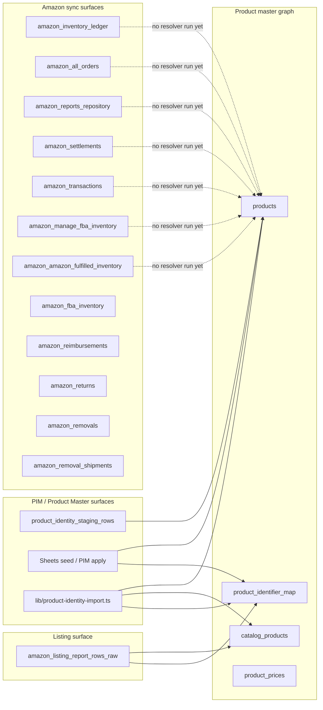

## NEXT-18A — Product Seed Candidate Audit (Plan only)

Plan only. Read-only. No SQL execution, no writes (no `products` / `product_identifier_map` / `resolved_product_id` / `product_id` writes), no migrations, no schema changes, no code edits, no deletions, no merges. This document defines the audit's data sources, queries, classification rules, and report shape so that a follow-up phase (NEXT-18B) can run them safely under user supervision.

---

### A. Product seed architecture map

The repo has three independent "product surface" pipelines today; an honest audit must respect that asymmetry rather than treat all rows uniformly.

Three column conventions on the Amazon side:

- Convention A (resolver quad) — `amazon_inventory_ledger`, `amazon_all_orders`, `amazon_settlements`, `amazon_transactions`, `amazon_manage_fba_inventory`, `amazon_amazon_fulfilled_inventory` carry `resolved_product_id`, `resolved_catalog_product_id`, `identifier_resolution_status`, `identifier_resolution_confidence` (added by [supabase/migrations/20260620_product_identifier_map_ledger_enrichment.sql](supabase/migrations/20260620_product_identifier_map_ledger_enrichment.sql) and [supabase/migrations/20260642_amazon_import_file_alignment.sql](supabase/migrations/20260642_amazon_import_file_alignment.sql)). No `product_id` column.
- Convention B (legacy product_id) — `amazon_reports_repository` carries `product_id`, `catalog_product_id`, `product_match_method`, `product_match_confidence`, `product_matched_at` (added by [supabase/migrations/20260704130000_amazon_reports_repository_wide_columns.sql](supabase/migrations/20260704130000_amazon_reports_repository_wide_columns.sql)). Different column names, same intent.
- Convention C (no link columns) — `amazon_fba_inventory`, `amazon_reimbursements`, `amazon_returns`, `amazon_removals`, `amazon_removal_shipments` have neither convention. Backfill cannot write to these tables without first adding columns (deferred — not part of this audit).

Cross-cutting facts (verified):

- `products.sku` is unique per `(organization_id, store_id, sku)` `NULLS NOT DISTINCT` ([supabase/migrations/20260808120000_pim_idempotent_import.sql](supabase/migrations/20260808120000_pim_idempotent_import.sql) lines 124–146). One seller_sku can never map to more than one product within a store.
- `product_identifier_map` is unique only on `(organization_id, store_id, seller_sku) WHERE seller_sku IS NOT NULL AND deleted_at IS NULL` ([supabase/migrations/20260808120000_pim_idempotent_import.sql](supabase/migrations/20260808120000_pim_idempotent_import.sql) lines 71–88). ASIN, FNSKU, UPC are deliberately multi-valued in the map.
- `product_identifier_map` rows have no foreign-key constraint to `products.id` or `catalog_products.id`; referential integrity must be validated at query time.
- `catalog_products.product_id` is `text` (Amazon's listing-side product id, not `products.id`); do not confuse it with the master.
- `amazon_reports_repository.upload_id` is live `text` (NEXT-14B), although [supabase/migrations/20260509_amazon_reports_repository.sql](supabase/migrations/20260509_amazon_reports_repository.sql) declares `uuid`. Joins to `raw_report_uploads.id` (uuid) MUST cast with `raw_report_uploads.id::text = amazon_reports_repository.upload_id`.

---

### B. Source table priority order

Run the audit in this order; the highest-quality identifier surfaces seed the most products with the least ambiguity, and the lower-quality surfaces ride on the resolved set they produce.

1. `catalog_products` — already the master listing surface with `(seller_sku, asin)` enforced unique per `(org, store)`; near-zero seed cost.
2. `amazon_inventory_ledger` — three strong native identifiers (`fnsku`, `sku`, `asin`) + `product_name`/`title`.
3. `amazon_manage_fba_inventory` — `sku`, `fnsku`, `asin`, `product_name`.
4. `amazon_fba_inventory` — `sku`, `fnsku`, `asin`, `product_name`.
5. `amazon_amazon_fulfilled_inventory` — `seller_sku`, `fulfillment_channel_sku`, `asin`.
6. `amazon_inbound_performance` — `sku`, `fnsku`, `asin`, `product_name`.
7. `amazon_returns` — `sku`, `asin`, `product_name` (no fnsku).
8. `amazon_removals` + `amazon_removal_shipments` — `sku`, `fnsku` (no asin native).
9. `amazon_all_orders` — `sku` native only; ASIN/FNSKU exist in `raw_data` per [lib/import-sync-mappers.ts](lib/import-sync-mappers.ts) lines 285–295. ASIN/FNSKU recovery is JSONB-readable but lower confidence.
10. `amazon_reimbursements` — `sku` only on native; ASIN in `raw_data`.
11. `amazon_transactions` — `sku` + `order_id` on native; settlement-summary rows often lack any product identifier.
12. `amazon_settlements` — legacy CSV path has `sku`; flat `.txt` path has no product identifier at all on native columns (line-level content in `raw_data`).
13. `amazon_reports_repository` — `sku` + `description` only; weakest surface.

PIM staging + Sheets seed continue to run independently and produce `products` rows directly. The audit reads from `product_identity_staging_rows` as another candidate stream but does not change its pipeline.

---

### C. Identifier extraction matrix per source table

Native columns vs raw_data overflow (verified against [lib/import-sync-mappers.ts](lib/import-sync-mappers.ts) `NATIVE_COLUMNS_*` sets and the 12 mappers in NEXT-15.6):

- ASIN native: `amazon_inventory_ledger`, `amazon_returns`, `amazon_manage_fba_inventory`, `amazon_fba_inventory`, `amazon_amazon_fulfilled_inventory`, `amazon_inbound_performance`, `catalog_products`. ASIN raw_data only: `amazon_all_orders`, `amazon_reimbursements`, `amazon_transactions`, `amazon_settlements`, `amazon_reports_repository`, `amazon_removals`, `amazon_removal_shipments`.
- FNSKU native: `amazon_inventory_ledger`, `amazon_removals`, `amazon_removal_shipments`, `amazon_manage_fba_inventory`, `amazon_fba_inventory`, `amazon_amazon_fulfilled_inventory` (as `fulfillment_channel_sku`), `amazon_inbound_performance`, `catalog_products`. FNSKU raw_data only: everywhere else.
- seller_sku native: every table (column name is `sku` for most; `seller_sku` for catalog and `amazon_amazon_fulfilled_inventory`).
- UPC native: NONE of the Amazon domain tables. UPC lives on `products.upc_code`, `product_identifier_map.upc_code`, `product_identity_staging_rows.upc_code`. Any UPC referenced from Amazon sources must come from a PIM import — Amazon `raw_data` rarely contains it.
- listing_id native: only `catalog_products.listing_id`. `amazon_all_orders` listing-id headers live in `raw_data`.
- title native (`product_name` / `title` / `item_name`): `amazon_inventory_ledger`, `amazon_all_orders`, `amazon_manage_fba_inventory`, `amazon_fba_inventory`, `amazon_inbound_performance`, `amazon_returns`, `amazon_safet_claims`, `catalog_products`. Titles in `description`-style columns only: `amazon_reports_repository`. Tables with NO product title native: `amazon_removals`, `amazon_removal_shipments`, `amazon_transactions`, `amazon_settlements`, `amazon_reimbursements`, `amazon_amazon_fulfilled_inventory`.

The audit's per-table SQL must read native columns first and fall through to `raw_data`/`raw_payload` JSONB extraction for the rest. Extraction expressions for raw_data ASIN/FNSKU (common across mappers): `coalesce(raw_data->>'asin', raw_data->>'product-id', raw_data->>'ASIN')`, `coalesce(raw_data->>'fnsku', raw_data->>'FNSKU', raw_data->>'fulfillment-network-sku')`. UPC: `coalesce(raw_data->>'upc', raw_data->>'upc-code', raw_data->>'upc_code')`.

---

### D. Existing-product match rules (read-only lookup)

For each candidate row, run lookups against the master graph in this strict order. First non-empty hit wins; record all hits for the audit log.

1. Self — if the row already has a non-null `resolved_product_id` / `product_id` (Convention A or B), classify as bucket 1 and stop.
2. `product_identifier_map` exact, scoped on `(organization_id, store_id)` plus identifier columns, filtered `deleted_at IS NULL`. Probe order: seller_sku, then fnsku, then asin, then upc_code. Each probe must `LIMIT 2` and check whether the resulting `product_id` set is unanimous (>1 distinct → conflict).
3. `products` direct columns, scoped `(organization_id, store_id)` plus identifier column, filtered `deleted_at IS NULL` and `merge_status != 'merged'`. Probe order: sku, then fnsku, then asin, then upc_code.
4. `catalog_products` direct, scoped `(organization_id, store_id, seller_sku, asin)` with `NULLS NOT DISTINCT` semantics; this gives a `catalog_product_id` only — to upgrade to a `products.id` requires an existing identifier_map bridge row.
5. `products.barcode` legacy unique on `(organization_id, barcode)`; only consult if no other hit and the row carries fnsku/upc (Amazon barcode legacy).

Cross-store relaxation is forbidden in this audit — every probe must include `store_id`. The probe order intentionally mirrors `backend-python/main.py:_pim_resolve_product` (lines 4296–4381) so the audit's "existing match" classification matches what the PIM resolver would do at apply-step time.

---

### E. Safe new product candidate rules

A row is bucketable as a safe new-product candidate only if every condition holds:

- `organization_id` is a syntactic uuid and the row's owning organization exists.
- `store_id` is a syntactic uuid and the row's owning store exists. PIM-organization-level rows (no store) are out of scope for Amazon seeding; they would route to a different bucket.
- At least one identifier of class `{asin, fnsku, seller_sku}` is present and passes shape validation (`B0[0-9A-Z]{9}` for ASIN, `X[0-9A-Z]{9}` or 10-char alphanum for FNSKU, non-empty seller_sku ≠ date-shaped per [backend-python/pim_seed_cleaning.py](backend-python/pim_seed_cleaning.py) `validate_seller_sku_token`).
- No `product_identifier_map` row with `deleted_at IS NULL` already maps any of the row's identifiers to a different `product_id` within the same `(organization_id, store_id)`.
- No existing `products` row in the same `(organization_id, store_id)` has the row's seller_sku (because of the unique constraint on `(org, store, sku) NULLS NOT DISTINCT`).
- No existing `catalog_products` row has the same `(organization_id, store_id, seller_sku, asin)` quadruple already bridged to a different product.
- Source provenance is preserved: every row has a non-null `upload_id` or `source_upload_id` that exists in `raw_report_uploads.id` (after `::text` cast for `amazon_reports_repository`).
- No Excel-corruption tokens in identifier values (covered by [backend-python/pim_seed_cleaning.py](backend-python/pim_seed_cleaning.py) Excel-error placeholder list, lines 15–18, 136–147; mirror it in TypeScript ignore values from [lib/product-identity-import.ts](lib/product-identity-import.ts) `IDENTIFIER_IGNORE_VALUES`, lines 200–217).

A row that satisfies all of the above is bucket 4. A row that satisfies most but is missing one field demotes to bucket 8/9/10/11 depending on which field.

---

### F. Ambiguity and conflict rules (bucket 5 sub-classes)

The audit must distinguish four sub-types of ambiguity:

- F1 — Identifier-map fan-out: a single ASIN/FNSKU/UPC maps to ≥2 distinct `product_id`s in `product_identifier_map` (filtered `deleted_at IS NULL`) within the same `(org, store)`. Sub-bucket 5a.
- F2 — Identifier-cross-product: the row carries `(seller_sku=A, asin=B)` but `seller_sku=A` resolves to product P1 and `asin=B` resolves to product P2 ≠ P1. Sub-bucket 5b. Critical: this would auto-merge if seed runs blind.
- F3 — Existing products column conflict: a `products` row exists at the same `(org, store, sku)` but with a different non-null asin/fnsku/upc on the row vs the source. Sub-bucket 5c.
- F4 — Multi-token identifier on the source row: the source `raw_data` carries multiple ASINs or FNSKUs in one cell (Excel/CSV merge artifact). Sub-bucket 5d. Mirror handled by [backend-python/pim_seed_cleaning.py](backend-python/pim_seed_cleaning.py) `parse_identifier_row` and `finalize_ambiguity_with_db`.

Every bucket-5 row must record the colliding `product_id`s and the identifier values that caused the collision so a human reviewer can adjudicate without re-running the query.

---

### G. Low-confidence / name-only handling (bucket 7)

Name-only rows (no SKU/ASIN/FNSKU/UPC, only `product_name` / `title` / `description`) are classified as bucket 7 and never auto-create products. The audit may record the name for reviewer enrichment but must not score it as a match — fuzzy title similarity is enrichment-only, never identity-establishing. Settlement flat-`.txt` lines and many `amazon_transactions` settlement-summary rows fall here.

Special case: the existing PIM Python `_pim_resolve_product` does not consult `product_identifier_map` for primary resolution (it only hits `products` columns). The audit's existing-match step intentionally adds the identifier-map probe to widen the existing-match set — that is a divergence the report should explicitly mark in the per-row reason field as `map_hit_outside_pim_resolver` so an operator can decide whether to widen `_pim_resolve_product` later.

---

### H. UPC-only handling (bucket 6)

UPC is rare across Amazon sources (verified — no native UPC column on any of the 12 Amazon tables). When UPC does appear it usually comes from PIM staging rows or a `raw_data` overflow in catalog imports. Rules:

- A UPC-only row is bucket 6. Never auto-create a product from UPC alone, even if the UPC matches a single existing product.
- A UPC + other identifier row is classified by the other identifier; UPC is corroborating evidence only.
- The audit must surface the count of `product_identifier_map` rows with `(organization_id, store_id, upc_code)` and a count of distinct `product_id`s per UPC. Any UPC mapping to ≥2 product_ids is logged as a "UPC fan-out" sub-finding even if not gating any specific row's seeding.

Reason: a single UPC routinely maps to multiple Amazon ASINs (variant size/color/pack), and the master ID model deliberately allows that fan-out in `product_identifier_map`.

---

### I. Dry-run SQL / report outputs

The audit produces five report artifacts. None of them write to the database. Each is a SELECT-only query plus optional JSON/CSV dump, runnable via the Supabase MCP `execute_sql` tool or psql session in read-only mode. Storage of the outputs is to local disk under `.cursor/audit-reports/next-18a/` (gitignored by inspection).

1. Per-table candidate roll-up — for each of the 13 source tables, returns `(organization_id, store_id, source_table, bucket_id, count(*), distinct_skus, distinct_asins, distinct_fnskus)`. Drives the executive summary.
2. Per-row classification dump — one row per source row, columns: `(source_table, source_row_id, organization_id, store_id, upload_id_or_source_upload_id, asin, fnsku, seller_sku, upc, product_name, bucket_id, bucket_reason, existing_product_id_hit, existing_catalog_product_id_hit, conflict_product_ids_json)`. Approximate cap of 1M rows; if a tenant is wider the audit chunks per `(org, store)`. This is the source of truth for any later seeder.
3. Identifier fan-out report — for `product_identifier_map`, `(organization_id, store_id, identifier_type, identifier_value, count_distinct_product_id)` where `count_distinct > 1` and `deleted_at IS NULL`. Used by bucket 5a / H.
4. Cross-product conflict report — rows where the candidate's `(seller_sku, asin)` pair points to two different existing products. Drives bucket 5b decisions.
5. Provenance gap report — rows missing `upload_id` / `source_upload_id`, missing organization_id, missing store_id, or with an `amazon_reports_repository.upload_id` that does not exist in `raw_report_uploads.id::text`.

Every output query is scoped by `organization_id` first, by `store_id` second; no cross-tenant lookups. Reports honor `deleted_at IS NULL` for `product_identifier_map` and `deleted_at IS NULL AND merge_status != 'merged'` for `products`.

---

### J. No-write validation plan

Before NEXT-18B can write any product or identifier-map row, this audit must show:

- J1 — Zero rows with `organization_id IS NULL` in the candidate set for any covered source table.
- J2 — Every row's `store_id IS NOT NULL` OR is intentionally a PIM-organization-level seed (those route to a separate review).
- J3 — Every row's `upload_id` / `source_upload_id` resolves to an existing `raw_report_uploads.id` (text cast for reports_repository).
- J4 — The intersection of bucket 4 (safe new) and bucket 5 (ambiguous) is empty — no row classified as both safe-to-create and ambiguous.
- J5 — For every bucket-4 row, no `product_identifier_map` row with `deleted_at IS NULL` already maps any of the candidate's identifiers to a different `product_id` within the same `(org, store)`.
- J6 — For every bucket-4 row, no `products` row exists with the same `(organization_id, store_id, sku)` already (would trip the unique constraint).
- J7 — Identifier shape validation passes for every bucket-4 row (ASIN/FNSKU regex per [backend-python/pim_seed_cleaning.py](backend-python/pim_seed_cleaning.py)).
- J8 — Dirty-rate per `(organization_id, source_table)` is below the existing PIM threshold `PIM_SEED_MAX_DIRTY_RATE` (referenced in [backend-python/main.py](backend-python/main.py) lines 2536–2537).

J1–J8 are pass/fail; the audit report explicitly lists failing rows and offending counts so the operator can decide whether to fix data, narrow scope, or defer.

---

### K. Recommended implementation order after audit

In rough priority:

1. Run reports 1–5 (read-only) and review with the operator. Confirm bucket counts pass J1–J8 globally and per `(org, store)`.
2. Add a dry-run "seeder simulator" script (NEXT-18B PLAN) — same classification logic in TypeScript, emits the rows it WOULD insert without running the insert. Mirrors the existing NEXT-15.6 fixture-only smoketest pattern.
3. Decide whether to widen `_pim_resolve_product` to consult `product_identifier_map` for primary resolution (open question raised by section G).
4. Decide whether to add a `resolved_product_id` quad to Convention-C tables (`amazon_fba_inventory`, `amazon_reimbursements`, `amazon_returns`, `amazon_removals`, `amazon_removal_shipments`) before backfill, or leave them un-linked indefinitely.
5. Decide on `amazon_reports_repository.upload_id` text vs uuid (NEXT-14B is open).

Only after steps 1–2 land (and 3–5 are at least decided) should NEXT-18C run a safe product seed for bucket-4 rows. NEXT-18D would then run `product_id` / `resolved_product_id` backfill for all non-ambiguous buckets.

---

### L. Do-not-touch list

- All 12 `mapRowToAmazon*` mappers and all 18 `NATIVE_COLUMNS_*` sets in [lib/import-sync-mappers.ts](lib/import-sync-mappers.ts) — verified correct by NEXT-15.1, NEXT-15.4, NEXT-15.5, NEXT-15.6.
- The sync route at [app/api/settings/imports/sync/route.ts](app/api/settings/imports/sync/route.ts) — frozen.
- `attachPhysicalRowIdentity` private helper (sync route lines 213–221).
- `_pim_resolve_product` and `_pim_upsert_identifier_map` in [backend-python/main.py](backend-python/main.py) — read-only reference for classification rules, no behavior change in NEXT-18A.
- [lib/product-identity-import.ts](lib/product-identity-import.ts) `normalizeAsin` / `normalizeFnsku` / `normalizeUpc` — referenced for shape validation but not modified.
- `raw_report_uploads` schema — no migration, no type change. The `amazon_reports_repository.upload_id` text divergence is documented, not patched here.
- `product_identifier_map` — no inserts, no updates, no soft-deletes. No new partial unique indexes proposed in NEXT-18A.
- `products` — no inserts, no updates, no merges, no `deleted_at` flips.
- `product_prices` — out of scope; price backfill is its own pipeline already (`run_pim_import_price_backfill_step`).
- `catalog_products` — read-only reference.
- FRR (`financial_reference_resolver`) — frozen post-NEXT-11.
- The three existing per-mapper smoketests and the NEXT-15.6 sync-dispatch smoketest — keep.
- `NEXT_PUBLIC_ORGANIZATION_ID` fallback in [lib/organization.ts](lib/organization.ts) — not consulted by ingestion writers; do not start using it as a resolver default.

---

### Classification buckets (recap, in run order)

1. Already has `resolved_product_id` / `product_id` — skip.
2. Existing product via `product_identifier_map` exact match scoped `(org, store)` + `deleted_at IS NULL`.
3. Existing product via `products` direct columns scoped `(org, store)` + `deleted_at IS NULL AND merge_status != 'merged'`.
4. Safe new product candidate — passes section E gates.
5. Ambiguous identifier conflict — F1/F2/F3/F4 sub-types.
6. UPC-only candidate — review only.
7. Name-only candidate — review only, never auto-create.
8. Missing required `organization_id` / `store_id`.
9. Missing useful identifiers — has org/store but no asin/fnsku/sku/upc/listing_id and no useful title.
10. Dirty / corrupted identifier — Excel error token, scientific-notation UPC, date-shaped SKU, all-whitespace.
11. Requires human review — anything else, including rows that simultaneously qualify for multiple ambiguous sub-buckets.

Every classified row carries `(bucket_id, primary_reason, secondary_reasons, evidence_json)` so the report is auditable end-to-end.

---

### Safe matching hierarchy (recap, descending confidence)

1. Existing explicit `product_id` / `resolved_product_id` on source row.
2. `product_identifier_map` exact match on `(organization_id, store_id, seller_sku)` with `deleted_at IS NULL`.
3. `products` exact on `(organization_id, store_id, sku)` (canonical unique).
4. `(asin, fnsku)` joint hit in `product_identifier_map` scoped `(org, store)` — unanimous `product_id` only.
5. `(asin, seller_sku)` joint hit — unanimous only.
6. `(fnsku, seller_sku)` joint hit — unanimous only.
7. `seller_sku` alone in `(org, store)` — usually canonical because of `products` unique.
8. `asin` alone — only if exactly one `product_id` exists across `product_identifier_map` and `products` combined for `(org, store, asin)`.
9. `upc_code` alone — only if both fan-out audit (H) is clean and exactly one product matches.
10. `listing_id` + `(org, store)` — only via `catalog_products.listing_id` bridging to the identifier_map.
11. Title / `product_name` similarity — enrichment hint only, never identity.

Anything matched at rank 4 or lower must record the rank and the evidence so a reviewer can sanity-check before NEXT-18C writes.

---

### Final recommendation

**Option 2 — implement a dry-run report generator (NEXT-18B).** The schema/data audit captured in this plan is comprehensive enough to start producing reports; further pure-schema audit will not add information that running the reports against live data won't surface immediately. Defer Option 3 (safe product seed pipeline) until after the dry-run reports are reviewed and the J1–J8 validations pass. Option 4 (tenant-gate hardening) is a separate workstream from NEXT-15.4's open observations and should not block NEXT-18B.

Constraints recap: no SQL execution, no Supabase writes, no migrations, no schema changes, no `upload_id` type conversion, no `product_id` writes, no `product_identifier_map` mutations, no merges, no deletions, no refactors, no FRR change, no PIM resolver change, no removal of "dead" code (e.g. unused `_pim_identifier_map_conflicts_other_product`), no test file creation in this step. Plan only.