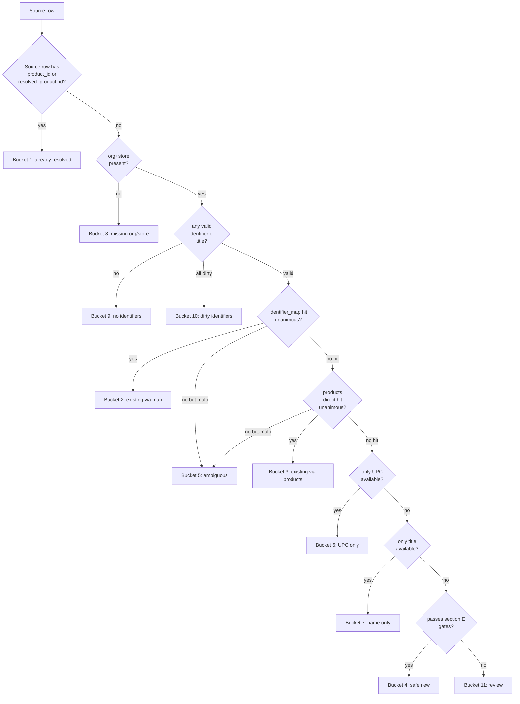
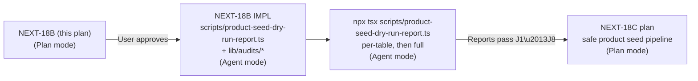

## NEXT-18B — Product seed dry-run report generator (Plan only)

Plan only. Read-only. No SQL execution, no code edits, no test creation, no Supabase writes, no migrations, no schema changes, no `products` / `product_identifier_map` / `resolved_product_id` / `product_id` writes. This document defines the generator's exact file layout, queries, classification rules, and output shape so a follow-up Agent-mode session can build and run it under operator supervision.

Locked predecessor: [.cursor/plans/product_seed_candidate_audit_4f2574f0.plan.md](.cursor/plans/product_seed_candidate_audit_4f2574f0.plan.md) (NEXT-18A). Section letters below refer to NEXT-18A where applicable.

---

### A. Recommended generator file path(s)

Single TypeScript entry point:

- [scripts/product-seed-dry-run-report.ts](scripts/product-seed-dry-run-report.ts) (~500–700 lines).

Co-located shared modules (created only by the NEXT-18B implementation, not by this plan):

- [lib/audits/product-seed-classifier.ts](lib/audits/product-seed-classifier.ts) — pure-function 11-bucket classifier + safe-matching hierarchy (~250 lines).
- [lib/audits/product-seed-identifier-extract.ts](lib/audits/product-seed-identifier-extract.ts) — per-source-table SELECT projection + `raw_data` overflow extractors (~200 lines).
- [lib/audits/product-seed-output.ts](lib/audits/product-seed-output.ts) — NDJSON / CSV / JSON writers and report headers (~150 lines).

Reason for splitting: the classifier is the only piece that other future scripts (NEXT-18C seed simulator, NEXT-18D backfill) will reuse. Keeping it pure (no Supabase imports) lets it be unit-tested by a future smoketest alongside the NEXT-15.6 pattern. Output writers are similarly pure I/O. The entry script keeps Supabase orchestration only.

The audit produces no `package.json` script entry in this phase — run via `npx tsx`.

---

### B. SQL-only vs TypeScript script vs hybrid

**Recommendation: TypeScript script (with embedded `.select()` queries via `@supabase/supabase-js`), not pure SQL files.**

| Approach | Pro | Con |
|---|---|---|
| Pure SQL files | Easy to run via Supabase MCP `execute_sql` or psql; auditable as plain text. | No streaming, no classification logic, no easy NDJSON/CSV writers, cannot enforce J1–J8 thresholds inline, hard to chunk reliably. |
| TypeScript via `tsx` | Mirrors existing `scripts/validate-import-checklist.ts` + `scripts/backfill-pim-store-id.ts` patterns; can stream large result sets, paginate with keyset iteration, compute classification per row, emit JSON evidence; honors `process.exit(1)` on threshold failure. | Slightly more code; depends on `SUPABASE_SERVICE_ROLE_KEY` in `.env.local`. |
| Hybrid (SQL + TS post-processor) | Maximally portable. | Doubles the surface, no concrete benefit for the dry-run case. |

The TS approach is read-only by construction — every Supabase call is `.from(...).select(...)`. No `.insert`, `.update`, `.upsert`, `.delete`, or `rpc(...)` call appears anywhere in the generator. Implementation will assert this with an explicit allow-list against the Supabase query-builder shape (the type system already gates it; a runtime assertion is belt-and-suspenders).

Service-role usage rationale: the generator must read every tenant's rows for the audit operator (an org-level analyst). Per the existing pattern in [scripts/validate-import-checklist.ts](scripts/validate-import-checklist.ts) lines 39 and [scripts/backfill-pim-store-id.ts](scripts/backfill-pim-store-id.ts) lines 43–50, the service-role key is loaded from `.env.local`, never logged, and the client is constructed with `auth: { persistSession: false }`.

---

### C. Exact five report definitions

Every report is per-tenant scoped (`organization_id` first, then `store_id`); cross-tenant lookups are forbidden.

#### C.1 — Per-table roll-up

One row per `(organization_id, store_id, source_table, bucket_id)`. Columns:

- `organization_id`, `store_id`, `source_table`, `bucket_id`, `bucket_label`, `row_count`, `distinct_seller_skus`, `distinct_asins`, `distinct_fnskus`, `distinct_upcs`, `with_upload_provenance_count`, `with_native_asin_count`, `with_native_fnsku_count`.

Aggregation runs in TypeScript over the streamed per-row dump (C.2) so we don't re-query for it; same passing of rows produces both files. Output file: `00-roll-up.csv`.

#### C.2 — Per-row classification dump

One NDJSON line per source row. Schema:

```text
{
  "source_table": "amazon_inventory_ledger",
  "source_row_id": "<row id or composite key>",
  "organization_id": "<uuid>",
  "store_id": "<uuid|null>",
  "upload_linkage_col": "upload_id"|"source_upload_id",
  "upload_id_value": "<uuid|text>",
  "upload_provenance_resolved": true|false,
  "identifiers": {
    "seller_sku": "<text|null>",
    "asin": "<text|null>",
    "fnsku": "<text|null>",
    "upc": "<text|null>",
    "listing_id": "<text|null>",
    "title": "<text|null>"
  },
  "identifier_source": {
    "seller_sku": "native"|"raw_data"|"none",
    "asin": "native"|"raw_data"|"none",
    "fnsku": "native"|"raw_data"|"none",
    "upc": "raw_data"|"none",
    "listing_id": "native"|"raw_data"|"none",
    "title": "native"|"raw_data"|"none"
  },
  "bucket_id": 1-11,
  "bucket_label": "...",
  "primary_reason": "...",
  "secondary_reasons": ["..."],
  "existing_product_id_hit": "<uuid|null>",
  "existing_catalog_product_id_hit": "<uuid|null>",
  "conflict_product_ids": ["<uuid>", "<uuid>"],
  "match_rank": 1-11,
  "match_evidence": {/* see section H */}
}
```

Output file: `01-rows.ndjson` (newline-delimited so streaming consumers can `jq` line-by-line). Approximate cap: 1.4M rows across the three largest tables. The generator MUST chunk per `(organization_id, store_id)` and write incrementally rather than buffering.

#### C.3 — Identifier fan-out report

Targets `product_identifier_map`. Rows where an identifier `(organization_id, store_id, identifier_type, identifier_value)` maps to `count_distinct(product_id) > 1` with `deleted_at IS NULL`. Columns:

- `organization_id`, `store_id`, `identifier_type` (asin/fnsku/upc/seller_sku), `identifier_value`, `count_distinct_product_id`, `product_ids` (json array, capped to 50), `first_seen_at_min`, `last_seen_at_max`, `match_source_modes` (json array of distinct `match_source` strings).

Note on seller_sku: by unique constraint `(organization_id, store_id, seller_sku) WHERE deleted_at IS NULL`, fan-out > 1 indicates a constraint anomaly (stale rows where `deleted_at IS NULL` accidentally on dupes). It should be empty. Reporting it is the canary.

Output file: `02-identifier-fan-out.json`.

#### C.4 — Cross-product conflict report

A row from the per-row dump is in this report iff:

- the row carries ≥2 identifiers of class `{seller_sku, asin, fnsku, upc}`, AND
- each identifier individually resolves to an existing product (via `product_identifier_map` or `products`), AND
- the resolved products differ.

One row per source row meeting the criterion. Columns:

- `source_table`, `source_row_id`, `organization_id`, `store_id`, `identifier_a_type`, `identifier_a_value`, `resolved_product_id_a`, `identifier_b_type`, `identifier_b_value`, `resolved_product_id_b`, `existing_map_match_sources`.

Cross-classified with bucket 5b (F2 in NEXT-18A section F). Output file: `03-cross-product-conflict.csv`.

#### C.5 — Provenance gap report

One row per source row that fails any of:

- `organization_id IS NOT NULL`,
- `store_id IS NOT NULL` (with exception for PIM-organization-level rows),
- `upload_id` / `source_upload_id IS NOT NULL`,
- the upload row exists in `raw_report_uploads.id` (uuid for all tables except `amazon_reports_repository` which requires `raw_report_uploads.id::text = upload_id`).

Columns: `source_table`, `source_row_id`, `organization_id`, `store_id`, `upload_id_value`, `gap_reasons` (json array: missing_org / missing_store / missing_upload / upload_not_resolved).

Output file: `04-provenance-gap.csv`.

---

### D. Source table coverage matrix

Fourteen sources in total (12 Amazon + 2 product-graph candidate streams). Coverage flags drive the generator's iteration plan.

- `amazon_inventory_ledger` — Convention A (`resolved_product_id` quad), native asin/fnsku/sku/title.
- `amazon_all_orders` — Convention A, native sku/title (ASIN/FNSKU in raw_data).
- `amazon_settlements` — Convention A, native sku (legacy CSV) / no product identifier (TXT flat).
- `amazon_transactions` — Convention A, native sku + order_id.
- `amazon_manage_fba_inventory` — Convention A, native sku/fnsku/asin/title.
- `amazon_amazon_fulfilled_inventory` — Convention A, native seller_sku/fulfillment_channel_sku/asin.
- `amazon_reports_repository` — Convention B (`product_id` legacy), native sku, **upload_id is text live (NEXT-14B)**.
- `amazon_fba_inventory` — Convention C (no link columns), native sku/fnsku/asin/title.
- `amazon_reimbursements` — Convention C, native sku.
- `amazon_returns` — Convention C, native sku/asin/title.
- `amazon_removals` — Convention C, native sku/fnsku.
- `amazon_removal_shipments` — Convention C, native sku/fnsku.
- `catalog_products` — listing master surface, native seller_sku/asin/fnsku/listing_id/title.
- `product_identity_staging_rows` — PIM staging, native seller_sku/asin/fnsku/upc/title.

Per-table iteration unit: chunk by `(organization_id, store_id)` then keyset-paginate `id > $last LIMIT 1000`. Source-row id is the primary key uuid for Amazon and PIM tables; for `catalog_products` it is `id`. No table is touched outside this list in NEXT-18B.

---

### E. Identifier extraction matrix

Per-table SELECT projection (native columns only), then in-process `raw_data` / `raw_payload` JSONB fallback for ASIN/FNSKU/UPC where the native column is absent. Critical mappings:

- ASIN — native: `amazon_inventory_ledger.asin`, `amazon_returns.asin`, `amazon_manage_fba_inventory.asin`, `amazon_fba_inventory.asin`, `amazon_amazon_fulfilled_inventory.asin`, `catalog_products.asin`. Raw-data extraction: `coalesce(raw_data->>'asin', raw_data->>'product-id', raw_data->>'ASIN')` for the remaining Amazon tables.
- FNSKU — native: `amazon_inventory_ledger.fnsku`, `amazon_removals.fnsku`, `amazon_removal_shipments.fnsku`, `amazon_manage_fba_inventory.fnsku`, `amazon_fba_inventory.fnsku`, `amazon_amazon_fulfilled_inventory.fulfillment_channel_sku`, `catalog_products.fnsku`. Raw-data fallback: `coalesce(raw_data->>'fnsku', raw_data->>'FNSKU', raw_data->>'fulfillment-network-sku')`.
- seller_sku — every covered table has a native `sku` or `seller_sku`.
- UPC — never native on Amazon tables. Native only on `catalog_products` raw_payload (`raw_payload->>'upc'` chain), `product_identity_staging_rows.upc_code`, `products.upc_code`, `product_identifier_map.upc_code`. Generator's UPC extraction step looks at `raw_data->>'upc'`, `raw_data->>'upc-code'`, `raw_data->>'upc_code'` for Amazon sources but does NOT count UPC as a primary identifier for those rows.
- listing_id — only on `catalog_products.listing_id` native and `raw_data->>'listing-id'` overflow in `amazon_all_orders`.
- title — `product_name` on most, `item_name` on `catalog_products` and `amazon_safet_claims`, `title` on `amazon_inventory_ledger`, `description` on `amazon_reports_repository` (transaction line text, not catalog).

Normalisation at extraction time:

- ASIN: trim, uppercase, validate `^B[0-9A-Z]{9}$` (mirror [lib/product-identity-import.ts](lib/product-identity-import.ts) `normalizeAsin`).
- FNSKU: trim, uppercase, validate `^X[0-9A-Z]{9}$` OR 10-char alphanumeric.
- UPC: trim, digits-only via `^[0-9]{8,14}$`, no leading-zero re-padding, no scientific-notation expansion (mirror `normalizeUpc`).
- seller_sku: trim, reject date-shaped tokens via [backend-python/pim_seed_cleaning.py](backend-python/pim_seed_cleaning.py) `validate_seller_sku_token` regex.
- Excel error tokens: reject `IDENTIFIER_IGNORE_VALUES` from [lib/product-identity-import.ts](lib/product-identity-import.ts) lines 200–217 (`#REF!`, `#N/A`, etc.).

Any value failing shape validation is preserved as the raw string in `identifiers.<type>` but the row classifies into bucket 10 (dirty/corrupted) with `primary_reason: "identifier_shape_invalid:<type>"`.

---

### F. Query / read strategy

#### F.1 Iteration shape

Per source table, per `(organization_id, store_id)`, keyset-paginate on `id`:

- `from(table).select('<projection>, raw_data').eq('organization_id', org).eq('store_id', store).gt('id', cursor).order('id', { ascending: true }).limit(1000)`.
- For `amazon_removal_shipments`, projection omits `raw_data` if the table column shape is `raw_row` instead — generator must detect at schema-introspection time (one `select * limit 1` per table at startup).

Page size 1000 is a balance between Supabase HTTP overhead and JS heap. Big tables (`amazon_settlements` 534k, `amazon_reports_repository` 412k, `amazon_inventory_ledger` 282k) chunk in 282–535 pages per (org, store) pair.

#### F.2 Lookup pre-loads (per (organization_id, store_id))

Before iterating source rows, the generator loads two lookup structures into memory per (org, store):

1. Identifier-map index — `select id, product_id, seller_sku, asin, fnsku, upc_code, deleted_at, match_source from product_identifier_map where organization_id = $org and (store_id = $store or store_id is null) and deleted_at is null`. Keyed in three maps in process memory: by seller_sku, by asin, by fnsku, by upc_code; each value is `Array<{product_id, source_id, match_source}>` so fan-out is detected by `.length > 1` lookup.
2. Products index — `select id, sku, asin, fnsku, upc_code, deleted_at, merge_status, merged_into_id from products where organization_id = $org and (store_id = $store or store_id is null) and deleted_at is null and (merge_status is null or merge_status != 'merged')`. Same in-memory shape as identifier-map.

Assumption: a single tenant's product graph fits in process memory (typical: ≤500k products, ≤2M identifier-map rows). If a tenant exceeds 5M rows, the generator must fall back to per-identifier point lookups instead of preload — guarded by a `--no-preload` CLI flag and a row-count check at startup.

Upload provenance index — `select id, id::text as id_text from raw_report_uploads where organization_id = $org`. One map keyed by uuid AND by uuid::text (the dual cast handles `amazon_reports_repository`).

#### F.3 Per-row classification call

For each streamed source row, the generator:

1. Builds the `identifiers` block from the projection + `raw_data` fallback (section E).
2. Validates each identifier's shape; failures flag bucket 10 candidates.
3. Probes the in-memory indices in safe-matching-hierarchy order (section G).
4. Calls the pure classifier with `(row, identifiers, hits, conflicts, upload_resolved)` → `(bucket_id, primary_reason, secondary_reasons, evidence)`.
5. Writes one NDJSON line for report C.2 immediately, increments the C.1 aggregator counters, conditionally writes C.4 and C.5 rows if applicable.

#### F.4 Cancellation, restart, idempotency

- The generator accepts `--organization-id=<uuid>` and `--store-id=<uuid>` to scope an invocation. Without flags it iterates every (org, store) discovered in `stores` (read-only).
- Output filenames carry a `run_id` (UTC timestamp) so reruns never overwrite previous results.
- If a run is interrupted, partial NDJSON files remain on disk; the operator restarts with a new run_id.

---

### G. Classification decision tree (canonical order)

The classifier is a pure function. Decision order:



Notes:

- "Unanimous" means the union of identifier-map and products direct hits for every identifier on the row yields a single distinct `product_id`. As soon as two identifiers point to different products → bucket 5 (cross-product conflict, sub-bucket 5b).
- Bucket-5 sub-types (F1 fan-out / F2 cross-product / F3 column conflict / F4 multi-token) are recorded in `secondary_reasons`, not by routing to different top-level buckets.
- Bucket-1 is set if EITHER `resolved_product_id` (Convention A) OR `product_id` (Convention B) is non-null on the source row. Convention-C tables (returns/removals/reimbursements/fba_inventory/removal_shipments) can never hit bucket-1 because they have no link column.
- A row in bucket 4 must additionally satisfy "no existing `products.(org, store, sku)` collision" — that check uses the in-memory products index. If it would collide, the row routes to bucket 5 sub-bucket 5c.

---

### H. Evidence JSON shape

Recorded inside the per-row dump (C.2) as `match_evidence`. Schema:

```text
{
  "rank": 1-11,                              // safe-matching rank that fired
  "probe_results": [
    {
      "probe": "identifier_map.seller_sku",
      "value": "ABC-123",
      "hits": [
        {"product_id": "<uuid>", "source_id": "<map row id>", "match_source": "...", "store_scope": "store|org"}
      ]
    },
    ...
  ],
  "shape_validation": {
    "asin": "valid"|"invalid"|"absent",
    "fnsku": "valid"|"invalid"|"absent",
    "upc": "valid"|"invalid"|"absent",
    "seller_sku": "valid"|"invalid"|"absent"
  },
  "upload_provenance": {
    "linkage_col": "upload_id"|"source_upload_id",
    "value": "<uuid|text>",
    "resolved_in_raw_report_uploads": true|false,
    "cast_required": "text"|"uuid"
  },
  "conflicts": {
    "f1_identifier_fan_out": [...],
    "f2_cross_product": [...],
    "f3_products_column_conflict": [...],
    "f4_multi_token": [...]
  },
  "candidates_seed_payload": {       // populated only for bucket 4
    "would_insert_into_products": {
      "organization_id": "<uuid>",
      "store_id": "<uuid>",
      "sku": "<text>",
      "asin": "<text|null>",
      "fnsku": "<text|null>",
      "upc_code": "<text|null>",
      "product_name": "<text|null>"
    },
    "would_insert_into_product_identifier_map": [
      {"identifier_type": "seller_sku", "value": "..."},
      ...
    ]
  }
}
```

`candidates_seed_payload` is populated only for bucket 4 rows. It is the exact insert payload that a future NEXT-18C seeder would attempt — recording it now means the operator can review every would-be insert without running it.

---

### I. Output file format and names

Directory layout under `.cursor/audit-reports/next-18a/<run_id>/`:

```text
<run_id>/
├── manifest.json                       # generator metadata, command-line args, env hash
├── run-summary.json                    # final J1–J8 pass/fail, totals, run timings
├── 00-roll-up.csv                      # per-table roll-up (C.1)
├── 01-rows.ndjson                      # per-row classification dump (C.2), streamed
├── 02-identifier-fan-out.json          # identifier fan-out report (C.3)
├── 03-cross-product-conflict.csv       # cross-product conflict report (C.4)
├── 04-provenance-gap.csv               # provenance gap report (C.5)
├── 05-validation-checks.json           # J1–J8 detailed pass/fail with offending samples
└── logs/
    ├── stderr.log                      # cli stderr capture (no secrets)
    └── per-table/<table>.log           # per-table runtime stats (rows scanned, ms, page count)
```

- `manifest.json` records: `run_id`, `cli_args`, `env_hash` (sha256 of `NEXT_PUBLIC_SUPABASE_URL` only — never the service-role key), `started_at`, `finished_at`, `generator_git_sha` (read from `git rev-parse HEAD` if available), `node_version`, `supabase_js_version`.
- Run_id format: `YYYYMMDDTHHMMSSZ` (UTC, no separators inside the timestamp).
- `01-rows.ndjson` is streamed and may exceed 1 GB on a wide tenant. The generator never buffers the full file in memory.
- `.cursor/audit-reports/` should be added to `.gitignore` (separate one-line change deferred to implementation; the plan does not make that edit).

---

### J. Validation thresholds (J1–J8)

All eight from NEXT-18A section J are enforced at the end of the run and recorded in `05-validation-checks.json`. Thresholds:

- J1 — Zero rows with `organization_id IS NULL`. Strict pass.
- J2 — Either `store_id IS NOT NULL` OR the source table is `product_identity_staging_rows` with a recorded "org-level seed" flag in `validation_errors`. Other org-level-only rows fail.
- J3 — `≥99%` of rows have a resolvable `upload_id` / `source_upload_id`. Below 99% blocks NEXT-18C.
- J4 — Bucket 4 ∩ Bucket 5 = ∅. Strict pass.
- J5 — Every bucket-4 row: zero `product_identifier_map` rows with `deleted_at IS NULL` mapping any of its identifiers to a different product within the same (org, store). Strict pass.
- J6 — Every bucket-4 row: zero `products.(org, store, sku)` collisions. Strict pass.
- J7 — Every bucket-4 row: shape validation `valid` or `absent` for every identifier present on the row (no `invalid`). Strict pass.
- J8 — Per `(organization_id, source_table)`, the bucket-10 (dirty) rate is below `PIM_SEED_MAX_DIRTY_RATE` (default `0.10` per [backend-python/main.py](backend-python/main.py) lines 2536–2537). Above threshold blocks NEXT-18C for that tenant/source.

If any strict-pass check fails, the generator exits with status 1 after writing all reports.

---

### K. Expected run command (when implemented later)

```bash
npx tsx scripts/product-seed-dry-run-report.ts
```

CLI options the implementation must support:

- `--organization-id=<uuid>` — limit to a single tenant.
- `--store-id=<uuid>` — limit further to a single store (requires `--organization-id`).
- `--source-table=<name>` — limit to a single source table (repeatable).
- `--output-dir=<path>` — override `.cursor/audit-reports/next-18a/<run_id>/` (e.g. for staging).
- `--no-preload` — skip in-memory lookup index for very large tenants; use point lookups instead.
- `--max-rows-per-table=<n>` — early-stop per table for quick smoke runs.
- `--dry-run-only` — explicit assertion (default behavior; this flag adds a runtime guard that fails the run if any write API is ever called).

Required env (loaded from `.env.local` per existing pattern):

- `NEXT_PUBLIC_SUPABASE_URL`
- `SUPABASE_SERVICE_ROLE_KEY`

Exit codes:

- `0` — all J1–J8 strict passes; non-strict (J3, J8) may be at warning level but did not fail.
- `1` — at least one strict-pass check failed OR a query errored OR a write attempt was detected.
- `2` — env missing / config invalid (no Supabase URL or key, malformed CLI flags).

---

### L. Risks / false positives

- L1 — Large-tenant memory blow-up. Mitigation: `--no-preload` switch and a startup `count(*)` check that auto-switches to point lookup mode above 5M `product_identifier_map` rows.
- L2 — JSONB extraction false negatives. Mitigation: extraction unit-tested in the future via fixture rows; alias coverage mirrors [lib/import-sync-mappers.ts](lib/import-sync-mappers.ts) alias arrays (`ASIN_ALIASES`, `FNSKU_ALIASES`, etc.).
- L3 — `amazon_reports_repository.upload_id` text vs uuid join. Mitigation: dedicated code path uses `id::text` in the in-memory upload index; `match_evidence.upload_provenance.cast_required = "text"` is recorded.
- L4 — Identifier normalisation drift. Mitigation: classifier imports the normalisers from [lib/product-identity-import.ts](lib/product-identity-import.ts) directly (or extracts them to [lib/audits/product-seed-identifier-extract.ts](lib/audits/product-seed-identifier-extract.ts) and re-exports). One source of truth.
- L5 — `product_identifier_map.deleted_at` semantics. Mitigation: all in-memory loads explicitly filter `deleted_at IS NULL`. The fan-out report C.3 is the audit canary that the filter is consistent.
- L6 — Soft-deleted products with active map rows. Mitigation: products index excludes `deleted_at IS NOT NULL` and `merge_status = 'merged'`; an orphan in the map points to a non-loaded product and is recorded as `evidence.probe_results[].hits[].product_id` with a `"missing_in_products_index": true` annotation.
- L7 — Settlement flat-`.txt` rows have no product identifier at all on natives — they will skew bucket 7/9 counts. Mitigation: per-table run-summary breaks out `(rows_with_any_native_identifier vs rows_with_only_raw_data_identifier vs rows_with_no_identifier)` for `amazon_settlements`.
- L8 — Cross-table double counting if the same row also lives in `catalog_products`. Mitigation: per-row dump is keyed by `(source_table, source_row_id)`, so a tenant that imports the same line into multiple tables is honestly counted in each — that's a feature, not a bug, for the dry-run.
- L9 — Time complexity. Mitigation: page size 1000, periodic stderr progress every 5 pages; total wall time estimate ≤30 minutes for a single mid-size tenant (≤2M rows across all 14 sources).
- L10 — `amazon_removal_shipments` has different column shape (`raw_row` instead of `raw_data` in older rows). Mitigation: schema introspection at startup, projection adapter per table.

---

### M. Do-not-touch list

- All NEXT-18A non-touch items remain in force (see [.cursor/plans/product_seed_candidate_audit_4f2574f0.plan.md](.cursor/plans/product_seed_candidate_audit_4f2574f0.plan.md) section L).
- The PIM resolver [backend-python/main.py](backend-python/main.py) `_pim_resolve_product` and `_pim_upsert_identifier_map` — read-only reference; do not change.
- [lib/import-sync-mappers.ts](lib/import-sync-mappers.ts) — frozen post-NEXT-15.6.
- [app/api/settings/imports/sync/route.ts](app/api/settings/imports/sync/route.ts) — frozen.
- [lib/product-identity-import.ts](lib/product-identity-import.ts) — the classifier may import normalisers from it but must not modify its public surface.
- `raw_report_uploads` schema — no migration, no column type change. The `amazon_reports_repository.upload_id` text divergence remains documented, not patched.
- `product_identifier_map`, `products`, `catalog_products`, `product_prices`, `product_identity_staging_rows` — read-only.
- The three existing per-mapper smoketests + [scripts/sync-dispatch-linkage-smoketest.ts](scripts/sync-dispatch-linkage-smoketest.ts) — keep.
- `package.json` scripts — no new entry in this phase.
- `.gitignore` for `.cursor/audit-reports/` — separate one-line change deferred to the operator's call before implementation.
- FRR (`financial_reference_resolver`) — frozen post-NEXT-11.
- No `--i-understand-this-writes` flag is added; this generator has no write path at all.

---

### N. Whether implementation should be Agent next

**Recommendation: yes, switch to Agent mode for NEXT-18B implementation, but with a guarded first slice.**

Implementation order inside the Agent session:

1. Create the three pure modules ([lib/audits/product-seed-classifier.ts](lib/audits/product-seed-classifier.ts), [lib/audits/product-seed-identifier-extract.ts](lib/audits/product-seed-identifier-extract.ts), [lib/audits/product-seed-output.ts](lib/audits/product-seed-output.ts)) without Supabase calls.
2. Create [scripts/product-seed-dry-run-report.ts](scripts/product-seed-dry-run-report.ts) with all CLI flags but only the `--source-table=catalog_products` path wired; everything else throws "not yet implemented".
3. Run the generator end-to-end on a single (org, store) with `--source-table=catalog_products --max-rows-per-table=1000`. Verify the five output files appear and the J-checks pass.
4. Add the remaining 13 source tables one at a time, in priority order from NEXT-18A section B, with the operator reviewing each table's output before the next is wired.
5. Final full-tenant run produces the canonical NEXT-18B report bundle. NEXT-18C planning starts from that bundle.



After the bundle exists and J1–J8 pass globally, the next step is NEXT-18C — plan a safe product seed pipeline that consumes only bucket-4 rows from this report. Both NEXT-18C and NEXT-18D (`product_id` / `resolved_product_id` backfill) remain plan-first / agent-second under the same cadence used through NEXT-15 and NEXT-18A.

---

### Constraints recap (still in force)

- No code edits in this step.
- No new files created in this step.
- No commands run.
- No SQL execution.
- No migrations.
- No schema changes.
- No `upload_id` type conversion.
- No `product_id` writes.
- No `resolved_product_id` writes.
- No `product_identifier_map` mutations.
- No `products` mutations.
- No deletions, merges, or `deleted_at` flips.
- No refactors of production files.
- No removal of "dead" code (e.g. unused `_pim_identifier_map_conflicts_other_product` in [backend-python/main.py](backend-python/main.py) lines 4384–4420).
- No FRR writer changes.
- No PIM resolver changes.
- No tenant-gate hardening in NEXT-18B (it's a separate workstream from NEXT-15.4 observations).