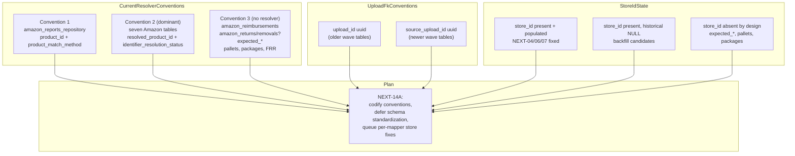

## NEXT-14A — Schema standardization + store attribution (plan only)

Plan only. No code edits. No migrations. No schema change. No UPDATE / INSERT / DELETE / ALTER / CREATE. No view drops. Nothing is deleted; deprecation candidates are listed only.

### Two corrections to the prompt's stated facts (please confirm with NEXT-10B-style queries before relying on either)

1. **`amazon_fba_inventory` uses the `resolved_product_id` convention, not the `product_id` convention.** Confirmed by the migration adding the columns at [`supabase/migrations/20260642_amazon_import_file_alignment.sql`](supabase/migrations/20260642_amazon_import_file_alignment.sql) and by `NATIVE_COLUMNS_FBA_INVENTORY` (entry at [`lib/import-sync-mappers.ts:344`](lib/import-sync-mappers.ts)). The only audit-target table that uses the `product_id`/`catalog_product_id`/`product_match_method`/`product_match_confidence`/`product_matched_at` convention is **`amazon_reports_repository`** (per [`supabase/migrations/20260704130000_amazon_reports_repository_wide_columns.sql:38-41`](supabase/migrations/20260704130000_amazon_reports_repository_wide_columns.sql)).
2. **`amazon_reports_repository.upload_id` is declared `uuid`, not `text`.** Original CREATE at [`supabase/migrations/20260509_amazon_reports_repository.sql:7`](supabase/migrations/20260509_amazon_reports_repository.sql) shows `upload_id uuid`. If a NEXT-10B-style query reports `text`, that would mean the live DB diverged from the in-repo migration; that divergence must be confirmed before any plan in section B is executed. The plan below treats `upload_id` as `uuid` per the in-repo migration; section B explicitly handles the divergent case.

---

## A. Schema standardization inventory

For each table: convention used (1=`product_id`/`product_match_method`, 2=`resolved_product_id`/`identifier_resolution_status`, 3=no resolver columns, 4=mixed/unknown); current resolver pair; current `store_id`; upload-FK column and direction.

### Amazon raw / sync tables

- **`amazon_amazon_fulfilled_inventory`** — convention 2. Resolver: `resolved_product_id`, `resolved_catalog_product_id`. Status: `identifier_resolution_status`, `identifier_resolution_confidence`. `organization_id uuid NOT NULL`, `store_id uuid` (FK to `stores`), `source_upload_id uuid` (FK to `raw_report_uploads`). Native identifiers: `seller_sku`, `fulfillment_channel_sku`, `asin`. Source: [`supabase/migrations/20260622_fba_inventory_engine_wave4.sql:165-194`](supabase/migrations/20260622_fba_inventory_engine_wave4.sql), [`supabase/migrations/20260642_amazon_import_file_alignment.sql:146-150`](supabase/migrations/20260642_amazon_import_file_alignment.sql).
- **`amazon_inventory_ledger`** — convention 2. Resolver / status: same as above. `organization_id`, `store_id`, `upload_id` (uuid). Identifiers: `fnsku`, `sku`, `asin`, `title`. Sources: [`supabase/migrations/20260621_product_identifier_bridge_listing_ledger_v2.sql:16-19`](supabase/migrations/20260621_product_identifier_bridge_listing_ledger_v2.sql), [`supabase/migrations/20260620_product_identifier_map_ledger_enrichment.sql`](supabase/migrations/20260620_product_identifier_map_ledger_enrichment.sql), [`supabase/migrations/20260642_amazon_import_file_alignment.sql:103-127`](supabase/migrations/20260642_amazon_import_file_alignment.sql).
- **`amazon_manage_fba_inventory`** — convention 2. `organization_id`, `store_id`, `source_upload_id`. Identifiers: `sku`, `fnsku`, `asin`, `product_name`. Source: [`supabase/migrations/20260622_fba_inventory_engine_wave4.sql`](supabase/migrations/20260622_fba_inventory_engine_wave4.sql), [`supabase/migrations/20260642_amazon_import_file_alignment.sql:131-143`](supabase/migrations/20260642_amazon_import_file_alignment.sql).
- **`amazon_fba_inventory`** — convention 2 (corrected). `organization_id`, `store_id`, `source_upload_id`. Identifiers: `sku`, `fnsku`, `asin`, `product_name`. Source: [`supabase/migrations/20260604_amazon_missing_report_tables.sql:115-130`](supabase/migrations/20260604_amazon_missing_report_tables.sql) plus extension migrations.
- **`amazon_all_orders`** — convention 2. `organization_id`, `store_id`, `source_upload_id`. Identifiers: `sku`, `amazon_order_id`, `merchant_order_id`, `product_name`. **No native `asin` column**; ASIN lives in `raw_data`. Source: [`lib/import-sync-mappers.ts:285-295`](lib/import-sync-mappers.ts), [`supabase/migrations/20260642_amazon_import_file_alignment.sql:34-38`](supabase/migrations/20260642_amazon_import_file_alignment.sql).
- **`amazon_settlements`** — convention 2. `organization_id`, `store_id` (post NEXT-07), `upload_id` (uuid). Identifiers: `sku`, `order_id`, `settlement_id`, `amazon_line_key`. Source: [`lib/import-sync-mappers.ts:209-259`](lib/import-sync-mappers.ts), [`supabase/migrations/20260642_amazon_import_file_alignment.sql:74-78`](supabase/migrations/20260642_amazon_import_file_alignment.sql).
- **`amazon_transactions`** — convention 2. `organization_id`, `store_id` (post NEXT-06), `upload_id` (uuid). Identifiers: `sku`, `order_id`, `settlement_id`. Source: [`lib/import-sync-mappers.ts:271-280`](lib/import-sync-mappers.ts), [`supabase/migrations/20260705120000_pim_model_stabilization.sql:191-197`](supabase/migrations/20260705120000_pim_model_stabilization.sql).
- **`amazon_reports_repository`** — convention 1 (the only one). Resolver: `product_id`, `catalog_product_id`. Status: `product_match_method`, `product_match_confidence`, `product_matched_at`. `organization_id` (NOT NULL), `store_id` (post NEXT-04), `upload_id` (uuid per in-repo CREATE). Identifiers: `sku`, `order_id`. Source: [`supabase/migrations/20260509_amazon_reports_repository.sql:1-17`](supabase/migrations/20260509_amazon_reports_repository.sql), [`supabase/migrations/20260704130000_amazon_reports_repository_wide_columns.sql:38-41`](supabase/migrations/20260704130000_amazon_reports_repository_wide_columns.sql).
- **`amazon_reimbursements`** — convention **3 (no resolver columns)**. `organization_id`, `store_id`, `upload_id`. Identifiers: `sku`, `order_id`, `reimbursement_id`. Source: [`lib/import-sync-mappers.ts:200-206`](lib/import-sync-mappers.ts).

### Amazon returns / removals (status not yet read in deep detail; must be confirmed by a NEXT-10B-style read on each)

- **`amazon_returns`** — convention to be confirmed (likely 3 or 2). Has `organization_id`. Likely has `upload_id` (uuid) and possibly `store_id`. Identifiers: `sku`, `asin`, `lpn`, `order_id`. Treat as **convention-unknown** and re-discover before any patch.
- **`amazon_removals`** — convention to be confirmed. Schema is structured around `removal_order` business keys; multiple constraint migrations exist ([`20260510_amazon_removals_composite_unique.sql`](supabase/migrations/20260510_amazon_removals_composite_unique.sql), [`20260511_amazon_removals_drop_legacy_constraint.sql`](supabase/migrations/20260511_amazon_removals_drop_legacy_constraint.sql), [`20260514_removals_logical_line_unique.sql`](supabase/migrations/20260514_removals_logical_line_unique.sql), [`20260515_removals_unique_include_order_date.sql`](supabase/migrations/20260515_removals_unique_include_order_date.sql), [`20260516_amazon_removals_extra_columns.sql`](supabase/migrations/20260516_amazon_removals_extra_columns.sql), [`20260521_wave1_removal_store_dual_dedupe.sql`](supabase/migrations/20260521_wave1_removal_store_dual_dedupe.sql)). Has `organization_id`, `store_id`, `upload_id` based on the dual-dedupe migration title. Treat as convention-unknown.
- **`amazon_removal_shipments`** — `organization_id`, `upload_id` (uuid, per [`supabase/migrations/20260513_amazon_removal_shipments.sql:7-9`](supabase/migrations/20260513_amazon_removal_shipments.sql)). Convention 3 likely. Re-confirm.

### Expected_* (operations side, not Amazon raw)

- **`expected_packages`** — **two CREATE TABLEs in repo**, on different timestamps:
  - [`supabase/migrations/20260420_import_detected_type_expected_sync.sql:68-79`](supabase/migrations/20260420_import_detected_type_expected_sync.sql) — `id`, `organization_id` (FK to `organization_settings`), `tracking_number`, `shipment_id`, `source_upload_id` (uuid FK to `raw_report_uploads`), `raw_row jsonb`, unique on `(organization_id, tracking_number, shipment_id)`.
  - [`supabase/migrations/20260427_expected_packages_removal_orders.sql:5-22`](supabase/migrations/20260427_expected_packages_removal_orders.sql) — `id`, `organization_id`, `upload_id` (uuid FK to `raw_report_uploads`), `order_id`, `sku`, `tracking_number`, `requested_quantity`, etc.
  - These two appear contradictory (different schemas, different FK column names). The live table is one of these (or merged), and the repo state is ambiguous. **Treat the live `expected_packages` as schema-unknown** and rely on a NEXT-10B-style schema dump to settle which physical schema is in production. Do not propose changes here.
  - Convention 3 (no resolver columns). No `store_id`. Either `upload_id` or `source_upload_id` (uuid).
- **`expected_returns`** — `id`, `organization_id` (FK to `organization_settings`), `lpn`, `asin`, `order_id`, `source_upload_id` (uuid FK), `raw_row jsonb`. Convention 3. No `store_id`. No resolver columns. Source: [`supabase/migrations/20260420_import_detected_type_expected_sync.sql:48-59`](supabase/migrations/20260420_import_detected_type_expected_sync.sql).
- **`expected_removals`** — `id`, `organization_id`, `upload_id` (uuid FK), `order_id`, `sku`, `tracking_number`, etc. Convention 3. No `store_id`. Source: [`supabase/migrations/20260428_expected_removals_rls_cleanup.sql:8-22`](supabase/migrations/20260428_expected_removals_rls_cleanup.sql).
- **`expected_pallets`** — `id`, `organization_id`, no `upload_id`, no `store_id`, no resolver columns. Source: [`supabase/migrations/20260407120000_expected_pallets_items_and_staging_batch.sql:13-21`](supabase/migrations/20260407120000_expected_pallets_items_and_staging_batch.sql).
- **`pallets`** — `id`, `organization_id`, no upload-FK, no `store_id`, no resolver columns. Source: [`supabase/migrations/20250319_returns_v1_pallets_rbac.sql:30-42`](supabase/migrations/20250319_returns_v1_pallets_rbac.sql).
- **`packages`** — `id`, `organization_id`, FK `pallet_id`. No upload-FK, no `store_id`, no resolver columns. Source: [`supabase/migrations/20250319_returns_v3_packages.sql:7-19`](supabase/migrations/20250319_returns_v3_packages.sql).

### PIM / catalog / canonical

- **`product_identifier_map`** — convention N/A (this *is* the resolver). Columns include: `organization_id`, `store_id`, `product_id` (FK to `products.id`), `seller_sku`, `asin`, `fnsku`, `upc_code`, `title`, `confidence_score`, `last_seen_at`, `deleted_at`, `external_listing_id`, `linked_from_report_family`, `linked_from_target_table`, `resolution_notes`. Lookup invariant: active rows filter on `deleted_at IS NULL`.
- **`catalog_products`** — Identifiers: `seller_sku`, `asin`, `fnsku`, `item_name`, etc. Has `source_upload_id uuid` (per [`supabase/migrations/20260531_catalog_products_listing_extensions.sql:6-7`](supabase/migrations/20260531_catalog_products_listing_extensions.sql)). Has `organization_id`. Has `store_id` (per the v_product_identity view's join). Convention 3 in the resolver sense (it doesn't carry `resolved_product_id`); it is itself a resolver target table.
- **`products`** — canonical. `id` is the canonical product identifier. Schema details out of scope for this plan but `organization_id`, `store_id`, `seller_sku` etc. are present.
- **`product_prices`** — Has `product_id` (FK), `organization_id`, `store_id`, `source_upload_id uuid` (per [`supabase/migrations/20260715120000_product_prices_ensure_amount_column.sql:14`](supabase/migrations/20260715120000_product_prices_ensure_amount_command.sql)), `amount`, `currency`, `observed_at`, `source`. Convention N/A (it carries canonical `product_id` already). No resolver-status columns; instead `source` text encodes provenance.

### Special

- **`financial_reference_resolver`** — convention 3 (no resolver columns) per NEXT-10B; no `store_id`, no `upload_id`, no `product_id`, no `catalog_product_id`. Frozen per NEXT-11.

### Convention rollup

- Convention 1 (`product_id` + `product_match_method`): `amazon_reports_repository` only.
- Convention 2 (`resolved_product_id` + `identifier_resolution_status`): `amazon_amazon_fulfilled_inventory`, `amazon_inventory_ledger`, `amazon_manage_fba_inventory`, `amazon_fba_inventory`, `amazon_all_orders`, `amazon_settlements`, `amazon_transactions`. **All seven Amazon raw/sync tables that have any resolver columns.**
- Convention 3 (none): `amazon_reimbursements`, `amazon_returns?`, `amazon_removals?`, `amazon_removal_shipments?`, all `expected_*`, `pallets`, `packages`, `expected_pallets`, `financial_reference_resolver`.
- Convention 4 (mixed/unknown): the convention-uncertain rows above (`amazon_returns`, `amazon_removals`, `amazon_removal_shipments`, `expected_packages`-dual). Re-confirm before any patch.

The dominant convention is 2. The single outlier is `amazon_reports_repository` (convention 1).

---

## B. Upload / source-id standardization plan

### Current state by column name

- **`upload_id uuid` FK to `raw_report_uploads (id)` ON DELETE SET NULL or CASCADE**: `amazon_inventory_ledger`, `amazon_settlements`, `amazon_transactions`, `amazon_reports_repository`, `amazon_reimbursements`, `amazon_removal_shipments`, `expected_packages` (one of two CREATEs), `expected_removals`, `pim_import_sessions`, `file_processing_status`, `pim_conflict_audit_log`, `product_identity_staging_rows`.
- **`source_upload_id uuid` FK to `raw_report_uploads (id)`**: `amazon_amazon_fulfilled_inventory`, `amazon_manage_fba_inventory`, `amazon_fba_inventory`, `amazon_all_orders`, `amazon_inbound_performance`, `amazon_replacements`, `amazon_fba_grade_and_resell`, `amazon_reserved_inventory`, `expected_packages` (the other CREATE), `expected_returns`, `catalog_products`, `product_prices`, `product_identifier_map`, `catalog_identity_unresolved_backlog`, `catalog_listing_rows_raw`, `amazon_ledger_staging` (added later).
- **Tables with both `upload_id` and `source_upload_id`**: none confirmed in repo CREATEs; if any such case exists in production it must be flagged in the schema dump.
- **Tables where `upload_id` is `text`**: none confirmed in repo. The prompt's note to the contrary should be verified against a live `\d` of the suspected table; if found, it indicates an out-of-repo ALTER and the column type must be reconciled before any standardization step.

### Code that writes each column

- TS sync route writes `upload_id` for: `amazon_settlements`, `amazon_transactions`, `amazon_reimbursements`, `amazon_inventory_ledger`, `amazon_reports_repository` — all via [`app/api/settings/imports/sync/route.ts`](app/api/settings/imports/sync/route.ts) calling mappers in [`lib/import-sync-mappers.ts`](lib/import-sync-mappers.ts).
- TS sync route writes `source_upload_id` for: `amazon_amazon_fulfilled_inventory`, `amazon_manage_fba_inventory`, `amazon_fba_inventory`, `amazon_all_orders`, `amazon_replacements`, `amazon_fba_grade_and_resell`, `amazon_reserved_inventory`, `amazon_inbound_performance`, `catalog_products`, `catalog_listing_rows_raw`.
- Python PIM writers populate `source_upload_id` on `product_identifier_map`, `product_prices`, `catalog_identity_unresolved_backlog`.
- Generic completion ([`lib/reports-repository-generic-completion.ts`](lib/reports-repository-generic-completion.ts)) and FRR sync ([`lib/financial-reference-resolver-sync.ts`](lib/financial-reference-resolver-sync.ts)) read `upload_id` from caller args.
- File-processing-status writer uses `upload_id`.
- Import-history UI joins on whichever upload-FK each table uses.

### Views / functions / RPCs that depend on each

- Reports / dashboards read by org+`upload_id` on settlements, transactions, reports_repository.
- Identity-enrichment specs ([`lib/inventory-family-identifier-enrich.ts`](lib/inventory-family-identifier-enrich.ts), [`app/api/settings/imports/identity-enrich/route.ts`](app/api/settings/imports/identity-enrich/route.ts)) join on `source_upload_id` for inventory family tables.
- `enrich_expected_packages_from_shipment_allocations(p_organization_id, p_upload_id)` ([`supabase/migrations/20260528_canonical_cross_file_expected_packages.sql`](supabase/migrations/20260528_canonical_cross_file_expected_packages.sql)) takes `p_upload_id`.
- `backfill_expected_packages_shipment_meta(p_organization_id, p_upload_id)` likewise.
- v_claim_base_amazon_removals view depends on `amazon_removals.upload_id`.

### Recommendation (staged, low risk)

The split between `upload_id` and `source_upload_id` is **historic, not architectural**: tables added in waves 1-3 used `upload_id`; tables added in waves 4+ (after the rename migration [`supabase/migrations/20260425_rename_source_upload_id.sql`](supabase/migrations/20260425_rename_source_upload_id.sql)) used `source_upload_id`. Both are uuid FKs to `raw_report_uploads (id)` with similar ON DELETE behavior. Standardizing **forward-only** is recommended:

- **Recommendation B1** — adopt `source_upload_id` as the canonical name for all newly added tables and patches. **Do not rename** existing `upload_id` columns; renames touch every code reader and would force a coordinated TS/Python/SQL change.
- **Recommendation B2** — for any table that genuinely needs both names exposed (e.g. consumer expects `source_upload_id` but writer writes `upload_id`), add a **read-side view** that aliases `upload_id AS source_upload_id`. Views are reversible with no data risk.
- **Recommendation B3** — if a future audit confirms `upload_id text` somewhere in the live DB, treat that as a separate remediation: add `source_upload_id uuid` (nullable, FK to `raw_report_uploads`), backfill from `upload_id::uuid` where parseable, and only later consider dropping `upload_id` — never in the same patch.

No rename, no type change, no destructive migration in this workstream. The audit alone (NEXT-10B-style schema dump per table) is the next step before B1 is triggered.

---

## C. Store attribution plan

### Tables where `store_id` is missing on historical rows but recoverable

For every Amazon raw/sync table with a nullable `store_id`, the recovery key is:

```
target_table.<UPLOAD_FK>  →  raw_report_uploads.id
raw_report_uploads.metadata->>'import_store_id'  (or 'ledger_store_id', or 'store_id')  →  target_table.store_id
```

The metadata key precedence in repo code is `metadata.import_store_id > metadata.ledger_store_id > metadata.store_id` (matches the precedence in [`backend-python/pim_import_async.py`](backend-python/pim_import_async.py) line ~2166 and the apply-step route).

### Per-table join keys (read-only inspection only)

| Table | upload-FK col | Join cast needed? | Notes |
|---|---|---|---|
| `amazon_settlements` | `upload_id` (uuid) | none | post-NEXT-07 future rows already include `store_id`. Historical may still be NULL. |
| `amazon_transactions` | `upload_id` (uuid) | none | post-NEXT-06 future rows already include `store_id`. |
| `amazon_reports_repository` | `upload_id` (uuid per in-repo CREATE) | conditional — if live shows `text`, then `r.id::text = t.upload_id` per the prompt's note. Confirm via NEXT-10B-style dump. |
| `amazon_reimbursements` | `upload_id` (uuid) | none |
| `amazon_inventory_ledger` | `upload_id` (uuid) | none |
| `amazon_all_orders` | `source_upload_id` (uuid) | none |
| `amazon_amazon_fulfilled_inventory` | `source_upload_id` (uuid) | none |
| `amazon_manage_fba_inventory` | `source_upload_id` (uuid) | none |
| `amazon_fba_inventory` | `source_upload_id` (uuid) | none |
| `amazon_replacements`, `amazon_fba_grade_and_resell`, `amazon_reserved_inventory`, `amazon_inbound_performance` | `source_upload_id` (uuid) | none | low-priority; smaller datasets. |
| `amazon_removal_shipments` | `upload_id` (uuid) | none | confirm convention; backfill priority TBD. |
| `expected_returns`, `expected_packages`, `expected_removals` | `source_upload_id` or `upload_id` per which CREATE survived | conditional | these tables intentionally do not carry `store_id` today; **adding `store_id` here is a separate decision** (see section D / G). Out of NEXT-14A's recommended scope. |

### Tables that need import-writer fixes so future rows always store `store_id`

Verified already in NEXT-04 / NEXT-06 / NEXT-07: `amazon_reports_repository`, `amazon_transactions`, `amazon_settlements`. **Already fixed.** No further writer change needed for these in this plan.

The remaining import-writer gaps (rows for which future imports do **not** populate `store_id` even though the column exists on the table):

- `amazon_reimbursements`: column exists per [`supabase/migrations/20260705120000_pim_model_stabilization.sql:199-205`](supabase/migrations/20260705120000_pim_model_stabilization.sql); confirm whether the mapper in [`lib/import-sync-mappers.ts`](lib/import-sync-mappers.ts) already passes `importStoreId` (per the NEXT-07 review it does **not** — `mapRowToAmazonReimbursement` does not yet accept `importStoreId`). **Candidate for a NEXT-07-equivalent writer patch (NEXT-15 candidate).**
- `amazon_inventory_ledger`, `amazon_all_orders`, `amazon_amazon_fulfilled_inventory`, `amazon_manage_fba_inventory`, `amazon_fba_inventory`, `amazon_replacements`, `amazon_fba_grade_and_resell`, `amazon_reserved_inventory`, `amazon_inbound_performance`: confirm via a `git grep` of each mapper signature to verify `importStoreId` is accepted and assigned. The presence of `store_id` in `NATIVE_COLUMNS_*` is necessary but not sufficient (mapper might still drop it like NEXT-06 / NEXT-07 showed for transactions / settlements). **Each is a separate small patch candidate; do not bundle.**

### Recommended store-attribution backfill order (after writer fixes)

1. `amazon_reimbursements` (smallest; writer fix sets the precedent).
2. `amazon_amazon_fulfilled_inventory` (identity carrier; high downstream impact).
3. `amazon_inventory_ledger`.
4. `amazon_manage_fba_inventory`, `amazon_fba_inventory`.
5. `amazon_all_orders`.
6. `amazon_settlements`, `amazon_transactions`, `amazon_reports_repository` historical NULL slice (writer is already correct for new rows; only old rows remain).
7. `amazon_replacements`, `amazon_fba_grade_and_resell`, `amazon_reserved_inventory`, `amazon_inbound_performance` (low priority).
8. `amazon_removal_shipments` (only after convention is re-confirmed).

### Dry-run verification queries needed before any UPDATE

For every table T with upload-FK U (and metadata key M):

```sql
-- C-dryrun-1) Count rows with NULL store_id, joined to upload metadata
SELECT
  count(*)                                                                AS rows_total_null_store,
  count(*) FILTER (WHERE r.metadata IS NOT NULL)                          AS upload_has_metadata,
  count(*) FILTER (WHERE r.metadata->>'import_store_id' IS NOT NULL)      AS upload_has_import_store_id,
  count(*) FILTER (WHERE r.metadata->>'ledger_store_id' IS NOT NULL)      AS upload_has_ledger_store_id,
  count(*) FILTER (WHERE r.metadata->>'store_id'        IS NOT NULL)      AS upload_has_store_id,
  count(DISTINCT t.<U>)                                                   AS distinct_uploads_to_attribute
FROM public.<T> t
LEFT JOIN public.raw_report_uploads r ON r.id = t.<U>
WHERE t.store_id IS NULL;
```

```sql
-- C-dryrun-2) Sanity: any upload metadata stores with malformed UUIDs?
SELECT
  r.id AS upload_id,
  r.metadata->>'import_store_id' AS import_store_id_raw
FROM public.raw_report_uploads r
WHERE r.id IN (SELECT DISTINCT t.<U> FROM public.<T> t WHERE t.store_id IS NULL)
  AND r.metadata->>'import_store_id' IS NOT NULL
  AND (r.metadata->>'import_store_id') !~* '^[0-9a-f]{8}-[0-9a-f]{4}-[0-9a-f]{4}-[0-9a-f]{4}-[0-9a-f]{12}$'
LIMIT 50;
```

```sql
-- C-dryrun-3) Multi-store-per-upload sanity: every upload should resolve to one store
SELECT
  r.id AS upload_id,
  count(DISTINCT s.id) AS distinct_stores_referenced
FROM public.raw_report_uploads r
LEFT JOIN public.stores s
  ON s.id = (r.metadata->>'import_store_id')::uuid
WHERE r.id IN (SELECT DISTINCT t.<U> FROM public.<T> t WHERE t.store_id IS NULL)
GROUP BY 1
HAVING count(DISTINCT s.id) <> 1
LIMIT 50;
```

Any UPDATE only after these three return clean counts the operator agrees with.

### Tables intentionally excluded from store-attribution

- `expected_*` tables — they do not carry `store_id` by design today. Adding `store_id` would be a schema change with no current consumer dependency. **Out of NEXT-14A scope.** Listed for review later, never deleted.
- `pallets`, `packages`, `expected_pallets` — operations side; `store_id` is not part of their model. **Out of scope.**
- `financial_reference_resolver` — frozen per NEXT-11.

---

## D. Product resolver column standardization plan

### Options

- **D1 — Keep current mixed conventions, document them, never auto-standardize.** The mixed pair (`amazon_reports_repository` is the only outlier) is small enough that codifying the rule "reports_repository uses `product_id`/`product_match_method`; everything else uses `resolved_product_id`/`identifier_resolution_status`" in a header comment in [`lib/import-sync-mappers.ts`](lib/import-sync-mappers.ts) is enough.
- **D2 — Add `resolved_product_id` / `resolved_catalog_product_id` to `amazon_reports_repository` to match the dominant convention.** Mechanical: two new nullable uuid columns, copy from the canonical pair. New writer must keep both populated for backwards compat. Low risk if columns are nullable; downstream consumers of `amazon_reports_repository.product_id` are unaffected.
- **D3 — Add `product_id` / `catalog_product_id` (canonical) to all convention-2 tables.** Larger blast radius (seven tables). Each new column needs writer support and a backfill from the resolved counterpart. **Not recommended** — every consumer that currently reads `resolved_product_id` would need to be updated and the canonical FK column would force harder constraints than the staged resolver column.
- **D4 — Standardize through views only.** Per-table or per-family read-side views that expose a uniform `product_id` (canonical) regardless of underlying convention, by `coalesce(product_id, resolved_product_id)`. Zero schema risk. Migrates the standardization burden from writers to readers.
- **D5 — Defer.** Do nothing; revisit when a concrete standardization-blocking consumer appears.

### Recommendation

- For convention 1 (`amazon_reports_repository`): **D1 + targeted D4** — codify the convention rule in the mapper file, and (later, if a consumer needs it) ship a read-side view `v_amazon_reports_repository_resolved` that exposes `product_id AS resolved_product_id`, etc.
- For convention 2 vs convention 3 (tables with no resolver columns at all): **D5 (defer)** until a use case appears. Adding resolver columns to `expected_*`, `amazon_reimbursements`, etc. is speculative.

The plan therefore **does not propose** structural standardization of the product-resolver column shape. The dominant convention is already convention 2; the single outlier is `amazon_reports_repository`. A future patch may add `resolved_*` aliases there if and only if a concrete downstream consumer requires it.

---

## E. Backend / import code update plan (per proposed change, future)

This section enumerates the writer files that must be touched **if** sections C / D are later approved. Nothing changes in NEXT-14A.

### For each store-attribution writer fix (one mapper at a time, NEXT-07 pattern)

Files affected per fix:

- `lib/import-sync-mappers.ts` — extend the relevant `mapRowToAmazon*` signature to accept `importStoreId?: string | null` and pass it into the returned object. Confirm `NATIVE_COLUMNS_*` already includes `"store_id"` (true for every table listed in section C); add it if missing (would have been the NEXT-06 pattern).
- `app/api/settings/imports/sync/route.ts` — extend the call site to pass `importStoreId` (already plumbed; only the per-kind branch needs the new arg).
- New `scripts/<kind>-mapper-smoketest.ts` — local-only verification test, mirroring `scripts/transactions-mapper-smoketest.ts`.

Tests:

- Local smoketest ensures `store_id` lands at root and not in `raw_data`.
- `tsc` and `eslint` clean.

### For canonical-FK aliasing on `amazon_reports_repository` (D4, future)

Files affected:

- A new migration (under [`supabase/migrations/`](supabase/migrations)) creating `v_amazon_reports_repository_resolved` with `security_invoker = true`.
- No app/server code change initially.

Tests:

- Read-only count parity: rows in view = rows in base table; columns map 1:1.

### For store-attribution backfill (data UPDATE, future)

Files affected:

- One TS server-only script (e.g. `scripts/store-attribution-backfill.ts`) that:
  - reads candidate rows scoped by upload,
  - re-validates `metadata.import_store_id` per the C-dryrun queries,
  - performs `UPDATE T SET store_id = $1 WHERE id = ANY($2) AND store_id IS NULL` in batches.
- Runs only after operator captures and signs off the C-dryrun outputs.

Tests:

- Per-upload dry-run prints planned diff.
- Idempotent re-run is a no-op (`store_id IS NULL` guard).
- Rollback by paired SELECT snapshot prior to each batch.

---

## F. Views / RPC / UI impact plan

Mapping which surfaces would be affected by sections B / C / D, were they to ship.

- **Views**:
  - `v_product_identity` ([`supabase/migrations/20260630_v_product_identity.sql`](supabase/migrations/20260630_v_product_identity.sql)) — joins on `seller_sku`, `asin`, `fnsku`, `organization_id`. Unaffected by store-attribution changes (already uses `organization_id` only). Unaffected by upload-id rename.
  - `v_claim_base_amazon_removals` ([`supabase/migrations/20260633_v_claim_base_amazon_removals.sql`](supabase/migrations/20260633_v_claim_base_amazon_removals.sql)) — depends on `amazon_removals.upload_id`. Any `upload_id` rename would break it. Recommendation B1 / B2 explicitly avoids renaming.
  - `v_ops_case_lines` ([`supabase/migrations/20260529_v_ops_case_lines.sql`](supabase/migrations/20260529_v_ops_case_lines.sql)) — to be reviewed for `upload_id` references.
- **Functions / RPCs**:
  - `enrich_expected_packages_from_shipment_allocations(p_organization_id, p_upload_id)` — signature uses `p_upload_id`. Unaffected unless we rename callers' tables.
  - `backfill_expected_packages_shipment_meta(p_organization_id, p_upload_id)` — same.
  - PIM RPCs ([`supabase/migrations/20260635_product_identity_enrichment_priority.sql`](supabase/migrations/20260635_product_identity_enrichment_priority.sql)) — accept `p_source_upload_id` arg consistently; no impact from B1.
- **UI surfaces**:
  - Product management / dashboard pages reading `resolved_product_id` from `amazon_*` tables: unaffected (D5 defer).
  - Import history UI: reads `raw_report_uploads.id` and the per-table upload-FK; unaffected by B1 (no rename).
  - Reports Repository UI: reads `amazon_reports_repository.product_id`; if D2 / D4 ships, the view path keeps reads stable.

No view will be deleted by this plan. All view updates (if any) are read-side additions.

---

## G. Deletion policy (audit only — nothing is deleted)

Anything that **looks** obsolete is reported below. **Marked as keep / review-later / candidate-for-deprecation only.** No DROP migrations.

- **`expected_packages` dual-CREATE divergence** ([`20260420_*`](supabase/migrations/20260420_import_detected_type_expected_sync.sql) vs [`20260427_*`](supabase/migrations/20260427_expected_packages_removal_orders.sql)): one of the two CREATEs is effectively dead in production. **Mark: review later** — confirm via schema dump which physical schema exists, then deprecate the other migration's column shape only after operator review. **Do not delete.**
- **`scripts/run-settlement-generic-once.ts`**: one-off operator script with embedded production-shaped flow. **Mark: keep** until SP-API ingestion is designed (NEXT-15+). It's a useful reference for fixture flow.
- **Orphan `v_trid_resolver` references**: the comment in [`lib/financial-reference-resolver-sync.ts:1-4`](lib/financial-reference-resolver-sync.ts) mentions `v_trid_resolver` but no DDL exists in repo and the live DB confirmed no such view (NEXT-10B). **Mark: candidate for deprecation later** — comment can be updated when NEXT-11 D4 ships, but the comment itself is harmless.
- **`amazon_ledger_staging`** column-rename history in [`20260404_upload_control_center.sql`](supabase/migrations/20260404_upload_control_center.sql), [`20260422_three_phase_etl.sql`](supabase/migrations/20260422_three_phase_etl.sql), [`20260425_rename_source_upload_id.sql`](supabase/migrations/20260425_rename_source_upload_id.sql): there are multiple staged ADD/RENAME steps. **Mark: keep** (history is necessary for replay).
- **Older `expected_pallets`, `pallets`, `packages` schema** ([`20250318/19/20`](supabase/migrations) era): **Mark: keep**. Returns / pallets subsystem has many depending migrations; touching it is out of scope for product-graph standardization.
- **`amazon_reimbursements.source_line_hash = id::text` UPDATE** in [`20260613_amazon_import_dedupe_fps_locks.sql:55-57`](supabase/migrations/20260613_amazon_import_dedupe_fps_locks.sql) is **not** obsolete — it's the one-time backfill that kept legacy rows valid. **Mark: keep** as historical context.

---

## H. Recommended phased implementation (eight phases, each requires explicit go-ahead before the next)

```mermaid
flowchart LR
  P1["P1: live schema audit<br/>NEXT-10B-style read-only"]
  P2["P2: store-attribution dry-run<br/>section C queries per table"]
  P3["P3: writer patches<br/>one mapper at a time<br/>NEXT-07 pattern"]
  P4["P4: writer smoketests<br/>tsc + eslint + isolated"]
  P5["P5: view/UI compat patch<br/>only if D4 view added"]
  P6["P6: store-attribution backfill<br/>per-upload, dry-run first"]
  P7["P7: backfill verification<br/>row-count parity"]
  P8["P8: post-mortem doc<br/>codify conventions"]

  P1 --> P2 --> P3 --> P4 --> P5 --> P6 --> P7 --> P8
```



- **Phase 1 — Live schema audit (read-only).** Run NEXT-10B-style schema queries (columns, constraints, indexes, RLS, triggers, views) for each table listed in section A. Settle the two corrections at the top, the `expected_packages` dual-CREATE divergence, and confirm `upload_id` types everywhere. Output: per-table CSV.
- **Phase 2 — Store-attribution dry-run.** Run the C-dryrun queries for each table in section C order. Output: counts of attributable rows per upload, plus malformed-uuid samples per upload.
- **Phase 3 — Writer patches (one mapper at a time, NEXT-07 pattern).** Per [section E](#e-backend--import-code-update-plan-per-proposed-change-future), update one mapper signature + one call site + one smoketest per patch. Land them in the order: `amazon_reimbursements` → `amazon_amazon_fulfilled_inventory` → `amazon_inventory_ledger` → `amazon_manage_fba_inventory` → `amazon_fba_inventory` → `amazon_all_orders` → tail.
- **Phase 4 — Writer smoketests.** Per patch: smoketest, `tsc`, `eslint`. No DB / no network.
- **Phase 5 — View / UI compat patch.** Only if D4 view is approved (likely deferred). Read-side only.
- **Phase 6 — Store-attribution backfill.** TS server-only script with `--dry-run` first, per upload. Operator captures the diff, approves, writes the batch.
- **Phase 7 — Backfill verification.** Row-count parity: every previously-NULL `store_id` either populated (and matches `raw_report_uploads.metadata.import_store_id`) or quarantined for ambiguous metadata.
- **Phase 8 — Post-mortem doc.** Update mapper file header to codify "convention 2 except `amazon_reports_repository`"; reference NEXT-14A as the inventory.

---

## I. Do-not-touch list

- All currently-resolved tables / writers / smoketests verified by PATCH-01, NEXT-02b, NEXT-04, NEXT-06, NEXT-07.
- `financial_reference_resolver` (frozen per NEXT-11).
- `expected_packages` dual-CREATE: do not delete either migration; do not pick a winner without a schema dump.
- All `expected_*` tables — no schema change; `store_id` is not added by this plan.
- `pallets`, `packages`, `expected_pallets` — operations side, untouched.
- `v_product_identity`, `v_claim_base_amazon_removals`, `v_ops_case_lines` — no changes.
- `amazon_returns`, `amazon_removals`, `amazon_removal_shipments` — no schema change without a fresh NEXT-10B-style dump first.
- `product_identifier_map` — no rename, no column drop, no change to active-row partial unique indexes. Resolver bridge schema is stable since NEXT-02b.
- `products` table — no canonical-id change.
- `product_prices` — no change to canonical-FK shape.
- `raw_report_uploads.metadata` — no schema constraint added; metadata remains free-form jsonb.
- No `upload_id → source_upload_id` rename anywhere.
- No type change on any `upload_id` / `source_upload_id` column.
- No `product_identifier_map_v2`.
- No `DROP VIEW`, `DROP TABLE`, `DROP COLUMN`.
- No data UPDATE / INSERT / DELETE.
- No migration file created in NEXT-14A.

---



Plan only. No edits.