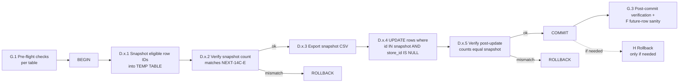

## NEXT-14D — Store-attribution implementation plan (plan only)

Plan only. No edits, no migrations, no UPDATE / INSERT / DELETE / ALTER / CREATE / DROP, no backfills, no schema change, no upload_id type change, no product_id work.

### Inputs (from NEXT-14C)

- `amazon_inventory_ledger`: **282,352 eligible**, single upload `ff362e3c-b8b8-42bb-a00d-642f02776eb0` (uuid), chosen store `509ee1f6-622c-46a5-8110-7b889ba46c2c`, malformed=0, unsafe=0.
- `amazon_reports_repository`: **412,645 eligible**, single upload `630f17a9-88a5-4567-a8be-e83e00deb0ac` (text), chosen store `509ee1f6-622c-46a5-8110-7b889ba46c2c`, malformed=0, unsafe=0. **`upload_id` is text** — keep it text in this patch.
- `amazon_settlements`: **534,978 eligible**, single upload `00692e18-8c7a-42f6-ad4e-b657e2008132` (uuid), chosen store `509ee1f6-622c-46a5-8110-7b889ba46c2c`, malformed=0, unsafe=0.
- All other in-scope tables: 0 eligible. **No work.**

The chosen `store_id` is the same UUID across all three target tables, derived from `raw_report_uploads.metadata.import_store_id` for each upload. The eligibility was confirmed by 14C-A / 14C-D / 14C-E.

---

## A. Recommended implementation method

| Method | Pros | Cons | Verdict |
|---|---|---|---|
| **A1. SQL migration committed to repo** | Auditable in git history; idempotent; easy peer review. | Once applied via CI/Supabase CLI, rolling back means a second migration. Also commits a one-time data fix into long-term migration history; future replays would re-run the UPDATE on a fresh DB only if the eligible rows still match (they would not). | Reject. |
| **A2. Server-only TS script with `--dry-run`** | Reusable; matches the NEXT-07 smoketest pattern; supports per-batch logging. | Requires shipping TS code, building a script that we will run exactly once and never again. Adds blast surface. | Reject for this one-off. |
| **A3. Operator-run SQL transaction (Supabase SQL editor)** | Smallest moving parts; the operator workflow already used through NEXT-10B / 14B / 14C; snapshot + UPDATE + verify all inside one explicit transaction that can be aborted by `ROLLBACK` at any point before COMMIT; reproducible across the three tables. | No git history of the run unless the operator commits the queries as docs. | **Recommend.** |
| **A4. Hybrid (committed migration + operator runs)** | Same as A1 plus operator gating. | Worst of both: history clutter + still operator-run. | Reject. |

**Recommended: A3 — operator-run SQL transactions, one per table, in the Supabase SQL editor.**

The chosen pattern per table is:

1. `BEGIN`
2. Snapshot the eligible row IDs into a `TEMP TABLE` inside the transaction.
3. Verify snapshot row count equals the 14C-E eligibility count for that table. If unequal, `ROLLBACK` and stop.
4. `UPDATE` only those snapshot row IDs, setting `store_id = chosen_uuid`.
5. Verify post-state row count equals the snapshot count and that all updated rows now show `store_id = chosen_uuid`. If unequal, `ROLLBACK`.
6. `COMMIT`.
7. Optionally export the temp table as CSV before the transaction ends (for rollback artefact).

The snapshot is exported to CSV per table as a permanent rollback artefact (`14d_<table>_snapshot.csv`) before COMMIT.

## B. Recommended table order

Order chosen to minimise blast-radius growth and to validate the text-`upload_id` pattern on the middle table before the largest one:

1. `amazon_inventory_ledger` — 282,352 rows. Smallest. Standard uuid join. Validates the snapshot/update/rollback flow.
2. `amazon_reports_repository` — 412,645 rows. Validates text-`upload_id` UPDATE works correctly with literal-text WHERE (no cast needed in the UPDATE because we compare text=text against the literal upload UUID). Confirms the special-case before largest table.
3. `amazon_settlements` — 534,978 rows. Largest. Run last with confidence built from steps 1 and 2.

This order is also "simplest to most consequential": settlements is the financial-impact table; do it last with the most evidence.

## C. Exact files likely to change if using script/code

**For the recommended method (A3) the answer is:** none.

If a future operator chooses A2 (script) anyway, the likely files would be:

- `scripts/store-attribution-backfill-14d.ts` (new, server-only) — paged read of eligible rows with `--dry-run`, batch UPDATE, per-batch snapshot to a CSV under `scripts/_logs/`.
- `package.json` would gain a `scripts.run-14d` entry.
- No mapper / no route / no migration changes.

These are not required for the recommended path and **must not be created in NEXT-14D**.

## D. Exact SQL shape per table (plan only — do not run yet)

The block below is the planned shape, parameterised by the constants in the inputs section. The operator will execute one such block per table after copy-pasting the chosen UPLOAD_UUID and TABLE.

### D1. `amazon_inventory_ledger` (uuid upload_id)

```sql
-- ===== 14d / amazon_inventory_ledger / planned (do not run yet) =====
BEGIN;

-- D1.1) Snapshot eligible rows into a temp table
CREATE TEMP TABLE _snap_ledger_14d AS
SELECT t.id
FROM public.amazon_inventory_ledger t
JOIN public.raw_report_uploads r ON r.id = t.upload_id
WHERE t.store_id IS NULL
  AND t.upload_id = 'ff362e3c-b8b8-42bb-a00d-642f02776eb0'::uuid
  AND r.metadata->>'import_store_id' = '509ee1f6-622c-46a5-8110-7b889ba46c2c'
  AND EXISTS (SELECT 1 FROM public.stores s WHERE s.id = '509ee1f6-622c-46a5-8110-7b889ba46c2c'::uuid);

-- D1.2) Pre-update verification — must equal 282352 from 14C-E
SELECT count(*) AS snapshot_count FROM _snap_ledger_14d;
-- IF count <> 282352 THEN ROLLBACK; STOP.

-- D1.3) Export snapshot as csv `14d_ledger_snapshot.csv` from the result panel BEFORE the UPDATE.

-- D1.4) Apply update
UPDATE public.amazon_inventory_ledger t
SET store_id = '509ee1f6-622c-46a5-8110-7b889ba46c2c'::uuid
WHERE t.id IN (SELECT id FROM _snap_ledger_14d)
  AND t.store_id IS NULL;
-- expected: UPDATE 282352

-- D1.5) Post-update verification (still inside transaction)
SELECT count(*)                                                                  AS rows_targeted,
       count(*) FILTER (WHERE store_id = '509ee1f6-622c-46a5-8110-7b889ba46c2c'::uuid) AS rows_set,
       count(*) FILTER (WHERE store_id IS NULL)                                  AS rows_still_null
FROM public.amazon_inventory_ledger t
WHERE t.id IN (SELECT id FROM _snap_ledger_14d);
-- IF rows_set <> 282352 OR rows_still_null > 0 THEN ROLLBACK; STOP.

COMMIT;
```

### D2. `amazon_reports_repository` (text upload_id)

```sql
-- ===== 14d / amazon_reports_repository / planned (do not run yet) =====
BEGIN;

-- D2.1) Snapshot — note: t.upload_id is text; literal compared as text. Join uses r.id::text = t.upload_id.
CREATE TEMP TABLE _snap_reports_14d AS
SELECT t.id
FROM public.amazon_reports_repository t
JOIN public.raw_report_uploads r ON r.id::text = t.upload_id
WHERE t.store_id IS NULL
  AND t.upload_id = '630f17a9-88a5-4567-a8be-e83e00deb0ac'                                    -- text equality
  AND r.metadata->>'import_store_id' = '509ee1f6-622c-46a5-8110-7b889ba46c2c'
  AND EXISTS (SELECT 1 FROM public.stores s WHERE s.id = '509ee1f6-622c-46a5-8110-7b889ba46c2c'::uuid);

-- D2.2) Pre-update verification — must equal 412645 from 14C-E
SELECT count(*) AS snapshot_count FROM _snap_reports_14d;
-- IF count <> 412645 THEN ROLLBACK; STOP.

-- D2.3) Export snapshot as csv `14d_reports_snapshot.csv`.

-- D2.4) Apply update
UPDATE public.amazon_reports_repository t
SET store_id = '509ee1f6-622c-46a5-8110-7b889ba46c2c'::uuid
WHERE t.id IN (SELECT id FROM _snap_reports_14d)
  AND t.store_id IS NULL;
-- expected: UPDATE 412645

-- D2.5) Post-update verification
SELECT count(*)                                                                  AS rows_targeted,
       count(*) FILTER (WHERE store_id = '509ee1f6-622c-46a5-8110-7b889ba46c2c'::uuid) AS rows_set,
       count(*) FILTER (WHERE store_id IS NULL)                                  AS rows_still_null
FROM public.amazon_reports_repository t
WHERE t.id IN (SELECT id FROM _snap_reports_14d);
-- IF rows_set <> 412645 OR rows_still_null > 0 THEN ROLLBACK; STOP.

COMMIT;
```

### D3. `amazon_settlements` (uuid upload_id)

```sql
-- ===== 14d / amazon_settlements / planned (do not run yet) =====
BEGIN;

CREATE TEMP TABLE _snap_settlements_14d AS
SELECT t.id
FROM public.amazon_settlements t
JOIN public.raw_report_uploads r ON r.id = t.upload_id
WHERE t.store_id IS NULL
  AND t.upload_id = '00692e18-8c7a-42f6-ad4e-b657e2008132'::uuid
  AND r.metadata->>'import_store_id' = '509ee1f6-622c-46a5-8110-7b889ba46c2c'
  AND EXISTS (SELECT 1 FROM public.stores s WHERE s.id = '509ee1f6-622c-46a5-8110-7b889ba46c2c'::uuid);

SELECT count(*) AS snapshot_count FROM _snap_settlements_14d;
-- IF count <> 534978 THEN ROLLBACK; STOP.

-- export csv `14d_settlements_snapshot.csv`

UPDATE public.amazon_settlements t
SET store_id = '509ee1f6-622c-46a5-8110-7b889ba46c2c'::uuid
WHERE t.id IN (SELECT id FROM _snap_settlements_14d)
  AND t.store_id IS NULL;
-- expected: UPDATE 534978

SELECT count(*)                                                                  AS rows_targeted,
       count(*) FILTER (WHERE store_id = '509ee1f6-622c-46a5-8110-7b889ba46c2c'::uuid) AS rows_set,
       count(*) FILTER (WHERE store_id IS NULL)                                  AS rows_still_null
FROM public.amazon_settlements t
WHERE t.id IN (SELECT id FROM _snap_settlements_14d);
-- IF rows_set <> 534978 OR rows_still_null > 0 THEN ROLLBACK; STOP.

COMMIT;
```

Important properties of the SQL shape above:

- The `store_id IS NULL` predicate in both the snapshot and the UPDATE makes the operation idempotent: a re-run is a no-op.
- The snapshot is taken inside the same transaction as the UPDATE; the read view of the table is consistent with what the UPDATE will modify.
- The metadata predicate (`r.metadata->>'import_store_id' = ...`) belt-and-braces the eligibility re-check against the chosen UUID.
- The literal `'509ee1f6-...'::uuid` is repeated explicitly per table; no parameter substitution is possible in Supabase's SQL editor.
- Each block is independent; one table failing does not affect the others.

## E. Per-table notes

- **`amazon_inventory_ledger`**. Uses `upload_id uuid`. Standard pattern. No writer patch verified yet (NEXT-04/06/07 covered reports_repository/transactions/settlements; ledger writer status is **to be verified** per section F).
- **`amazon_reports_repository`**. `upload_id` is `text` per NEXT-14B. Plan **does not** change column type; both the snapshot join and the literal compare are text-aware (`r.id::text` for the join, plain string literal for the WHERE). Writer was already fixed in NEXT-04, so future rows already populate `store_id`.
- **`amazon_settlements`**. Standard uuid pattern. Writer was already fixed in NEXT-07. Largest blast radius; run last with confidence.

## F. Writer / import future-row plan (read-only verification step; no patch in this phase)

For each of the three target tables, after the UPDATE commits, the operator runs a single confirmation query:

```sql
-- F-confirm-future / per table
SELECT
  count(*)                                                         AS rows_total,
  count(*) FILTER (WHERE store_id IS NULL)                         AS rows_store_null_total,
  count(*) FILTER (WHERE store_id IS NULL AND <UPLOAD_COL> <> '<HISTORICAL_UPLOAD>')  AS rows_store_null_other_uploads
FROM public.<TABLE>;
```

`rows_store_null_other_uploads = 0` confirms that no NEW rows beyond the historical upload are landing without `store_id`, meaning the writer is already correct.

If `rows_store_null_other_uploads > 0`:

- `amazon_settlements` — should be 0 (NEXT-07 fixed). If not, escalate.
- `amazon_reports_repository` — should be 0 (NEXT-04 fixed). If not, escalate.
- `amazon_inventory_ledger` — **expected to potentially be > 0** because the ledger writer has not yet received an explicit NEXT-07-equivalent patch. If non-zero, queue a NEXT-15 candidate to update [`lib/import-sync-mappers.ts`](lib/import-sync-mappers.ts) (`mapRowToAmazonInventoryLedger` signature, `NATIVE_COLUMNS_LEDGER` already includes `store_id`) and the call site in [`app/api/settings/imports/sync/route.ts`](app/api/settings/imports/sync/route.ts), with a paired smoketest in `scripts/`. **Do not implement in NEXT-14D.**

No code changes in NEXT-14D regardless.

## G. Verification plan (before / after)

For each table, run all of these at the times indicated:

### G.1 Pre-flight (right before opening the transaction)

```sql
-- G.1.a) Lock-free count of eligible rows — must match 14C-E expected count
SELECT count(*) AS pre_eligible
FROM public.<TABLE> t
JOIN public.raw_report_uploads r ON r.id<CAST?> = t.<UPLOAD_COL>
WHERE t.store_id IS NULL
  AND t.<UPLOAD_COL> = <UPLOAD_LITERAL>
  AND r.metadata->>'import_store_id' = '509ee1f6-622c-46a5-8110-7b889ba46c2c';

-- G.1.b) Confirm store still exists
SELECT 1 AS store_exists FROM public.stores
WHERE id = '509ee1f6-622c-46a5-8110-7b889ba46c2c'::uuid;
```

### G.2 In-transaction (the snapshot count and post-update count blocks already shown in section D).

### G.3 Post-commit (any time after COMMIT)

```sql
-- G.3.a) Updated rows count = expected
SELECT count(*) AS rows_with_chosen_store
FROM public.<TABLE>
WHERE store_id = '509ee1f6-622c-46a5-8110-7b889ba46c2c'::uuid
  AND <UPLOAD_COL> = <UPLOAD_LITERAL>;

-- G.3.b) Future-row sanity (per section F)
-- See F-confirm-future query above.
```

The expected counts per table are 282,352 / 412,645 / 534,978 from NEXT-14C-E. Any deviation = stop the workstream and re-audit.

## H. Rollback plan (per table, explicit)

The transaction-internal failure path is already covered by the in-transaction `ROLLBACK` instructions in section D (any verification step that disagrees with the expected count aborts the COMMIT).

The post-commit rollback (i.e. an UPDATE has been committed and the operator decides to revert) requires the snapshot CSV (`14d_<table>_snapshot.csv`) exported in step D.x.3:

```sql
-- ===== H / rollback / per table (do not run unless rolling back) =====
BEGIN;

-- H.1) Re-import snapshot rows into a temp table.
CREATE TEMP TABLE _rollback_<table>_14d (id uuid PRIMARY KEY);
-- Operator imports the previously-exported CSV into _rollback_<table>_14d.

-- H.2) Sanity check
SELECT count(*) FROM _rollback_<table>_14d;
-- Must equal the original snapshot count.

-- H.3) Reverse the UPDATE — only on rows where the UPDATE we made is still the current state.
UPDATE public.<TABLE> t
SET store_id = NULL
WHERE t.id IN (SELECT id FROM _rollback_<table>_14d)
  AND t.store_id = '509ee1f6-622c-46a5-8110-7b889ba46c2c'::uuid;

-- H.4) Verify
SELECT count(*) FILTER (WHERE store_id IS NULL) AS now_null
FROM public.<TABLE>
WHERE id IN (SELECT id FROM _rollback_<table>_14d);
-- Must equal the snapshot count.

COMMIT;
```

Properties:

- The rollback only sets rows back to NULL **if** their `store_id` is still the chosen UUID. If something else has touched these rows since (which would be unusual, but possible), the rollback no-ops on those rows rather than overwriting newer state.
- The rollback is targeted: only the row IDs in the snapshot. No other rows are affected.
- The rollback is independent per table; rolling back one table does not require rolling back the others.

If the snapshot CSV is lost: the rollback can still be derived from the same predicate as the original UPDATE, with the additional constraint that we only revert rows where the chosen `store_id` matches and the upload-FK still points at the historical upload. This is less safe (cannot prove row identity) and should be a last resort.

## I. Risks and mitigations

- **Risk: concurrent writes to the target rows during the transaction.**
  Mitigation: the SQL editor session takes row locks during UPDATE; the snapshot+update inside one transaction sees a consistent view. The `store_id IS NULL` predicate ensures concurrent writers that have already set a store_id are skipped (idempotent).
- **Risk: snapshot count diverges from 14C-E expected count.**
  Mitigation: pre-flight G.1.a; in-transaction step D.x.2 aborts via ROLLBACK if the count differs.
- **Risk: chosen store_id was correct at NEXT-14C time but stores table changed.**
  Mitigation: G.1.b confirms the store row still exists immediately before opening the transaction; the EXISTS subquery inside the snapshot CTE re-checks once more.
- **Risk: text-vs-uuid coercion bug on `amazon_reports_repository`.**
  Mitigation: WHERE clause uses literal text equality (no cast on the column side); the join uses `r.id::text` only on the join, never on the UPDATE target. Writers and readers continue to compare text-text.
- **Risk: post-commit drift before rollback CSV is needed.**
  Mitigation: snapshot CSV is exported and labelled per table; rollback predicate is conservative (only reverts rows whose store_id is still the chosen UUID).
- **Risk: blast-radius miscount due to dual-table view of `expected_packages` / similar.**
  Mitigation: NEXT-14D does **not** touch `expected_*`, `pallets`, `packages`. The audit set is strictly the three eligible tables.
- **Risk: writer drift — future rows still landing with NULL `store_id` on inventory_ledger.**
  Mitigation: section F's post-commit check measures this; if non-zero, queue NEXT-15 (writer fix) — **not** in scope here.
- **Risk: this work being mistaken for a product-graph backfill.**
  Mitigation: section J prohibits all product/identifier work in this phase.

## J. Do-not-touch list (NEXT-14D)

- **No `product_id` / `resolved_product_id` / `catalog_product_id` / `resolved_catalog_product_id` writes anywhere.** Product backfill is a separate workstream (NEXT-13/-14 family), not implemented here.
- **No `product_identifier_map` changes** (no inserts, no updates, no soft-delete, no schema change).
- **No `upload_id` type conversion.** `amazon_reports_repository.upload_id` stays `text`. No ALTER TABLE.
- **No `expected_packages`, `expected_returns`, `expected_removals`, `expected_pallets`, `pallets`, `packages` changes.** Their NEXT-14C eligibility was 0 and they are explicitly outside this scope.
- **No deletes of any kind.** No `DROP`, no row deletion, no tombstoning.
- **No schema rewrite.** No `ALTER`, no `CREATE`, no view changes.
- **No API sync implementation.**
- **No mapper changes / no writer patch in this phase.** Writer fixes (e.g. for inventory_ledger) are queued separately as NEXT-15 candidates and are not part of this plan.
- **No `financial_reference_resolver` changes.**
- **No raw_data column changes.**

---



Plan only. No edits.