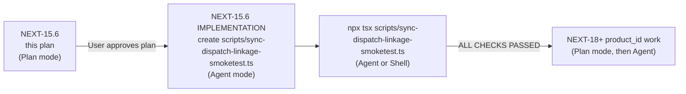

## NEXT-15.6 — Sync-dispatch regression smoketest plan (Plan only)

Plan / inspection only. No code edits, no test creation yet, no commands run, no SQL, no migrations, no schema changes, no `upload_id` type conversion, no `product_id` writes, no `product_identifier_map` mutations, no deletions, no refactors. Below is the complete plan for a single `tsx`-runnable smoketest, ready for Agent mode when the user approves.

---

### A. Recommended file path

**`scripts/sync-dispatch-linkage-smoketest.ts`**

Rationale:

- Consistent with the existing per-mapper smoketests ([`scripts/reports-repository-mapper-smoketest.ts`](scripts/reports-repository-mapper-smoketest.ts), [`scripts/settlement-mapper-smoketest.ts`](scripts/settlement-mapper-smoketest.ts), [`scripts/transactions-mapper-smoketest.ts`](scripts/transactions-mapper-smoketest.ts)).
- Name names the coverage: full sync-dispatch surface, focus on linkage (org / store / upload).
- Keeps existing three per-mapper smoketests untouched — they remain bug-regression artifacts for NEXT-04 / NEXT-06 / NEXT-07. The new file supersedes them at the coverage level but does not replace them.

---

### B. Exact test coverage matrix

For each row below: build one minimal valid `Record<string, string>` row → call mapper with `(orgId, uploadId, storeId)` → run `packPayloadForSupabase([row], NATIVE_COLUMNS_*)` → assert four invariants:

1. `packed[0].organization_id === ORG_ID`
2. `packed[0].store_id === STORE_ID` (or `null` for Convention B that allows null)
3. Convention A: `packed[0].upload_id === UPLOAD_ID`
4. Convention B: `packed[0].source_upload_id === UPLOAD_ID`

Plus: `raw_data` (if present) **must NOT** contain `store_id`, `organization_id`, `upload_id`, or `source_upload_id` keys (proves the allow-list captured them and they did not fall into JSONB overflow).

#### Convention A — `upload_id` (uuid) — 9 destination tables

| # | Kind (AmazonSyncKind) | Mapper | NATIVE_COLUMNS allow-list | Required minimal row fields |
|---|---|---|---|---|
| 1 | `FBA_RETURNS` | `mapRowToAmazonReturn` | `NATIVE_COLUMNS_RETURNS` | `lpn`, `order-id`, `sku`, `return-date` |
| 2 | `REMOVAL_ORDER` | `mapRowToAmazonRemoval` | `NATIVE_COLUMNS_REMOVALS` | `order-id` (mapper returns null if missing), `sku`, `fnsku`, `disposition`, `requested-quantity`, `order-date`, `order-type` |
| 3 | `REMOVAL_SHIPMENT` | `mapRowToAmazonRemovalShipment` | `NATIVE_COLUMNS_REMOVALS` (shared) | `order-id` (mapper gates), `sku`, `fnsku`, `disposition` |
| 4 | `INVENTORY_LEDGER` (CSV path) | `mapRowToAmazonInventoryLedger` | `NATIVE_COLUMNS_LEDGER` | `fnsku` (mapper gates on missing fnsku), `date`, `asin`, `sku`, `event-type`, `quantity` |
| 5 | `INVENTORY_LEDGER` (TXT/positional path) | `mapLedgerPositionalRawRowToAmazonInventoryLedgerInsert` | `NATIVE_COLUMNS_LEDGER` | `ledger_pos_01`…`ledger_pos_15` (positional cells), with `ledger_pos_02` = fnsku |
| 6 | `REIMBURSEMENTS` | `mapRowToAmazonReimbursement` | `NATIVE_COLUMNS_REIMBURSEMENTS` | `reimbursement-id` (mapper gates), `amount-reimbursed`, `sku` |
| 7 | `SETTLEMENT` | `mapRowToAmazonSettlement` | `NATIVE_COLUMNS_SETTLEMENTS` | `settlement-id`, `transaction-type`, `posted-date`, `amount-type`, `amount-description`, `amount` |
| 8 | `SAFET_CLAIMS` | `mapRowToAmazonSafetClaim` | `NATIVE_COLUMNS_SAFET` | `safet-claim-id` (mapper gates), `claim-date`, `reimbursement-amount-total`, `asin`, `order-id` |
| 9 | `TRANSACTIONS` | `mapRowToAmazonTransaction` | `NATIVE_COLUMNS_TRANSACTIONS` | `transaction-type`, `posted-date`, `amount`, `order-id`, `sku` (mirror the working fixture from NEXT-06 smoketest) |
| 10 | `REPORTS_REPOSITORY` | `mapRowToAmazonReportsRepository` | `NATIVE_COLUMNS_REPORTS_REPOSITORY` | `date/time`, `transaction-type`, `order-id`, `sku`, `total-amount` (mirror NEXT-04 smoketest) |

#### Convention B — `source_upload_id` (uuid) — 10 destination tables

| # | Kind | Mapper | NATIVE_COLUMNS allow-list | Required minimal row fields |
|---|---|---|---|---|
| 11 | `ALL_ORDERS` | `mapRowToAmazonAllOrders` | `NATIVE_COLUMNS_ALL_ORDERS` | `amazon-order-id` OR `merchant-order-id`, `purchase-date`, `sku`, `quantity` |
| 12 | `REPLACEMENTS` (via dispatch) | `mapRowToAmazonRawArchive` | `NATIVE_COLUMNS_REPLACEMENTS` | any non-empty cell (mapper only gates on "all values blank") |
| 13 | `FBA_GRADE_AND_RESELL` (via dispatch) | `mapRowToAmazonRawArchive` | `NATIVE_COLUMNS_FBA_GRADE_AND_RESELL` | any non-empty cell |
| 14 | `RESERVED_INVENTORY` (via dispatch) | `mapRowToAmazonRawArchive` | `NATIVE_COLUMNS_RESERVED_INVENTORY` | any non-empty cell |
| 15 | `FEE_PREVIEW` (via dispatch) | `mapRowToAmazonRawArchive` | `NATIVE_COLUMNS_FEE_PREVIEW` | any non-empty cell |
| 16 | `MONTHLY_STORAGE_FEES` (via dispatch) | `mapRowToAmazonRawArchive` | `NATIVE_COLUMNS_MONTHLY_STORAGE_FEES` | any non-empty cell |
| 17 | `MANAGE_FBA_INVENTORY` | `mapRowToAmazonManageFbaInventory` | `NATIVE_COLUMNS_MANAGE_FBA_INVENTORY` | `sku`, `fnsku`, `asin` |
| 18 | `FBA_INVENTORY` | `mapRowToAmazonFbaInventory` | `NATIVE_COLUMNS_FBA_INVENTORY` | `sku`, `fnsku`, `asin`, `snapshot-date` |
| 19 | `INBOUND_PERFORMANCE` | `mapRowToAmazonInboundPerformance` | `NATIVE_COLUMNS_INBOUND_PERFORMANCE` | `issue-reported-date`, `fba-shipment-id` |
| 20 | `AMAZON_FULFILLED_INVENTORY` | `mapRowToAmazonAmazonFulfilledInventory` | `NATIVE_COLUMNS_AMAZON_FULFILLED_INVENTORY` | `seller-sku`, `asin`, `quantity-available` |

Total: **20 mapper invocations covering 19 destination tables** (RawArchive runs once for fixture content but is packed five times against five allow-lists — that is the "five dispatch targets" coverage). The amazon_listing_report_rows_raw kinds (`ALL_LISTINGS`, etc.) are out of scope — they take a different code path (catalog finalisation in [`lib/pipeline/listing-import-complete-from-staging.ts`](lib/pipeline/listing-import-complete-from-staging.ts), not the `mapRowToAmazon*` dispatch).

#### Special-case sub-tests beyond the matrix

| Sub-test | What it asserts | Why |
|---|---|---|
| **Ledger CSV path** (kind 4) | mapper returns non-null when fnsku is present; CSV literal returns `upload_id: storeId/uploadId` and store_id at line 1512 | NEXT-15.1 documented two return paths; both must be covered |
| **Ledger TXT/positional path** (kind 5) | `mapLedgerPositionalRawRowToAmazonInventoryLedgerInsert` returns non-null with `ledger_pos_*` cells; emits `store_id: storeId,` at line 1596 | Sync-route line 2011–2023 calls a different mapper for positional rows |
| **RawArchive ×5** (kinds 12–16) | one mapper call, five `packPayloadForSupabase` invocations against five allow-lists; each preserves `organization_id`, `store_id || null`, `source_upload_id` | Confirms the dispatcher's allow-list independence |
| **`amazon_removals` source_staging_id attach** (kind 2 follow-up) | after mapper returns, set `insertRow.source_staging_id = "44444444-..."` and re-pack; assert `packed.source_staging_id` survives via the `"source_staging_id"` entry at `NATIVE_COLUMNS_REMOVALS:160` | Mirrors sync-route line 2008 (`insertRow.source_staging_id = sr.id`) |
| **`attachPhysicalRowIdentity` shape** | for one mapper output (e.g. FBA_INVENTORY), call `row.source_file_sha256 = "deadbeef…"; row.source_physical_row_number = 7;` then pack; assert both survive (the allow-lists include them) | Mirrors sync-route line 2100; does NOT import the private helper, replicates its trivial body inline |
| **`amazon_reports_repository.upload_id` text contract** (kind 10 follow-up) | assert `typeof packed.upload_id === "string"` and `packed.upload_id === UPLOAD_ID` (no `cast`, no coercion); document the live-text divergence | Confirms the writer keeps the uuid string format; reader-side cast is out of scope |
| **`raw_data` overflow non-collision** (every kind) | for every packed row, `Object.keys(packed.raw_data ?? {})` must not include `organization_id`, `store_id`, `upload_id`, or `source_upload_id` | Locks the NATIVE_COLUMNS contract — if any of those four leak into overflow, allow-list regression |
| **Empty-row null-return** (sanity, one kind) | call any "newer" mapper with a row of all empty strings → expect `null` | Confirms the empty-content gate at the top of newer mappers (line 2433, 2486, 2608, 2737, 2854, 2915) still works |

---

### C. Required imports / exports

#### Already exported in [`lib/import-sync-mappers.ts`](lib/import-sync-mappers.ts) — no library change needed

```ts
import {
  packPayloadForSupabase,
  // All 19 NATIVE_COLUMNS allow-lists
  NATIVE_COLUMNS_RETURNS,
  NATIVE_COLUMNS_REMOVALS,
  NATIVE_COLUMNS_LEDGER,
  NATIVE_COLUMNS_REIMBURSEMENTS,
  NATIVE_COLUMNS_SETTLEMENTS,
  NATIVE_COLUMNS_SAFET,
  NATIVE_COLUMNS_TRANSACTIONS,
  NATIVE_COLUMNS_ALL_ORDERS,
  NATIVE_COLUMNS_REPLACEMENTS,
  NATIVE_COLUMNS_FBA_GRADE_AND_RESELL,
  NATIVE_COLUMNS_MANAGE_FBA_INVENTORY,
  NATIVE_COLUMNS_FBA_INVENTORY,
  NATIVE_COLUMNS_INBOUND_PERFORMANCE,
  NATIVE_COLUMNS_AMAZON_FULFILLED_INVENTORY,
  NATIVE_COLUMNS_RESERVED_INVENTORY,
  NATIVE_COLUMNS_FEE_PREVIEW,
  NATIVE_COLUMNS_MONTHLY_STORAGE_FEES,
  NATIVE_COLUMNS_REPORTS_REPOSITORY,
  // All 12 mapRowTo* mappers under test (NEXT-15.1 + NEXT-04/06/07)
  mapRowToAmazonReturn,
  mapRowToAmazonRemoval,
  mapRowToAmazonRemovalShipment,
  mapRowToAmazonInventoryLedger,
  mapLedgerPositionalRawRowToAmazonInventoryLedgerInsert,
  mapRowToAmazonReimbursement,
  mapRowToAmazonSettlement,
  mapRowToAmazonSafetClaim,
  mapRowToAmazonTransaction,
  mapRowToAmazonReportsRepository,
  mapRowToAmazonAllOrders,
  mapRowToAmazonRawArchive,
  mapRowToAmazonManageFbaInventory,
  mapRowToAmazonFbaInventory,
  mapRowToAmazonInboundPerformance,
  mapRowToAmazonAmazonFulfilledInventory,
} from "../lib/import-sync-mappers";
```

Verified by grep against [`lib/import-sync-mappers.ts`](lib/import-sync-mappers.ts):

- `packPayloadForSupabase` — line 486, `export function`.
- All 19 `NATIVE_COLUMNS_*` sets — lines 150, 159, 183, 200, 209, 262, 271, 285, 298, 306, 320, 344, 374, 390, 402, 410, 418, 426, 899, all `export const`.
- `mapLedgerPositionalRawRowToAmazonInventoryLedgerInsert` — line 1551, `export function`.
- `rawRowUsesInventoryLedgerPositionalKeys` (optional, not required by the test) — exported from [`lib/inventory-ledger-positional.ts:23`](lib/inventory-ledger-positional.ts).

#### Whether `attachPhysicalRowIdentity` needs to be exported

**No.** It is a 4-line function private to [`app/api/settings/imports/sync/route.ts:213-221`](app/api/settings/imports/sync/route.ts):

```ts
function attachPhysicalRowIdentity(row, stagingRowNumber, fileSha) {
  if (!row) return;
  row.source_file_sha256 = fileSha;
  row.source_physical_row_number = stagingRowNumber;
}
```

The smoketest replicates its body inline (six lines) for the one special-case sub-test that needs it. Exporting the route-internal helper would widen a private surface area for no net coverage gain.

#### `AmazonSyncKind` registry

Optional — exported from [`lib/pipeline/amazon-report-registry.ts:9`](lib/pipeline/amazon-report-registry.ts). The smoketest can iterate `AMAZON_REPORT_REGISTRY` to label each test case by kind, but does not need to; the mapper/allow-list pairing is what's under test, not the registry lookup itself. Use it only for human-readable log lines.

---

### D. Helpers that need to be exported for testing

**None.** All required surface is already public:

- 19 `NATIVE_COLUMNS_*` sets — exported.
- `packPayloadForSupabase` — exported.
- 12 `mapRowToAmazon*` + `mapRowToAmazonSettlement` + `mapLedgerPositionalRawRowToAmazonInventoryLedgerInsert` — exported.
- `attachPhysicalRowIdentity` — replicate inline (3-line body).
- `rawRowUsesInventoryLedgerPositionalKeys` — exported but not required (test directly invokes the positional mapper, bypassing the sync-route's runtime route-selection).

**Library code is untouched.** This is a pure test-only addition.

---

### E. Minimal implementation plan (file structure)

#### E.1 Top-of-file docblock (10 lines)

Mirrors the existing smoketests: describe purpose, run command, what is and is not asserted, that there is no DB / network / Supabase call.

#### E.2 Imports block (≈ 35 lines)

Static imports from [`../lib/import-sync-mappers`](lib/import-sync-mappers.ts) only. Optional import of `AMAZON_REPORT_REGISTRY` for log labels.

#### E.3 Constants block (≈ 10 lines)

```ts
const ORG_ID    = "11111111-1111-4111-8111-111111111111";
const UPLOAD_ID = "22222222-2222-4222-8222-222222222222";
const STORE_ID  = "33333333-3333-4333-8333-333333333333";
const STAGING_ID = "44444444-4444-4444-8444-444444444444";
const FILE_SHA = "deadbeef".repeat(8); // 64-char placeholder

const LINKAGE_KEYS_NOT_IN_OVERFLOW = ["organization_id", "store_id", "upload_id", "source_upload_id"] as const;
```

#### E.4 Assertion helpers (≈ 30 lines)

```ts
function assertEqual<T>(label: string, actual: T, expected: T): void { … }
function assertNonNull<T>(label: string, value: T | null | undefined): asserts value is T { … }
function assertNoLinkageInRawData(label: string, packed: Record<string, unknown>): void { … }
```

Pattern matches [`scripts/transactions-mapper-smoketest.ts:47-59`](scripts/transactions-mapper-smoketest.ts).

#### E.5 Per-kind fixture builders (≈ 250 lines, the bulk)

One function per kind, each returns the minimal `Record<string, string>` row that:

- (a) passes the mapper's null-gate (e.g., supplies `fnsku` for ledger, `order-id` for removals).
- (b) uses header names that match the mapper's alias group exactly (mirror NEXT-06 fixture lesson — substring matching can cause "transaction-type" → "amount-type" cross-matches; the smoketest must avoid that by using unambiguous header names).

Recommended fixtures (header names mirror the existing in-repo aliases visible in the mappers):

- `buildReturnRow()`, `buildRemovalRow()`, `buildRemovalShipmentRow()`, `buildLedgerCsvRow()`, `buildLedgerPositionalRawRow()` (uses `ledger_pos_NN` keys), `buildReimbursementRow()`, `buildSettlementRow()` (mirror [`scripts/settlement-mapper-smoketest.ts`](scripts/settlement-mapper-smoketest.ts)), `buildSafetClaimRow()`, `buildTransactionRow()` (mirror [`scripts/transactions-mapper-smoketest.ts`](scripts/transactions-mapper-smoketest.ts)), `buildReportsRepoRow()` (mirror [`scripts/reports-repository-mapper-smoketest.ts`](scripts/reports-repository-mapper-smoketest.ts)), `buildAllOrdersRow()`, `buildRawArchiveRow()` (single fixture used five times for five allow-lists), `buildManageFbaInventoryRow()`, `buildFbaInventoryRow()`, `buildInboundPerformanceRow()`, `buildAmazonFulfilledInventoryRow()`, `buildEmptyRow()`.

#### E.6 Per-kind verification harness (≈ 250 lines)

For each kind, a `runCase(label, mapperOutput, nativeColumns, expectedUploadCol)` helper:

```ts
function runCase(
  label: string,
  mapperOutput: Record<string, unknown> | null,
  nativeColumns: Set<string>,
  expectedUploadCol: "upload_id" | "source_upload_id",
  expectedStoreId: string | null,
): void {
  assertNonNull(`${label}: mapper non-null`, mapperOutput);
  const packed = packPayloadForSupabase([mapperOutput], nativeColumns)[0];
  assertEqual(`${label}: organization_id`, packed.organization_id, ORG_ID);
  assertEqual(`${label}: ${expectedUploadCol}`, packed[expectedUploadCol], UPLOAD_ID);
  assertEqual(`${label}: store_id`, packed.store_id, expectedStoreId);
  assertNoLinkageInRawData(`${label}: raw_data overflow`, packed);
}
```

#### E.7 Main() body (≈ 60 lines)

Sequential per-kind calls; each prints `[PASS] <label>` or throws. Final `console.log("ALL NEXT-15.6 CHECKS PASSED")` on success; `try / catch / process.exit(1)` on failure (matches [`scripts/transactions-mapper-smoketest.ts:131-136`](scripts/transactions-mapper-smoketest.ts)).

#### E.8 Special-case blocks (≈ 80 lines)

- **Ledger positional** sub-block calls `mapLedgerPositionalRawRowToAmazonInventoryLedgerInsert` directly.
- **RawArchive ×5** sub-block runs one mapper, five `packPayloadForSupabase` invocations.
- **`source_staging_id` attach** sub-block mutates the removal mapper output before packing.
- **`attachPhysicalRowIdentity` replica** sub-block mutates an FBA mapper output before packing.
- **REPORTS_REPOSITORY text upload_id** sub-block asserts `typeof packed.upload_id === "string"` (no `instanceof Date`, no number coercion).

#### E.9 Expected file length

≈ **600–700 lines** total. Single file, no helpers in `scripts/lib/*`. Self-contained; mirrors the existing per-mapper smoketests' style.

---

### F. Commands to run the test locally

```bash
npx tsx scripts/sync-dispatch-linkage-smoketest.ts
```

Expected stdout on success:

```text
[smoketest] NEXT-15.6 — sync dispatch linkage regression
[PASS] FBA_RETURNS: organization_id / store_id / upload_id
[PASS] REMOVAL_ORDER: organization_id / store_id / upload_id
[PASS] REMOVAL_SHIPMENT: organization_id / store_id / upload_id
[PASS] INVENTORY_LEDGER (CSV): organization_id / store_id / upload_id
[PASS] INVENTORY_LEDGER (TXT/positional): organization_id / store_id / upload_id
[PASS] REIMBURSEMENTS: organization_id / store_id / upload_id
[PASS] SETTLEMENT: organization_id / store_id / upload_id
[PASS] SAFET_CLAIMS: organization_id / store_id / upload_id
[PASS] TRANSACTIONS: organization_id / store_id / upload_id
[PASS] REPORTS_REPOSITORY: organization_id / store_id / upload_id (text)
[PASS] ALL_ORDERS: organization_id / store_id / source_upload_id
[PASS] REPLACEMENTS (raw archive): organization_id / store_id / source_upload_id
[PASS] FBA_GRADE_AND_RESELL (raw archive): organization_id / store_id / source_upload_id
[PASS] RESERVED_INVENTORY (raw archive): organization_id / store_id / source_upload_id
[PASS] FEE_PREVIEW (raw archive): organization_id / store_id / source_upload_id
[PASS] MONTHLY_STORAGE_FEES (raw archive): organization_id / store_id / source_upload_id
[PASS] MANAGE_FBA_INVENTORY: organization_id / store_id / source_upload_id
[PASS] FBA_INVENTORY: organization_id / store_id / source_upload_id
[PASS] INBOUND_PERFORMANCE: organization_id / store_id / source_upload_id
[PASS] AMAZON_FULFILLED_INVENTORY: organization_id / store_id / source_upload_id
[PASS] REMOVAL_ORDER: source_staging_id attach survives
[PASS] FBA_INVENTORY: physical-row identity attach survives
[PASS] empty-row null-return gate
ALL NEXT-15.6 CHECKS PASSED
```

Optional: a CI/local convenience npm script entry could be added later (e.g. `"smoketest:sync-linkage": "tsx scripts/sync-dispatch-linkage-smoketest.ts"`), but that is a separate `package.json` change deferred until after the test file is approved and merged.

---

### G. Risks / false positives

| Risk | Likelihood | Mitigation in the test |
|---|---|---|
| **Alias substring collision in `pickT`** | Medium | Mirror the NEXT-06 fixture lesson: use the most specific header form for each field (`"transaction-type"` not `"type"`; `"amazon-order-id"` not `"order id"`). Document each fixture's header choice in an inline comment. |
| **Mapper return-null gate** | Medium | For mappers that gate on a required field (fnsku for ledger, order-id for removals, reimbursement-id for reimbursements, safet-claim-id for safet, amazon-order-id OR merchant-order-id for all_orders), always include that field with a non-empty value. |
| **`raw_data` JSONB overflow false-positive** | Low | `assertNoLinkageInRawData` checks only the four linkage keys; any other field in raw_data is acceptable and expected (this is the documented overflow behaviour). |
| **`source_line_hash` non-determinism** | Low | The hash is deterministic given the same `orgId` + row contents, so this is fine for a fixture-based test. The test asserts only that the field is a non-empty string. |
| **REPORTS_REPOSITORY upload_id text vs uuid** | Low | The mapper writes the canonical uuid string; the test asserts `typeof === "string"` and equality, not column type. The live-column-text divergence is a DB-side fact the smoketest does not reach. |
| **Ledger positional mapper requires real raw_row shape** | Low | The positional mapper takes a `Record<string, string>` with keys `ledger_pos_01`…`ledger_pos_15`. Fixture must use those exact keys per [`lib/inventory-ledger-positional.ts:9-16`](lib/inventory-ledger-positional.ts). |
| **`mapRowToAmazonSettlement` dispatcher polymorphism** | Low | The dispatcher in [`lib/import-sync-mappers.ts:1971-1980`](lib/import-sync-mappers.ts) picks between TxtFlat and LegacyCsv based on header shape. Test uses one fixture aligned with the legacy CSV path (mirror [`scripts/settlement-mapper-smoketest.ts`](scripts/settlement-mapper-smoketest.ts)). A future enhancement could add a TXT-flat fixture; not in NEXT-15.6 scope. |
| **TypeScript strict-mode / eslint rules** | Low | Existing per-mapper smoketests pass `tsc` + `eslint` clean. New file follows the same style (static imports, no `require`, no `any` without explicit cast comment). |
| **Removal of `mapRowToAmazonInventoryLedger`'s TXT inner return path** | Low | The test calls the dedicated `mapLedgerPositionalRawRowToAmazonInventoryLedgerInsert` (line 1551), which is the routed-to function for the positional path; this is the same function the sync route invokes at line 2012. |
| **Hidden side-effects on the mapper output object** | Low | The smoketest packs a defensive shallow copy (`packPayloadForSupabase` takes an array; mapper output is passed through `as unknown as Record<string, unknown>`, same as the existing smoketests). |

**No false negatives expected** — the assertions test only invariants documented in NEXT-15.1 / NEXT-15.4 / NEXT-15.5; any change that would flip a test result would also be a propagation regression by definition.

---

### H. Do-not-touch list

- **All 22 mapper bodies** — verified correct by NEXT-15.1.
- **All 19 `NATIVE_COLUMNS_*` allow-lists** — verified correct by NEXT-15.1 / NEXT-15.5.
- **`packPayloadForSupabase`** ([`lib/import-sync-mappers.ts:486`](lib/import-sync-mappers.ts)) — public; test consumes as-is.
- **`mapLedgerPositionalRawRowToAmazonInventoryLedgerInsert`** ([`lib/import-sync-mappers.ts:1551`](lib/import-sync-mappers.ts)) — public; test consumes as-is.
- **`attachPhysicalRowIdentity`** (private in [`app/api/settings/imports/sync/route.ts:213`](app/api/settings/imports/sync/route.ts)) — do NOT export; replicate inline.
- **Sync route's `if (kind === ...)` ladder** ([`app/api/settings/imports/sync/route.ts:1990-2097`](app/api/settings/imports/sync/route.ts)) — do not modify; the smoketest tests the dispatch contract from the outside, not the dispatcher itself.
- **`raw_report_uploads` schema** — no migration, no column type change.
- **`amazon_reports_repository.upload_id` text type** — tracked by NEXT-14A; test asserts the writer-side string contract only.
- **FRR writer** — frozen post-NEXT-11; no coverage in this smoketest.
- **PIM Python pipeline** — separate test surface; not in NEXT-15.6 scope.
- **`product_id` / `product_identifier_map`** — NEXT-18+ work; not in NEXT-15.6.
- **The three existing smoketests** ([`scripts/reports-repository-mapper-smoketest.ts`](scripts/reports-repository-mapper-smoketest.ts), [`scripts/settlement-mapper-smoketest.ts`](scripts/settlement-mapper-smoketest.ts), [`scripts/transactions-mapper-smoketest.ts`](scripts/transactions-mapper-smoketest.ts)) — keep; they remain valuable bug-regression artifacts for NEXT-04 / NEXT-06 / NEXT-07.
- **`package.json`** — no `"smoketest:sync-linkage"` entry in this step; runnable via `npx tsx` directly.

---

### I. Mode recommendation



**Recommendation: switch to Agent mode after the plan is approved.** The implementation work is:

- Create a single file (`scripts/sync-dispatch-linkage-smoketest.ts`).
- ≈ 600–700 lines.
- Zero library code changes.
- Self-contained; no migrations, no SQL, no Supabase calls.

A focused Agent-mode session creates the file, runs it locally, and reports `ALL NEXT-15.6 CHECKS PASSED` (or surfaces a real propagation regression — in which case the audit was wrong and we plan a fix before the test is merged).

After the smoketest is green, the pipeline-stabilization phase (NEXT-15 family) is complete and the codebase is ready for NEXT-18+ `product_id` backfill work — still under the same plan-first / agent-second cadence used throughout this audit series.

---

### Constraints recap (still in force)

- No code edits.
- No test file creation in this step.
- No commands run.
- No SQL.
- No migrations.
- No schema changes.
- No `upload_id` type conversion.
- No `product_id` writes.
- No `product_identifier_map` mutations.
- No deletions.
- No refactors.
- No removal of "dead" code; mark only.
- No FRR writer change.

Plan only.