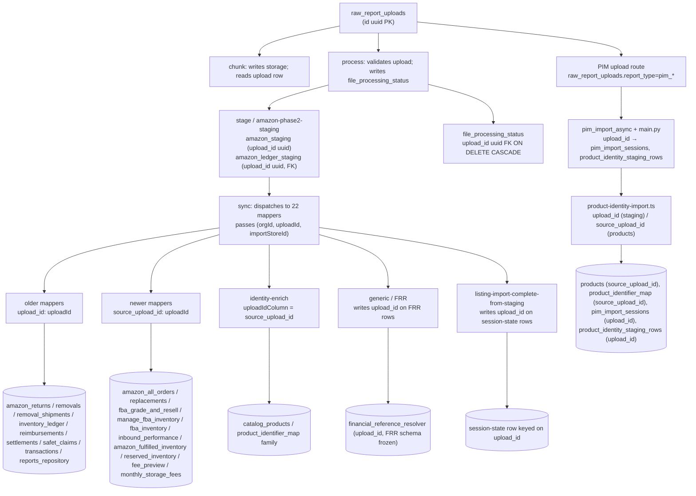
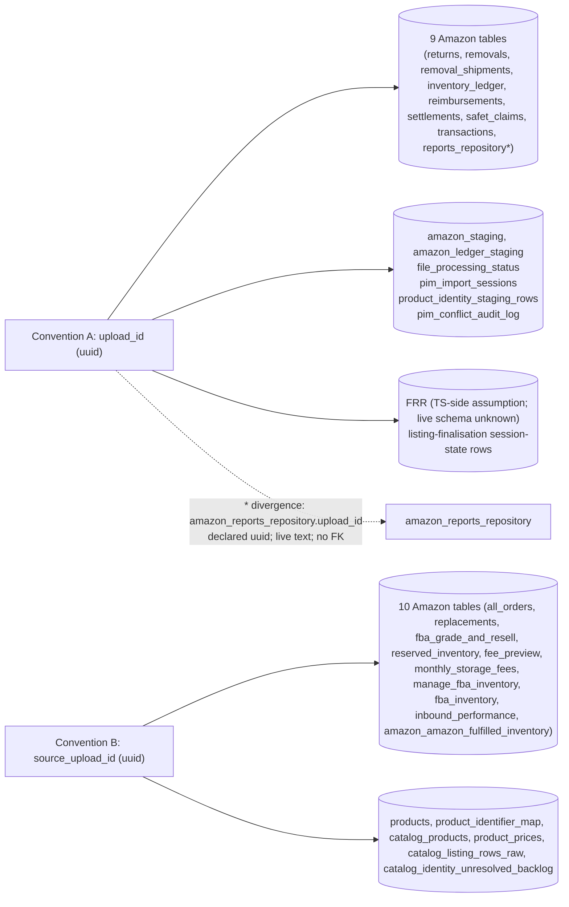

## NEXT-15.5 — Upload linkage propagation audit (read-only, plan only)

Plan / inspection only. No code edits, no migrations, no SQL, no schema changes, no `upload_id` type conversion, no backfill, no `product_id` writes, no `product_identifier_map` mutations, no patch implementations. Audit consisted of reading the mappers, all `NATIVE_COLUMNS_*` allow-lists, the sync / process / chunk / stage routes, the generic / FRR / identity-enrich / listing-finalisation paths, the PIM TS and Python pipelines, the canonical product-identity importer, and every migration that declares an `upload_id` or `source_upload_id` column.

---

### A. Upload-linkage architecture map

Two propagation conventions coexist intentionally:

- **Convention A — `upload_id` (uuid):** older Amazon ingestion tables, all staging tables, all session-state tables, all PIM staging tables. The historic default.
- **Convention B — `source_upload_id` (uuid):** newer Amazon ingestion tables (added via migration `20260604_amazon_missing_report_tables.sql`, `20260622_fba_inventory_engine_wave4.sql`) and all domain tables (`products`, `product_identifier_map`, `catalog_products`, `product_prices`, etc.). The forward-only standard after `20260425_rename_source_upload_id.sql`.

The split is correct and stable. Every mapper writes the matching column for its destination table.

---

### B. Table-by-table upload-linkage report (A–K)

Header legend: **A** = table; **B** = expected column; **C** = mapper / writer; **D** = return literal includes linkage?; **E** = `NATIVE_COLUMNS_*` includes correct column?; **F** = sync route passes correct id?; **G** = column type; **H** = FK to `raw_report_uploads`?; **I** = risk; **J** = patch needed?; **K** = refs.

#### B.1 Amazon ingestion tables (Convention A — `upload_id uuid`)

##### 1. amazon_returns
- A: `amazon_returns`
- B: `upload_id`
- C: `mapRowToAmazonReturn` (3rd positional `uploadId: string`)
- D: yes — `upload_id: uploadId,` ([`lib/import-sync-mappers.ts:1143`](lib/import-sync-mappers.ts))
- E: yes — `NATIVE_COLUMNS_RETURNS` ([`lib/import-sync-mappers.ts:151`](lib/import-sync-mappers.ts))
- F: yes — sync route line 2005 passes `uploadId` positionally
- G: uuid (per schema convention; not divergent)
- H: unknown — older migration not re-read; likely yes per pattern
- I: Low
- J: NO
- K: [`lib/import-sync-mappers.ts:1131-1154`](lib/import-sync-mappers.ts), [`app/api/settings/imports/sync/route.ts:2005`](app/api/settings/imports/sync/route.ts)

##### 2. amazon_removals
- A: `amazon_removals`
- B: `upload_id` **and** `source_staging_id` (the only table with both)
- C: `mapRowToAmazonRemoval`
- D: yes — `upload_id: uploadId,` ([`lib/import-sync-mappers.ts:1369`](lib/import-sync-mappers.ts)); `source_staging_id` is attached at sync line 2008 (`insertRow.source_staging_id = sr.id`)
- E: yes — `NATIVE_COLUMNS_REMOVALS` includes both `"upload_id"` and `"source_staging_id"` ([`lib/import-sync-mappers.ts:160`](lib/import-sync-mappers.ts))
- F: yes — sync route line 2007 passes `uploadId`; line 2008 attaches staging id
- G: uuid
- H: unknown (likely yes)
- I: Low — strongest linkage of any Amazon table (file + staging row + upload row)
- J: NO
- K: [`lib/import-sync-mappers.ts:1357-1380`](lib/import-sync-mappers.ts), [`app/api/settings/imports/sync/route.ts:2007-2008`](app/api/settings/imports/sync/route.ts)

##### 3. amazon_removal_shipments
- A: `amazon_removal_shipments`
- B: `upload_id`
- C: `mapRowToAmazonRemovalShipment`
- D: yes — `upload_id: uploadId,` ([`lib/import-sync-mappers.ts:1333`](lib/import-sync-mappers.ts))
- E: yes — shares `NATIVE_COLUMNS_REMOVALS` ([`lib/import-sync-mappers.ts:160`](lib/import-sync-mappers.ts))
- F: yes — sync route line 952 passes the local `storeId`-scoped `uploadId` resolved from the REMOVAL_SHIPMENT batch loop (the variable in this scope is also named `uploadId`; per NEXT-15.1)
- G: uuid (migration: [`supabase/migrations/20260513_amazon_removal_shipments.sql:9`](supabase/migrations/20260513_amazon_removal_shipments.sql) — `upload_id uuid REFERENCES public.raw_report_uploads (id) ON DELETE SET NULL`)
- H: **yes** (explicit FK, ON DELETE SET NULL)
- I: Low
- J: NO
- K: [`lib/import-sync-mappers.ts:1285-1355`](lib/import-sync-mappers.ts), [`supabase/migrations/20260513_amazon_removal_shipments.sql`](supabase/migrations/20260513_amazon_removal_shipments.sql)

##### 4. amazon_inventory_ledger
- A: `amazon_inventory_ledger`
- B: `upload_id`
- C: `mapRowToAmazonInventoryLedger` (two return paths: CSV at 1513, TXT/positional at 1597)
- D: yes — both paths emit `upload_id: uploadId,`
- E: yes — `NATIVE_COLUMNS_LEDGER` ([`lib/import-sync-mappers.ts:184`](lib/import-sync-mappers.ts))
- F: yes — sync route line 2016 (positional path) and line 2025 (CSV path) pass `uploadId`
- G: uuid
- H: unknown (likely yes)
- I: Low
- J: NO
- K: [`lib/import-sync-mappers.ts:1470-1638`](lib/import-sync-mappers.ts), [`app/api/settings/imports/sync/route.ts:2009-2028`](app/api/settings/imports/sync/route.ts)

##### 5. amazon_reimbursements
- A: `amazon_reimbursements`
- B: `upload_id`
- C: `mapRowToAmazonReimbursement`
- D: yes — `upload_id: uploadId,` ([`lib/import-sync-mappers.ts:1654`](lib/import-sync-mappers.ts))
- E: yes — `NATIVE_COLUMNS_REIMBURSEMENTS` ([`lib/import-sync-mappers.ts:201`](lib/import-sync-mappers.ts))
- F: yes — sync route line 2030 passes `uploadId`
- G: uuid
- H: unknown (likely yes)
- I: Low
- J: NO
- K: [`lib/import-sync-mappers.ts:1641-1665`](lib/import-sync-mappers.ts), [`app/api/settings/imports/sync/route.ts:2030`](app/api/settings/imports/sync/route.ts)

##### 6. amazon_settlements
- A: `amazon_settlements`
- B: `upload_id`
- C: `mapRowToAmazonSettlement` → `mapRowToAmazonSettlementTxtFlat` / `mapRowToAmazonSettlementLegacyCsv`
- D: yes — `upload_id: uploadId,` ([`lib/import-sync-mappers.ts:1815`](lib/import-sync-mappers.ts), [`1891`](lib/import-sync-mappers.ts))
- E: yes — `NATIVE_COLUMNS_SETTLEMENTS` ([`lib/import-sync-mappers.ts:212`](lib/import-sync-mappers.ts))
- F: yes — sync route line 2034 passes `uploadId`
- G: uuid (per [`supabase/migrations/20260502220000_idx_amazon_settlements_org_upload_id.sql`](supabase/migrations/20260502220000_idx_amazon_settlements_org_upload_id.sql) — index on `(organization_id, upload_id)`)
- H: unknown (index suggests column exists; FK status not confirmed in current pass)
- I: Low
- J: NO
- K: [`lib/import-sync-mappers.ts:1775-1980`](lib/import-sync-mappers.ts), [`app/api/settings/imports/sync/route.ts:2033-2039`](app/api/settings/imports/sync/route.ts)

##### 7. amazon_safet_claims
- A: `amazon_safet_claims`
- B: `upload_id`
- C: `mapRowToAmazonSafetClaim`
- D: yes — `upload_id: uploadId,` ([`lib/import-sync-mappers.ts:2023`](lib/import-sync-mappers.ts))
- E: yes — `NATIVE_COLUMNS_SAFET` ([`lib/import-sync-mappers.ts:263`](lib/import-sync-mappers.ts))
- F: yes — sync route line 2041 passes `uploadId`
- G: uuid
- H: unknown (likely yes)
- I: Low
- J: NO
- K: [`lib/import-sync-mappers.ts:2008-2030`](lib/import-sync-mappers.ts), [`app/api/settings/imports/sync/route.ts:2041`](app/api/settings/imports/sync/route.ts)

##### 8. amazon_transactions
- A: `amazon_transactions`
- B: `upload_id`
- C: `mapRowToAmazonTransaction`
- D: yes — `upload_id: uploadId,` ([`lib/import-sync-mappers.ts:2105`](lib/import-sync-mappers.ts))
- E: yes — `NATIVE_COLUMNS_TRANSACTIONS` ([`lib/import-sync-mappers.ts:272`](lib/import-sync-mappers.ts))
- F: yes — sync route line 2043 passes `uploadId`
- G: uuid
- H: unknown (likely yes)
- I: Low
- J: NO
- K: [`lib/import-sync-mappers.ts:2057-2118`](lib/import-sync-mappers.ts), [`app/api/settings/imports/sync/route.ts:2043`](app/api/settings/imports/sync/route.ts)

##### 9. amazon_reports_repository  ←  **DIVERGENT TABLE**
- A: `amazon_reports_repository`
- B: `upload_id`
- C: `mapRowToAmazonReportsRepository`
- D: yes — `upload_id: uploadId,` ([`lib/import-sync-mappers.ts:2309`](lib/import-sync-mappers.ts))
- E: yes — `NATIVE_COLUMNS_REPORTS_REPOSITORY` ([`lib/import-sync-mappers.ts:427`](lib/import-sync-mappers.ts))
- F: yes — sync route line 2045 passes `uploadId`
- G: **TEXT in live DB** (per NEXT-14B) / declared `uuid` in migration ([`supabase/migrations/20260509_amazon_reports_repository.sql:7`](supabase/migrations/20260509_amazon_reports_repository.sql))
- H: **NO FK** declared in migration; live state matches
- I: Medium (tracked, not new) — TS writer passes a uuid string; PostgreSQL accepts it as text (round-trip works); any read-side join must cast `r.id::text = t.upload_id` (per NEXT-14C)
- J: NO (do not change in NEXT-15; type reconciliation is a separate cross-reader project)
- K: [`lib/import-sync-mappers.ts:2256-2310`](lib/import-sync-mappers.ts), [`supabase/migrations/20260509_amazon_reports_repository.sql`](supabase/migrations/20260509_amazon_reports_repository.sql); divergence audit at NEXT-14A §B and NEXT-14B Sec 2

#### B.2 Amazon ingestion tables (Convention B — `source_upload_id uuid` + `REFERENCES raw_report_uploads ON DELETE SET NULL`)

All ten Convention B tables were defined in [`supabase/migrations/20260604_amazon_missing_report_tables.sql`](supabase/migrations/20260604_amazon_missing_report_tables.sql) (lines 19, 46, 71, 96, 120, 144, 168, 194) and [`supabase/migrations/20260622_fba_inventory_engine_wave4.sql`](supabase/migrations/20260622_fba_inventory_engine_wave4.sql) (lines 113, 169). All have explicit FK `REFERENCES public.raw_report_uploads (id) ON DELETE SET NULL`.

| Table | Mapper | Return literal line | NATIVE_COLUMNS line | Sync route call site | FK? |
|---|---|---|---|---|---|
| `amazon_all_orders` | `mapRowToAmazonAllOrders` | `source_upload_id: uploadId,` (2456) | `NATIVE_COLUMNS_ALL_ORDERS` (286) | sync:2083-2087 | yes |
| `amazon_replacements` | `mapRowToAmazonRawArchive` (dispatch) | `source_upload_id: uploadId,` (2499) | `NATIVE_COLUMNS_REPLACEMENTS` (299) | sync:2089-2096 | yes |
| `amazon_fba_grade_and_resell` | `mapRowToAmazonRawArchive` | `source_upload_id: uploadId,` (2499) | `NATIVE_COLUMNS_FBA_GRADE_AND_RESELL` (307) | sync:2089-2096 | yes |
| `amazon_reserved_inventory` | `mapRowToAmazonRawArchive` | `source_upload_id: uploadId,` (2499) | `NATIVE_COLUMNS_RESERVED_INVENTORY` (403) | sync:2089-2096 | yes |
| `amazon_fee_preview` | `mapRowToAmazonRawArchive` | `source_upload_id: uploadId,` (2499) | `NATIVE_COLUMNS_FEE_PREVIEW` (411) | sync:2089-2096 | yes |
| `amazon_monthly_storage_fees` | `mapRowToAmazonRawArchive` | `source_upload_id: uploadId,` (2499) | `NATIVE_COLUMNS_MONTHLY_STORAGE_FEES` (419) | sync:2089-2096 | yes |
| `amazon_manage_fba_inventory` | `mapRowToAmazonManageFbaInventory` | `source_upload_id: uploadId,` (2617) | `NATIVE_COLUMNS_MANAGE_FBA_INVENTORY` (321) | sync:2052-2056 | yes |
| `amazon_fba_inventory` | `mapRowToAmazonFbaInventory` | `source_upload_id: uploadId,` (2750) | `NATIVE_COLUMNS_FBA_INVENTORY` (345) | sync:2059-2063 | yes |
| `amazon_inbound_performance` | `mapRowToAmazonInboundPerformance` | `source_upload_id: uploadId,` (2867) | `NATIVE_COLUMNS_INBOUND_PERFORMANCE` (375) | sync:2066-2070 | yes |
| `amazon_amazon_fulfilled_inventory` | `mapRowToAmazonAmazonFulfilledInventory` | `source_upload_id: uploadId,` (2924) | `NATIVE_COLUMNS_AMAZON_FULFILLED_INVENTORY` (391) | sync:2073-2077 | yes |

All ten share: column type uuid, FK present, mapper writes correctly, allow-list correct, sync route passes correctly. **Risk: Low. Patch needed: NO.**

#### B.3 Staging / session / processing tables

##### amazon_staging
- A: `amazon_staging`
- B: `upload_id`
- C: [`lib/pipeline/amazon-phase2-staging.ts`](lib/pipeline/amazon-phase2-staging.ts) (writer reads upload row, validates UUID, batches insert)
- D: yes — `upload_id: uploadId` at multiple insert sites (e.g., lines 1167, 1354, 1498, 1555, 1598, 1697, 1842, 1895, 1949)
- E: n/a — phase-2 staging writer does not flow through `packPayloadForSupabase`
- F: yes — upload row is the source of truth; orgId+uploadId form the conflict key
- G: uuid
- H: unknown (likely yes — older migration not re-read)
- I: Low. **Staging contract:** `(organization_id, upload_id, row_number)` per [`lib/pipeline/amazon-phase2-staging.ts:45`](lib/pipeline/amazon-phase2-staging.ts). store_id is intentionally absent from staging.
- J: NO
- K: [`lib/pipeline/amazon-phase2-staging.ts`](lib/pipeline/amazon-phase2-staging.ts)

##### amazon_ledger_staging
- A: `amazon_ledger_staging`
- B: `upload_id` (renamed from `source_upload_id` per [`supabase/migrations/20260425_rename_source_upload_id.sql`](supabase/migrations/20260425_rename_source_upload_id.sql))
- C: phase-2 staging writer
- G: uuid
- H: yes — explicit FK `REFERENCES public.raw_report_uploads (id) ON DELETE SET NULL` ([`supabase/migrations/20260425_rename_source_upload_id.sql:25-26`](supabase/migrations/20260425_rename_source_upload_id.sql))
- I: Low
- J: NO (do not re-rename; this was the canonical rename moment)
- K: [`supabase/migrations/20260425_rename_source_upload_id.sql`](supabase/migrations/20260425_rename_source_upload_id.sql)

##### file_processing_status
- A: `file_processing_status`
- B: `upload_id` (uuid NOT NULL, FK ON DELETE CASCADE)
- C: `process` / `sync` / `generic` routes update FPS rows; `amazon-phase2-staging` also writes
- G: uuid
- H: yes — `REFERENCES public.raw_report_uploads(id) ON DELETE CASCADE` ([`supabase/migrations/20260419_file_processing_status.sql:32-33`](supabase/migrations/20260419_file_processing_status.sql))
- I: Low — strongest linkage: NOT NULL + CASCADE
- J: NO
- K: [`supabase/migrations/20260419_file_processing_status.sql`](supabase/migrations/20260419_file_processing_status.sql)

##### pim_import_sessions
- A: `pim_import_sessions`
- B: `upload_id` (uuid NOT NULL UNIQUE, FK ON DELETE CASCADE)
- C: [`backend-python/pim_import_async.py:585`](backend-python/pim_import_async.py) writes via `on_conflict="upload_id"`
- G: uuid
- H: yes — `REFERENCES public.raw_report_uploads (id) ON DELETE CASCADE` ([`supabase/migrations/20260726120000_pim_import_sessions.sql:10`](supabase/migrations/20260726120000_pim_import_sessions.sql))
- I: Low
- J: NO
- K: [`supabase/migrations/20260726120000_pim_import_sessions.sql`](supabase/migrations/20260726120000_pim_import_sessions.sql), [`backend-python/pim_import_async.py:585`](backend-python/pim_import_async.py)

##### product_identity_staging_rows
- A: `product_identity_staging_rows`
- B: `upload_id` (uuid NOT NULL, FK ON DELETE CASCADE)
- C: [`lib/product-identity-import.ts:1828`](lib/product-identity-import.ts) inserts; line 1981 reads with `.eq("upload_id", uploadId)`
- D: yes
- E: n/a (no NATIVE_COLUMNS — PI staging is hand-rolled)
- F: yes — PIM apply-step propagates uploadId end-to-end
- G: uuid
- H: yes — `REFERENCES public.raw_report_uploads(id) ON DELETE CASCADE` ([`supabase/migrations/20260641_product_identity_staging_rows.sql:28`](supabase/migrations/20260641_product_identity_staging_rows.sql))
- I: Low — also enforces upsert conflict on `(upload_id, source_physical_row_number)` ([`lib/product-identity-import.ts:1686`](lib/product-identity-import.ts))
- J: NO
- K: [`supabase/migrations/20260641_product_identity_staging_rows.sql`](supabase/migrations/20260641_product_identity_staging_rows.sql), [`lib/product-identity-import.ts:1686-1981`](lib/product-identity-import.ts)

##### pim_conflict_audit_log
- A: `pim_conflict_audit_log`
- B: `upload_id` (uuid, FK ON DELETE SET NULL)
- C: PIM Python writer
- G: uuid
- H: yes ([`supabase/migrations/20260808130000_pim_conflict_audit.sql:12`](supabase/migrations/20260808130000_pim_conflict_audit.sql))
- I: Low
- J: NO

#### B.4 Domain tables (Convention B)

##### products (canonical PIM domain table)
- A: `products`
- B: `source_upload_id`
- C: [`lib/product-identity-import.ts`](lib/product-identity-import.ts) lines 119 (type), 440, 529, 834, 843, 937, 1077, 1591
- D: yes — every products upsert path writes `source_upload_id: uploadId` or `source_upload_id: sourceUploadId`
- E: n/a (manual upserts)
- F: yes — PIM apply-step + Python `_process_pim_seed_row` carries upload context end-to-end
- G: uuid
- H: yes — added in [`supabase/migrations/20260422_three_phase_etl.sql:39-40`](supabase/migrations/20260422_three_phase_etl.sql) with `REFERENCES public.raw_report_uploads (id) ON DELETE SET NULL`
- I: Low — canonical domain table
- J: NO
- K: [`lib/product-identity-import.ts`](lib/product-identity-import.ts), [`supabase/migrations/20260422_three_phase_etl.sql`](supabase/migrations/20260422_three_phase_etl.sql)

##### product_identifier_map (resolver bridge)
- A: `product_identifier_map`
- B: `source_upload_id`
- C: [`lib/inventory-family-identifier-enrich.ts`](lib/inventory-family-identifier-enrich.ts), [`lib/product-identity-import.ts`](lib/product-identity-import.ts)
- D: yes — every upsert path writes `source_upload_id: uploadId` ([`lib/inventory-family-identifier-enrich.ts:398,459,495`](lib/inventory-family-identifier-enrich.ts))
- E: n/a (manual upserts)
- F: yes
- G: uuid
- H: unknown (FK status not confirmed in current pass; per [`supabase/migrations/20260620_product_identifier_map_ledger_enrichment.sql:19`](supabase/migrations/20260620_product_identifier_map_ledger_enrichment.sql) the column is `source_upload_id uuid` but FK not visible in that snippet — likely added in a separate `product_identifier_map` migration)
- I: Low
- J: NO
- K: [`lib/inventory-family-identifier-enrich.ts`](lib/inventory-family-identifier-enrich.ts), [`lib/product-identity-import.ts`](lib/product-identity-import.ts)

##### catalog_products
- A: `catalog_products`
- B: `source_upload_id`
- C: [`lib/import-sync-mappers.ts:1080`](lib/import-sync-mappers.ts) `mapRowToCatalogProduct`; [`lib/pipeline/listing-import-complete-from-staging.ts`](lib/pipeline/listing-import-complete-from-staging.ts)
- D: yes — `source_upload_id: sourceUploadId && isUuidString(sourceUploadId) ? sourceUploadId : null` ([`lib/import-sync-mappers.ts:1080`](lib/import-sync-mappers.ts)) — **only mapper that explicitly UUID-guards the column**
- E: yes — `NATIVE_COLUMNS_CATALOG_PRODUCTS` line 904 includes `"source_upload_id"`
- F: yes
- G: uuid
- H: yes — `REFERENCES public.raw_report_uploads (id) ON DELETE SET NULL` ([`supabase/migrations/20260531_catalog_products_listing_extensions.sql:7-8`](supabase/migrations/20260531_catalog_products_listing_extensions.sql))
- I: Low — best-in-class mapper guard
- J: NO
- K: [`lib/import-sync-mappers.ts:1040-1083`](lib/import-sync-mappers.ts), [`supabase/migrations/20260531_catalog_products_listing_extensions.sql`](supabase/migrations/20260531_catalog_products_listing_extensions.sql)

##### product_prices
- A: `product_prices`
- B: `source_upload_id` (uuid)
- C: PIM price-backfill in Python; also [`lib/product-identity-import.ts`](lib/product-identity-import.ts)
- G: uuid
- H: unknown (column ensured to exist in [`supabase/migrations/20260715120000_product_prices_ensure_amount_column.sql:14`](supabase/migrations/20260715120000_product_prices_ensure_amount_column.sql); FK declared in a separate migration not in current pass)
- I: Low
- J: NO

##### catalog_listing_rows_raw
- A: `catalog_listing_rows_raw`
- B: `source_upload_id` (uuid **NOT NULL**, FK ON DELETE CASCADE)
- C: listing-import staging path
- G: uuid
- H: yes — `REFERENCES public.raw_report_uploads (id) ON DELETE CASCADE` ([`supabase/migrations/20260601_catalog_listing_rows_raw.sql:10`](supabase/migrations/20260601_catalog_listing_rows_raw.sql))
- I: Low — strongest constraint (NOT NULL + CASCADE)
- J: NO

##### catalog_identity_unresolved_backlog
- A: `catalog_identity_unresolved_backlog`
- B: `source_upload_id` (uuid, FK ON DELETE SET NULL)
- G: uuid
- H: yes ([`supabase/migrations/20260630130000_product_identity_existing_tables.sql:103,157`](supabase/migrations/20260630130000_product_identity_existing_tables.sql))
- I: Low
- J: NO

#### B.5 FRR (financial_reference_resolver)

- A: `financial_reference_resolver`
- B: `upload_id` — TS writer treats this as Convention A
- C: [`lib/financial-reference-resolver-sync.ts:296`](lib/financial-reference-resolver-sync.ts) writes `upload_id: uploadId`; line 264 reads `.eq("upload_id", uploadId)`
- D: yes
- E: n/a (manual upsert; no NATIVE_COLUMNS pack)
- F: yes — `generic` route passes uploadId
- G: unknown — FRR has no in-repo schema (per NEXT-10 / NEXT-10B)
- H: unknown
- I: Medium — depends on whether live FRR has `upload_id` column. NEXT-10 froze the FRR writer because of this uncertainty. TS code assumes Convention A; live schema not verified.
- J: NO — FRR is frozen (NEXT-11). Do not touch.
- K: [`lib/financial-reference-resolver-sync.ts:215-296`](lib/financial-reference-resolver-sync.ts); NEXT-10, NEXT-11

#### B.6 Listing finalisation

- Target tables: probably session-state and catalog-merge tables; uses `upload_id` (Convention A) consistently within [`lib/pipeline/listing-import-complete-from-staging.ts`](lib/pipeline/listing-import-complete-from-staging.ts) (lines 80, 116, 169; `onConflict: "upload_id"` at 100, 129, 200).
- Note: line 105 of the same file (per earlier grep) passes `organizationId: orgId` and uses `import_store_id` from metadata; line 117 writes `organization_id: orgId` and a `upload_id`. This is on a "wave-1 listing state" table — Convention A by design.
- Risk: Low.
- Patch needed: NO. Confirm target-table names if a later cross-reference audit is desired (NEXT-15.6 smoketest scope).

#### B.7 Convention summary

---

### C. Safe paths (verified correct propagation)

1. **All 22 Amazon mappers** correctly write the upload-linkage column matching their destination table.
2. **All 22 `NATIVE_COLUMNS_*` allow-lists** list the correct column for their destination — `upload_id` for Convention A, `source_upload_id` for Convention B. None strip the linkage.
3. **Sync route** passes `uploadId` as the 3rd positional argument to every mapper (verified in NEXT-15.1).
4. **Phase-2 staging writer** sources `upload_id` from `raw_report_uploads.id` and validates UUID before any write ([`lib/pipeline/amazon-phase2-staging.ts:1015-1017`](lib/pipeline/amazon-phase2-staging.ts)).
5. **All five raw-report import routes** (`chunk`, `process`, `sync`, `generic`, `identity-enrich`) read `organization_id` + `id` from the upload row before doing anything else.
6. **Identity-enrich** declares `uploadIdColumn = "source_upload_id"` per target table and writes consistently to all destinations ([`lib/inventory-family-identifier-enrich.ts:49,69,85,101,124`](lib/inventory-family-identifier-enrich.ts)).
7. **PIM TS layer** correctly splits Convention A (staging / session) from Convention B (domain) — staging tables write `upload_id`; `products` / `product_identifier_map` write `source_upload_id` ([`lib/product-identity-import.ts:653,1828` Convention A; `:119,440,529` Convention B](lib/product-identity-import.ts)).
8. **PIM Python layer** propagates `upload_id` end-to-end, validates UUIDs at every FastAPI endpoint that accepts it ([`backend-python/main.py:1646-1650, 1667-1671`](backend-python/main.py)), and bridges Convention A → B correctly at the PIM-resolver layer ([`backend-python/main.py:4926-4990`](backend-python/main.py) — accepts `pim_upload_id`, queries `.eq("source_upload_id", uid)` on `products`).
9. **`catalog_products` mapper guards source_upload_id as UUID** before writing ([`lib/import-sync-mappers.ts:1080`](lib/import-sync-mappers.ts)) — best-in-class.
10. **`amazon_removals`** carries triple linkage: `upload_id` + `source_staging_id` + (via `attachPhysicalRowIdentity`) `source_file_sha256` + `source_physical_row_number`. Strongest forensic chain.

---

### D. Missing / weak paths

1. **`amazon_reports_repository.upload_id` text-vs-uuid divergence + no FK** — sole structurally divergent table. Tracked by NEXT-14A/B/C/D. **Do not reconcile in NEXT-15.5.**
2. **FRR writer schema assumption** — TS code writes `upload_id: uploadId` but FRR's live schema is not in the repo (NEXT-10/11). FRR is frozen; no action.
3. **`expected_packages` dual-CREATE migrations** — [`20260420_*`](supabase/migrations/20260420_import_detected_type_expected_sync.sql) (Convention B: `source_upload_id`) vs [`20260427_*`](supabase/migrations/20260427_expected_packages_removal_orders.sql) (Convention A: `upload_id`). Tracked by NEXT-14A. Live state per NEXT-14B has both. **Mark; do not touch.**

No active writer is missing upload linkage. No mapper is missing the column. No allow-list strips the column.

---

### E. `amazon_reports_repository.upload_id` text-risk assessment

| Dimension | Finding |
|---|---|
| Declared type | `uuid` ([`supabase/migrations/20260509_amazon_reports_repository.sql:7`](supabase/migrations/20260509_amazon_reports_repository.sql)) |
| Live type | `text` (per NEXT-14B operator-verified live schema) |
| FK to raw_report_uploads | **none** (neither declared nor live) |
| Writer behaviour | TS passes the canonical uuid string; PostgreSQL accepts as text; round-trip is byte-identical |
| Reader behaviour | All readers must cast: `r.id::text = t.upload_id`. None of the in-repo readers currently join from `raw_report_uploads` into `amazon_reports_repository` directly (FRR is the candidate consumer; frozen) |
| `ON DELETE` semantics | none — orphaned rows possible if the upload row is deleted |
| Mapper-side risk | none — mapper writes a valid uuid string regardless of column type |
| Migration-vs-live divergence cause | unknown; predates current audit. NEXT-14A tracks it |
| Effect on product_id phase | a future `product_id` backfill that joins amazon_reports_repository on `upload_id` must (a) cast, (b) explicitly tolerate orphans (no FK) |

**Verdict:** the text-type and missing-FK combination is **stable for writes**. The risk surface is read-side: any future cross-table join must cast and handle the no-FK case. The right time to reconcile is during a coordinated reader update, not now. **NEXT-15.5 should not change anything.** Continue to treat the column as text in joins and as uuid-shaped strings in writes.

---

### F. Answers to the prompt's ten questions

1. **Which tables use `upload_id`?** Convention A — `amazon_returns`, `amazon_removals`, `amazon_removal_shipments`, `amazon_inventory_ledger`, `amazon_reimbursements`, `amazon_settlements`, `amazon_safet_claims`, `amazon_transactions`, `amazon_reports_repository` (divergent text), `amazon_staging`, `amazon_ledger_staging`, `file_processing_status`, `pim_import_sessions`, `product_identity_staging_rows`, `pim_conflict_audit_log`, `expected_packages` (per migration `20260427`), `expected_removals`, `expected_returns`, plus (TS-assumed) `financial_reference_resolver` and the listing-finalisation session-state row.
2. **Which tables use `source_upload_id`?** Convention B — `amazon_all_orders`, `amazon_replacements`, `amazon_fba_grade_and_resell`, `amazon_reserved_inventory`, `amazon_fee_preview`, `amazon_monthly_storage_fees`, `amazon_manage_fba_inventory`, `amazon_fba_inventory`, `amazon_inbound_performance`, `amazon_amazon_fulfilled_inventory`, `products`, `product_identifier_map`, `catalog_products`, `product_prices`, `catalog_listing_rows_raw`, `catalog_identity_unresolved_backlog`, plus `expected_packages` (per migration `20260420` — dual-schema). All have explicit FK with `ON DELETE SET NULL` (or `CASCADE` for `catalog_listing_rows_raw`).
3. **Which tables have no upload linkage and why?** `raw_report_uploads` itself (the upload row is the linkage target). `pim_*_view`-style views (read-only). Reference tables (`organizations`, `stores`, `profiles`). No ingestion writer in scope is missing linkage.
4. **Is `amazon_reports_repository.upload_id` text handled safely?** Yes for writes (TS passes a valid uuid string; PostgreSQL accepts). For reads, every future join must cast `r.id::text = t.upload_id`. The risk is structural (no FK = orphan rows possible) and is tracked by NEXT-14A. **No NEXT-15 change.**
5. **Are there any future import paths that can write rows without upload linkage?** No active path. The design pattern for future API ingestion (NEXT-15 §I) creates a synthetic `raw_report_uploads` row first, so every API row inherits the same linkage as CSV rows. **Pre-condition for API ingestion: this synthetic-upload pattern must be enforced.**
6. **Does PIM product import preserve upload/session linkage?** Yes, end-to-end. Staging tables (`pim_import_sessions`, `product_identity_staging_rows`) use `upload_id` with FK; domain tables (`products`, `product_identifier_map`) use `source_upload_id` with FK. The PIM Python bridge at [`backend-python/main.py:4926-4990`](backend-python/main.py) accepts `pim_upload_id` and translates correctly.
7. **Do `generic` / FRR / `identity-enrich` paths preserve source row / upload context?** Yes. `generic` reads `upload_id` from the upload row; FRR writes `upload_id` on every row (Convention A; live schema frozen — see NEXT-10/11); `identity-enrich` writes `source_upload_id` on every upsert per its `uploadIdColumn` config.
8. **Is upload linkage good enough before product seed / product_id phases?** **Yes.** Every writer carries linkage; every domain table has FK with ON DELETE SET NULL or CASCADE; PIM bridges conventions correctly; mappers write the right column. The only structural exception is `amazon_reports_repository` (text + no FK) which is tracked separately and does not block product_id work.
9. **What hardening should happen before API ingestion?** Before any SP-API / Walmart / Shopify ingestion goes live: enforce the synthetic `raw_report_uploads` pattern at the per-adapter transformer layer; add a smoke assertion that every adapter creates the upload row before writing into `amazon_staging`; mirror PIM's UUID-validation gates on the synthetic uploads. None of this is NEXT-15.5 work.
10. **What should be done next?** **NEXT-15.6 — sync-dispatch regression smoketest (plan-only mention here; implementation deferred).** A single `tsx`-runnable script that, for every `AmazonSyncKind`, calls the mapper + `packPayloadForSupabase(NATIVE_COLUMNS_*)` and asserts both `store_id` and the correct upload-linkage column (`upload_id` for Convention A, `source_upload_id` for Convention B) survive. Replaces the dropped NEXT-15.2 ladder; also covers ledger's two return paths and `mapRowToAmazonRawArchive`'s five dispatch targets.

---

### G. Do-not-touch list

- **All 22 mapper upload-linkage return literals** (lines 1143, 1333, 1369, 1513, 1597, 1654, 1815, 1891, 2023, 2105, 2309, 2456, 2499, 2617, 2750, 2867, 2924). Every one is correct for its destination.
- **All 22 `NATIVE_COLUMNS_*` allow-lists' inclusion of the matching upload-linkage column** (lines 151, 160, 184, 201, 212, 263, 272, 286, 299, 307, 321, 345, 375, 391, 403, 411, 419, 427, 904).
- **`amazon_reports_repository.upload_id`** — text type and no FK. Tracked by NEXT-14A. Reader-side joins must cast; do not alter the column.
- **FRR writer** — frozen post-NEXT-11. Do not touch.
- **`amazon_ledger_staging` column rename** — done in [`supabase/migrations/20260425_rename_source_upload_id.sql`](supabase/migrations/20260425_rename_source_upload_id.sql). Do not reverse.
- **`amazon_staging.upload_id`** — part of conflict tuple `(organization_id, upload_id, row_number)`. Do not add additional columns to staging.
- **`expected_packages` dual-CREATE** — tracked by NEXT-14A. Mark; do not reconcile.
- **PIM Python upload-id validation gates** — at [`backend-python/main.py:1646-1650, 1667-1671`](backend-python/main.py) and `_validate_pim_org_store`. Load-bearing.
- **`catalog_products` mapper UUID guard** — best-in-class; keep verbatim.
- **`amazon_removals` triple-linkage pattern** — (`upload_id`, `source_staging_id`, physical-row identity). Reference implementation; do not regress.

---

### H. Recommended next step (plan-only)

**NEXT-15.6 — Single sync-dispatch regression smoketest.** One `tsx`-runnable script in `scripts/` that, for every `AmazonSyncKind`:

- Builds a minimal valid CSV row (one per kind).
- Calls the mapper with a fixed `(orgId, uploadId, storeId)` triple.
- Runs `packPayloadForSupabase(returnedRow, NATIVE_COLUMNS_*)` against the matching allow-list.
- Asserts: (a) `organization_id === orgId`; (b) `store_id === storeId` (or null per convention); (c) for Convention A targets, `upload_id === uploadId`; for Convention B targets, `source_upload_id === uploadId`.
- Special cases:
  - `mapRowToAmazonInventoryLedger`: exercise both CSV and TXT/positional return paths.
  - `mapRowToAmazonRawArchive`: exercise all five dispatch-target allow-lists.
  - `mapRowToAmazonRemoval`: assert `source_staging_id` is set when attached at sync layer.

This is one ~200-line file; replaces the dropped NEXT-15.2 ladder and locks in the current correct behaviour for both `store_id` (NEXT-15.1) and upload linkage (NEXT-15.5) ahead of NEXT-18+ product_id work.

After NEXT-15.6, the recommended sequencing is:

---

### Constraints recap (still in force)

- No code edits.
- No migrations.
- No SQL.
- No schema changes.
- No `upload_id` type conversion.
- No data backfill.
- No `product_id` writes.
- No `product_identifier_map` mutations.
- No deletions.
- No `expected_packages` / `pallets` / `packages` changes.
- No FRR writer change.
- No removal of "dead" code; mark only.
- No patch implementations.
- No refactors.

Plan / inspection only.